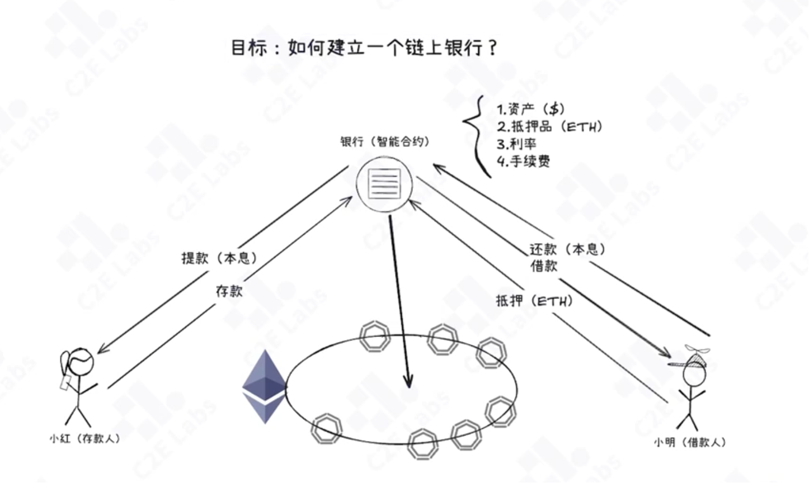
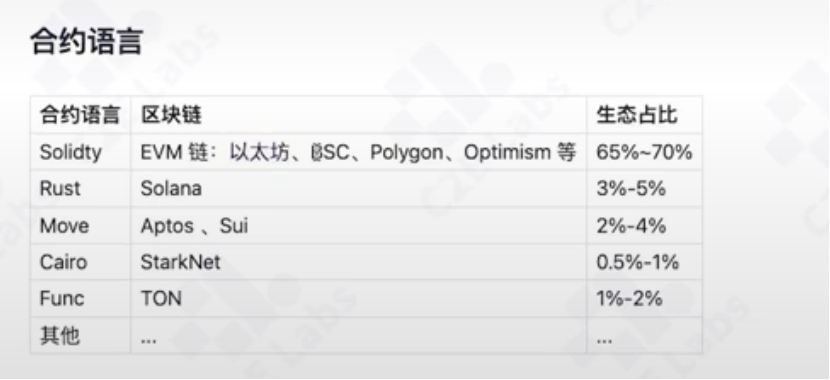

# 智能合约与应用

## 什么是智能合约

智能合约的概念
智能合约的特点：去中心化、不可篡改、公开透明

## 智能合约应用逻辑

示例

DeBank vs Bank
    去中介化：没有中介机构与信任依赖
    持续运行：7*24全体运作
    安全隐私：用户通过自己私钥管理资产
    公平透明：任何人都可以审查合约逻辑
现实例子
    commpound(app.compound.finance/markets)
        TVL链上总锁仓量（defillama.com/protocol/compound-finance#information）
    Aave(app.aave.com/markets/)
         TVL链上总锁仓量（defillama.com/protocol/aave#information）
解决什么问题
   互不信任的人之间，创建一个可信的协作环境
   一切去中心化、依赖信任的业务场景

## 应用与技术生态

赛道应用
   defi(decentralized finance):uniswap、Compound、Aave
   NFT(non-fungible token):OpenSea、LooksRare、Rarible、Cryptopunks、BoredApeYachtClub
   DAO(decentralized autonomous organization):MakerDAO、Compound、Synthetix、Uniswap、DYDX
   DePIN(decentralized personal identification):DID
   RWA(real world asset)

合约语言
   Solidity
   
