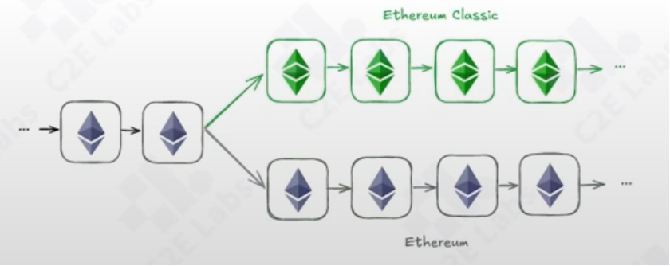

# web3黑客事件分析一

案例一：重入漏洞攻击事件

the DAO事件
    DAO（Decently Activated Organization）旨在创建一种新的去中心化组织模式，既无需中心化的领导机构，由所有社会成员共同治理
    the DAO项目旨在建立一个去中心化运作的基金，通过投票权治理。该项目通过智能合约进行众筹。
    2016年4月，项目启动，成为历史上最大的众筹活动之一
    2026年6月，黑客利用漏洞进行攻击，转移了360万个以太币
合约交易分析
    ethereum <https://etherscan.io>
    the DAO合约分析 <https://etherscan.io/address/0xbb9bc244d798123fde783fcc1c72d3bb8c189413#code>
漏洞代码分析
    954行代码
    ```solidity
    // 退出机制
    function splitDAO(
        uint _proposalID,
        address_newCurator,
    ) noEther onlyTokenholders returns (bool _success){
        Proposal p = proposals[_proposalID];

        // 检查

        // Burn DAO Tokens
        // 问题1：先执行转账，在执行burn
    }

    // 重入攻击
    _recipient.call.value(_amount) 
    上面的函数使用了低级调用，这里的接收者可以是普通账户，也可以是合约地址，如果是合约地址，会触发_recipient的fallback（或者reciver函数）函数，黑客可以自己部署一个合约，在fallback函数中实现再次调用splitDAO函数，导致_recipient的fallback函数调用splitDAO函数，导致重入攻击
    ```
    。攻击方式
        攻击者部署自己的合约
        利用转账fallbank回调不断重入该合约的splitDAO函数

结果与影响
    导致硬分叉形成了两条独立的链：以太坊（ETH）和以太经典（ETC）
    撕裂共识，导致以太坊社区的分裂
    

重入攻击问题
   重入攻击历史案例集合<https://github.com/pcaversaccio/reentrancy-attacks>
   为何频现重入攻击？
       EVM机制
       多合约交互复杂性
       未遵循最佳开发实践
       缺乏安全审计
