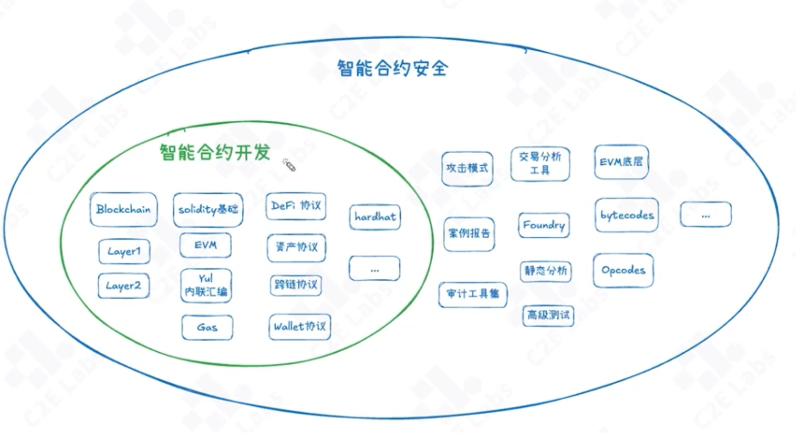

# 智能合约安全

## 合约安全的重要性

智能合约的环境
   去中心化-》合约代码会在任意节点执行
   透明-》合约代码公开
   不可篡改-》合约代码在链上不可篡改

智能合约的开源属性
   智能合约代码一般选择开源：
       作为一个web3去中心化应用的底层核心，开源合约代码可以让社区和用户清楚地了解智能合约的运行逻辑，增强信任
       项目方会通过bug-bounty、审计等方式进行合约安全保障

智能合约安全的重要性
    在web3项目中，合约作为区块链上运行的代码，托管所有资金，直面各类用户，一旦合约出现漏洞，项目就会面临重大风险，因此，合约安全问题怎么强调都不为过

      合约开发是一个“零容忍”的工程领域
      与web2技术不同，智能合约开发与安全师一个整体
      智能合约开发简单、优化难

## 合约安全技术栈

## 为什么学习合约安全

智能合约开发技能的全面提升
长期参与web3 build ，深入理解web3技术热点与事件
随着智能合约应用数量指数级上涨，越来越多的合约安全需求
多方拓展职业与赛道方向
