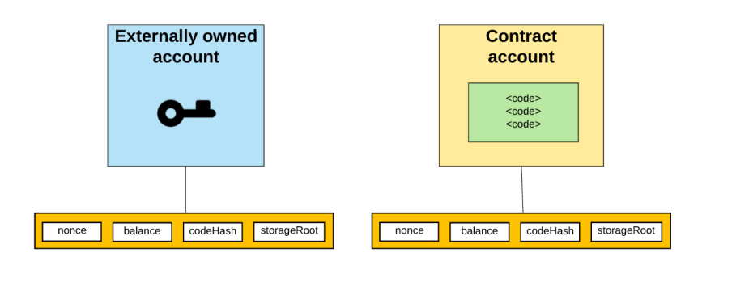
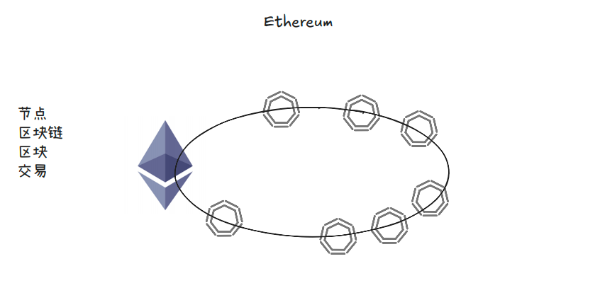
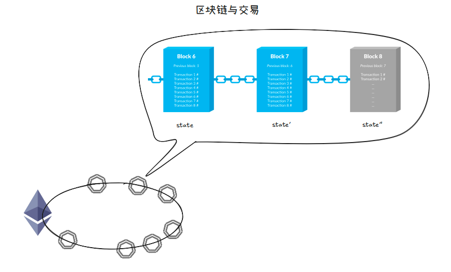
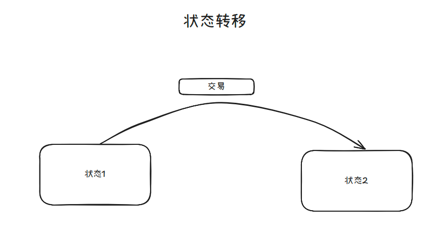
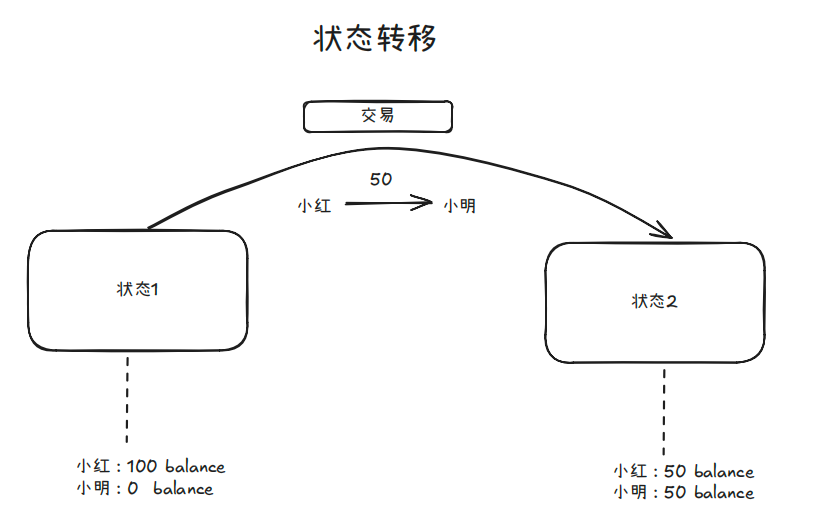
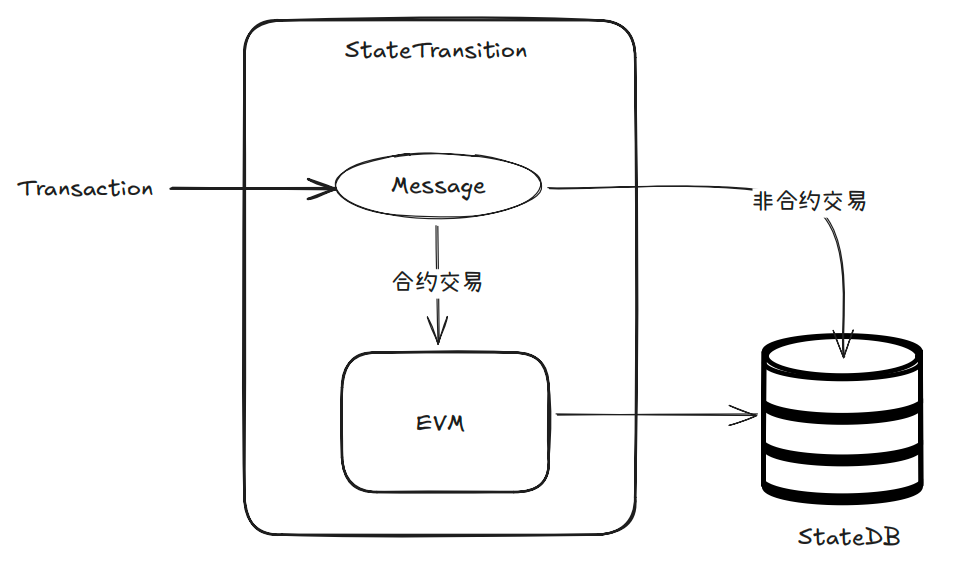

# 理解交易

## 账户模型

与比特币的 UTXO 模型相比，以太坊等EVM链的最大特点之一就是其使用账户模型，类似“银行储户”概念 ，使得以太坊账户可以拥有多种状态（如余额、代码） ，其作用是状态数据隔离和高效更新。

分类
    外部账户（Externally Owned Accounts）：外部账户由私钥拥有者控制，外部账户下没有 code
    合约账户（Contract Accounts）：由合约代码控制，合约账户下存有 code

账户状态
    nonce：由此账户地址发出的交易数量，防止双花
    balance：以太币余额，以 wei 为单位
    storageRoot：账户存储的默克尔树根节点哈希值，用于存储和验证状态  MPT根节点
    codeHash：在合约账户中表示其EVM code 的哈希

    

外部账户与合约账户的区别：在外部账户中，codeHash可以为空

## 区块链与交易

自上而下的结构如图所示：
    

区块链与交易
    

每个节点包含区块链
区块链由区块构成
区块中包含一系列交易

## 交易原理

作用
以太坊是基于交易的状态机，通过交易使以太坊 World State 状态转移
    
例子：
    

核心结构
构造一笔交易需要以下信息
Nonce：帐户发送的交易数量的计数
GasPrice：为支付该交易计算成本而设置的每单位 Gas 价值
GasLimit：用户愿意在此交易中花费的最大 Gas 量
to：接收者地址，可以为 EOA 账户或者合约账户
value：本次交易中发送给接收者的 以太币 金额
data：消息调用的输入数据
signature：签名数据

执行
    

交易执行过程

构建交易
transaction 转换为 message
通过 to 目标地址判断交易类型
    简单转账不使用 EVM ，直接进行状态改变
    合约相关交易使用 EVM，通过执行代码进行状态改变
