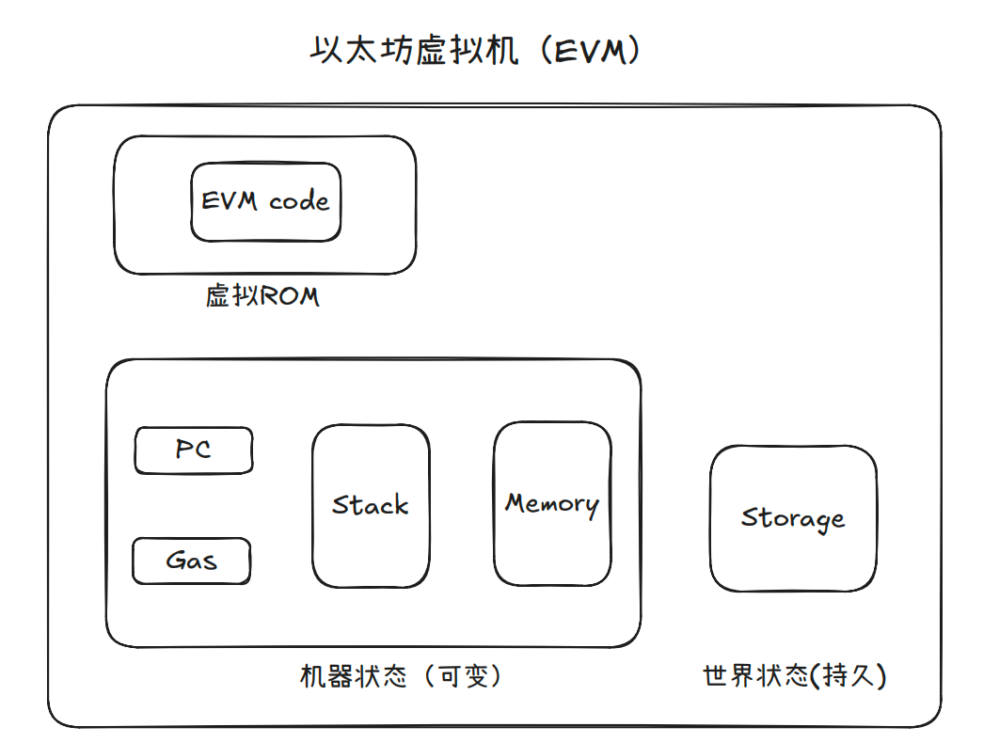
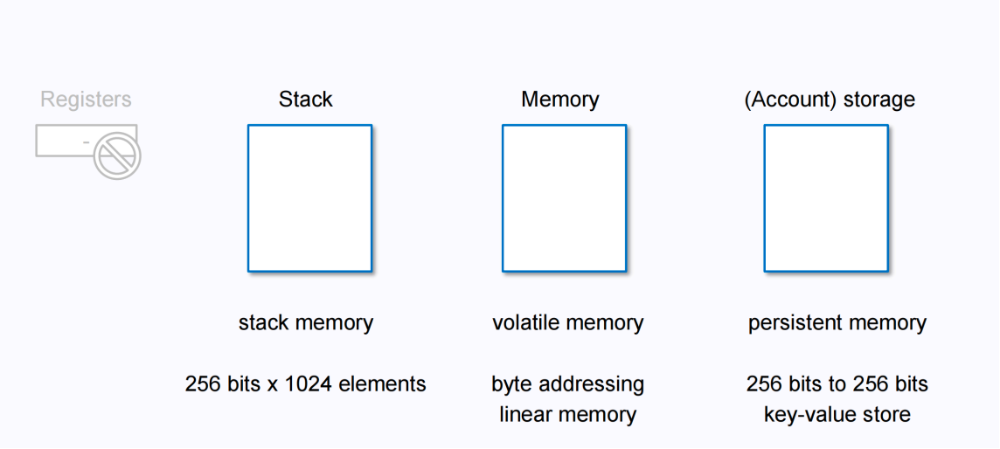
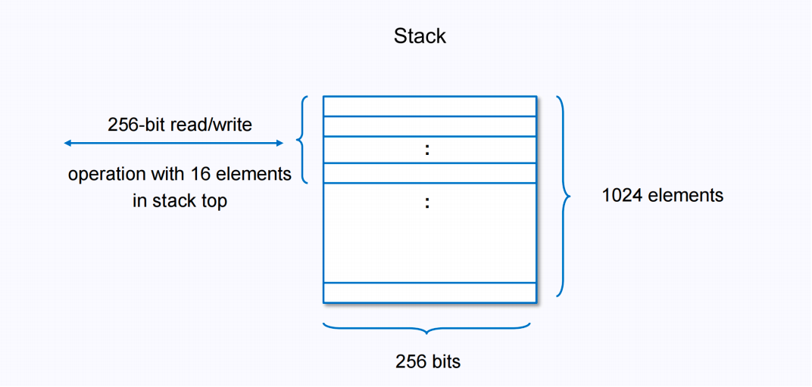
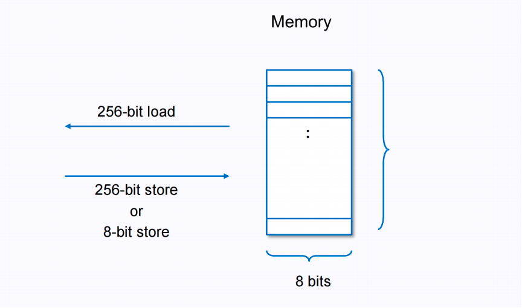
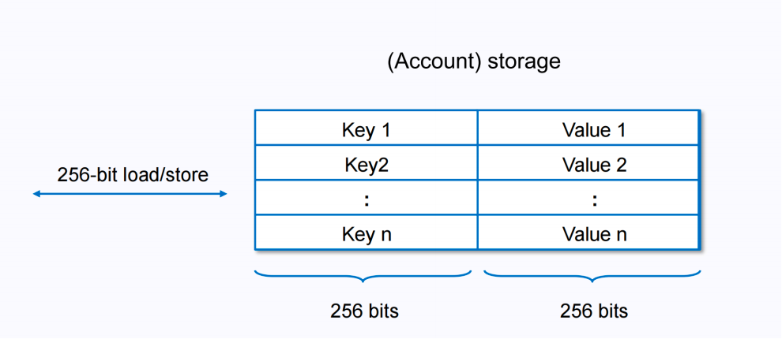
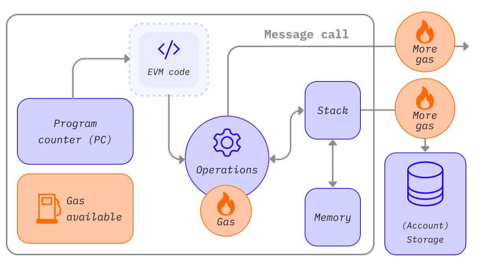
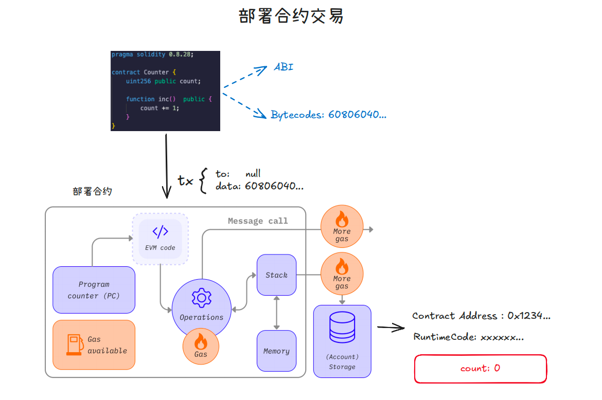
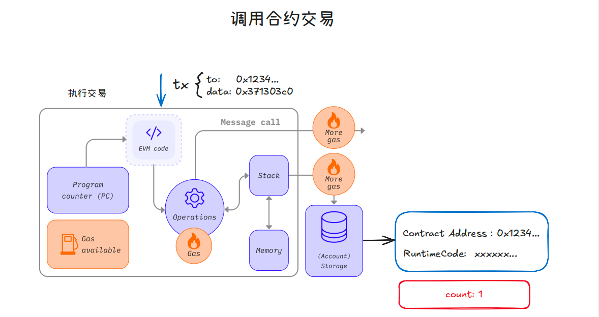

# EVM与智能合约

## EVM

### 概念

EVM（Ethereum Virtual Machine）以太坊虚拟机，是一个基于栈架构、顺序执行的以太坊智能合约运行时环境，用以处理智能合约相关交易，同一笔交易的代码会在所有节点EVM上执行。EVM 使用 Gas（燃料）度量所需的计算工作，确保去中心化环境下安全和高效地执行合约代码。

### 特点

沙盒环境：代码隔离环境下运行，无法访问网络、文件系统等
确定性：相同输入和代码在所有节点上得到的结果相同
图灵完备性：支持复杂计算，能够执行任何逻辑明确的代码
状态持久性：持久存储合约的全局状态变量
Gas 机制：通过 Gas 费用限制计算资源消耗，防止滥用

### 结构



### 空间资源

没有寄存器


Stack（栈）：存储字节码执行过程的中间数据和指令，最多可容纳 256 bit x 1024 个元素，以 256 bit 为单位进行读写。



Memory（内存）：线性存储，用来在运行期间临时存储数据，字长为 8 位，一次读取 256 位，一次写入可以为 8 bit或 256 bit。



Storage（存储）：可读写修改的持久存储，为 256 bit 到 256 bit的键值对存储（插槽），一共 2^256个插槽 ，每次读写都是 256 bit



## EVM 执行交易

### EVM 运行



运行步骤：

1. 加载字节码
2. 字节码逐条执行操作码
3. PC 移动，消耗一定数量的 Gas
4. 通过 Stack 进行操作码运算
5. Memory 用以临时存储中间数据
6. 交易过程及结果在 Storage 持久存储

字节码和操作码
   字节码（Bytecodes）：合约编译后的低级代码，形如 60806040523...
   操作码（Opcode）：EVM Codes - An Ethereum Virtual Machine Opcodes Interactive Reference(<https://www.evm.codes/>)

## 合约示例

### 合约代码

```solidity
// SPDX-License-Identifier: MIT
pragma solidity 0.8.27;
contract Counter {
 uint256 public count;
 function inc() public {
 count += 1;
 }
}
```

Remix 点击执行部署背后的逻辑

合约部署交易


1. 初始化一个 EVM 执行环境
2. 加载字节码
3. 依次执行每个操作码 ，PC 移动，消耗一定数量的 Gas
4. Stack 中进行操作码运算，Memory 用以临时存储中间数据
5. 初始化变量、执行构造函数
6. 生成并存储合约代码（RuntimeCode）

调用合约交易



1. 以太坊初始化一个 EVM 执行环境
2. 通过 to -> codeHash 加载合约实际字节码
3. 加载 data 并解析，找到执行函数入口，并传递参数
4. 依次执行操作码，PC 移动，消耗一定数量的 Gas
5. Stack 中进行操作码运算，Memory 用以临时存储中间数据
6. 交易过程及结果在 Storage 持久存储
