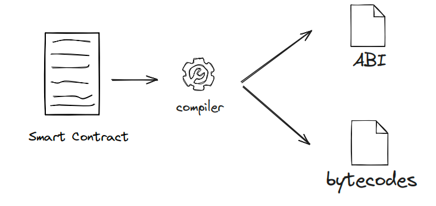

# ABI 编码

## 什么是 ABI

### 概念

ABI（Application Binary Interface）合约应用二进制接口，是一种与以太坊智能合约交互的标准规范，无论从外部调用合约，还是合约调用合约，都需要使用 ABI 规范对交互数据进行编码，确保数据能够被 EVM 正确解析和处理。



### 示例

```solidity
// SPDX-License-Identifier: MIT
pragma solidity 0.8.27;

contract Counter {
    uint256 public count;
    function inc() public {
       count += 1;
    }
 // 调用：ABI编码 100
 //
0x82ab890a0000000000000000000000000000000000000000000000000000000000000064
    function update(uint256 _num) public {
        count =_num;
    }
}
```

## ABI 编码

### 内置函数

编码
    abi.encode(...) returns (bytes memory)
       标准 ABI 编码
       占用更多空间，gas消耗更多
       适用于合约函数调用等场景
    abi.encodePacked(...) returns (bytes memory)
        紧凑格式编码，不进行填充
        更节省空间，gas消耗少
        适用于生成哈希值等场景
解码
    abi.decode(bytes memory encodedData, (...)) returns (...)
        数据解码
        将abi.encode 或低级调用返回的 bytes 数据解码成指定的 Solidity 数据类型

### 代码

```solidity
// SPDX-License-Identifier: MIT
pragma solidity 0.8.27;
contract EncodeDecode {
 // 0x0000000000000000000000000000000000000000000000000000000000000001
    function encodeNumber() public pure returns(bytes memory) {
       return abi.encode(uint256(1));
    }
 // 0x0000000000000000000000000000000000000000000000000000000000000002
    function encodeAddress() public pure returns(bytes memory) {
       return abi.encode(address(2));
    }
 // 0x0300000000000000000000000000000000000000000000000000000000000000
    function encodeBytes1() public pure returns(bytes memory) {
       return abi.encode(bytes1(0x03));
    }
 // 0x
 // 0000000000000000000000000000000000000000000000000000000000000004
 // 0000000000000000000000000000000000000000000000000000000000000005
    function encodeArray() public pure returns(bytes memory) {
       uint256[2] memory arr = [uint256(4), 5];
       return abi.encode(arr);
    }
 // 0x
 // 0000000000000000000000000000000000000000000000000000000000000020 //
0x00
 // 0000000000000000000000000000000000000000000000000000000000000006 //
0x20
 // 737472696e670000000000000000000000000000000000000000000000000000 //
0x40
    function encodeString() public pure returns(bytes memory) {
       return abi.encode("string");
    }
 // 0x
 // 00000000000000000000000000000000000000000000000000000000000000c0 //
0x00
 // 0000000000000000000000000000000000000000000000000000000000000001 //
0x20
 // 0000000000000000000000000000000000000000000000000000000000000002 //
0x40
 // 0300000000000000000000000000000000000000000000000000000000000000 //
0x60
 // 0000000000000000000000000000000000000000000000000000000000000004 //
0x80
 // 0000000000000000000000000000000000000000000000000000000000000005 //
0xa0
 // 0000000000000000000000000000000000000000000000000000000000000006 //
0xc0
 // 737472696e670000000000000000000000000000000000000000000000000000 //
0xe0
    function multiEncode() public pure returns(bytes memory) {
        return abi.encode("string", uint256(1), address(2), bytes1(0x03),
        [uint256(4), 5]);
    }
 // 0x737472696e67
 // 0000000000000000000000000000000000000000000000000000000000000001
 // 0000000000000000000000000000000000000002
 // 03
 // 0000000000000000000000000000000000000000000000000000000000000004
 // 0000000000000000000000000000000000000000000000000000000000000005
    function multiEncodePacked() public pure returns(bytes memory) {
       return abi.encodePacked("string", uint256(1), address(2),
        bytes1(0x03), [uint256(4), 5]);
    }
    function decode() public pure returns(string memory, uint256, address,
       bytes1, uint256[2] memory) {
        bytes memory encodeData = multiEncode();
        return abi.decode(encodeData, (string, uint256, address, bytes1,
        uint256[2]));
    }
}
```

动态数组编码组成
    偏移量：指向动态数组实际数据在 ABI 编码中的起始位置
    数组长度：动态数组的元素个数
    数组内容：按顺序存储每个元素
资料
ABI 文档：Contract ABI Specification — Solidity 0.8.29 documentation(<https://docs.soliditylang.org/en/latest/abi-spec.html>)
