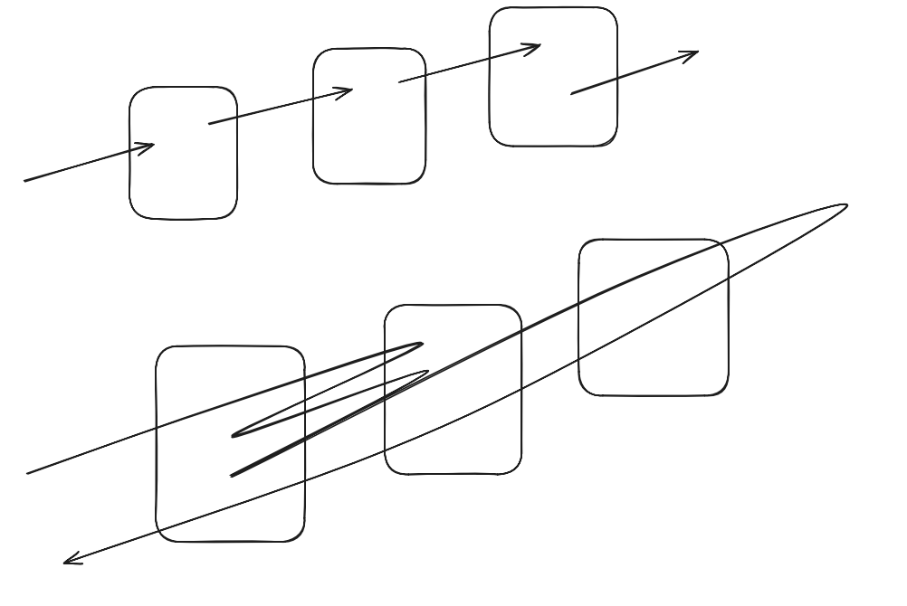

# 低级调用

## 什么是低级调用

### 概念

Solidity 中的低级调用指的是通过 call、delegatecall、staticcall 等底层函数与其他地址进行交互，而不依赖于高层抽象（如调用合约函数）。当不知道目标合约的代码或 ABI 时，依然可以使用低级调用的方式与合约地址交互，需要手动编码调用数据。

### 特点

   灵活
   不安全
   底层交互

## 低级调用函数

### 函数调用相关

   目标地址.call{value:x, gas:y}(calldata)
   目标地址.delegatecall(calldata)
   目标地址.staticcall(calldata)

### ether 相关

    目标地址.transfer(amount)
    目标地址.send(amount)
    目标地址.balance

参考：Members of Addresses（<https://docs.soliditylang.org/en/latest/types.html#members-of-addresses）>

## 调用任意合约方法

### 代码

使用 call 调用任何合约的任何函数

```solidity
// SPDX-License-Identifier: MIT
pragma solidity ^0.8.27;

contract Vault {
    event Wthdraw(address to, uint256 amount);
    function withdraw(address to, uint256 amount) external {
       emit Wthdraw(to, amount);
    }
}

contract Caller {
    function callAnything(address _contract, bytes calldata_data) external {
       (bool ok,) = _contract.call(_data);
       require(ok, "call failed");
    }
    
    // 获取编码数据
    function encode(address to, uint256 amount)
       external
       pure
       returns (bytes memory)
    {
       // 哪个函数
       // 哪些参数
        bytes4 selector = bytes4(keccak256("withdraw(address,uint256)"));  // 函数选择器
        bytes memory params = abi.encode(to, amount);
        return abi.encodePacked(selector, params);
    }
}
```

## 合约调用编码

相关编码函数

```solidity
abi.encodeWithSignature(string memory signature, ...) returns (bytes memory)
abi.encodeWithSelector(bytes4 selector, ...) returns (bytes memory)
abi.encodeCall(function functionPointer, (...)) returns (bytes memory)
```

参考：ABI Encoding and Decoding Functions(<https://docs.soliditylang.org/en/latest/cheatsheet.html#abi-encoding-and-decoding-functions>)

## 代码演示

### call

   通用的合约调用方式，可以调用其他合约函数或发送以太币
   在目标合约的上下文中运行
   可指定 calldata 外，还支持 gas、value 参数

#### 代码

```solidity
// SPDX-License-Identifier: MIT
pragma solidity 0.8.27;
contract Vault {
 event Wthdraw(address to, uint256 amount);
 function withdraw(address to, uint256 amount) external {
 emit Wthdraw(to, amount);
 }
}
contract Caller {
 function callAnything(address _contract, bytes calldata_data) external {
 (bool ok, ) = _contract.call(_data);
 require(ok, "call failed");
 }
 function encode(address to, uint256 amount)
 external
 pure
 returns(bytes memory)
 {
 // 哪个函数
 // 哪些参数
 bytes4 selector = bytes4(keccak256("withdraw(address,uint256)"));
 bytes memory params = abi.encode(to, amount);
 return abi.encodePacked(selector, params);
 }
    function encodeWithSignature(address to, uint256 amount)
        external
        pure
        returns(bytes memory)
    {
        return abi.encodeWithSignature("withdraw(address,uint256)", to,amount);
    }

    function encodeWithSelector(address to, uint256 amount)
        external
        pure
        returns(bytes memory)
    {
        return abi.encodeWithSelector(Vault.withdraw.selector, to, amount);
    }

    function encodeCall(address to, uint256 amount)
       external
       pure
       returns(bytes memory)
    {
        return abi.encodeCall(Vault.withdraw, (to, amount));
    }
}
```

### delegatecall

委托调用
在当前主调合约的上下文中运行
目标合约本身的存储不会被修改，所有操作作用于主调合约
只可指定 calldata

#### 代码

```solidity
// SPDX-License-Identifier: MIT
pragma solidity 0.8.27;
contract Called {
    address public caller;
    uint256 public value;
    string public message;
 
    function changeStates(string memory _message) public payable {
        caller = msg.sender;
        value = msg.value;
        message =_message;
    }
}

contract DelegateCaller {
 address public caller;
 uint256 public value;
 string public message;
    function delegatecall(address _contract) external payable {
 bytes memory_data = encodeWithSelector();
 (bool ok, ) = _contract.delegatecall(_data);
 require(ok, "delegatecall failed");
 }
 function encodeWithSelector() internal pure returns(bytes memory) {
 return abi.encodeWithSelector(Called.changeStates.selector, "hello");
 }
}
```

### staticcall

调用逻辑不允许修改任何区块链的状态
确保调用函数为 pure 或者 view

#### 代码

```solidity
// SPDX-License-Identifier: MIT
pragma solidity 0.8.27;
contract Called {
 address public caller;
 uint256 public value;
 string public message;
 function changeStates(string memory _message) public payable {
 caller = msg.sender;
 value = msg.value;
 message =_message;
 }
 function viewStates() public view returns(uint256) {
 return value;
 }
 function pureCompute() public pure returns(uint256) {
 return 1 + 1;
 }
}
contract StaticCaller {
 function staticcall(address _contract, bytes memory_data) external
payable {
 (bool ok, ) = _contract.staticcall(_data);
 require(ok, "staticcall failed");
 }
 function storageFuncData() public pure returns(bytes memory) {
 return abi.encodeWithSelector(Called.changeStates.selector, "hello");
  }
 function viewFuncData() public pure returns(bytes memory) {
 return abi.encodeWithSelector(Called.viewStates.selector);
 }
 function pureFuncData() public pure returns(bytes memory) {
 return abi.encodeWithSelector(Called.pureCompute.selector);
 }
}
```

## 合约调用问题

由于 EVM 机制以及低级调用的存在，一笔交易中可以实现无数个低级调用，合约可以实现很复杂
的功能，真实环境下合约之间的调用可能会非常复杂


