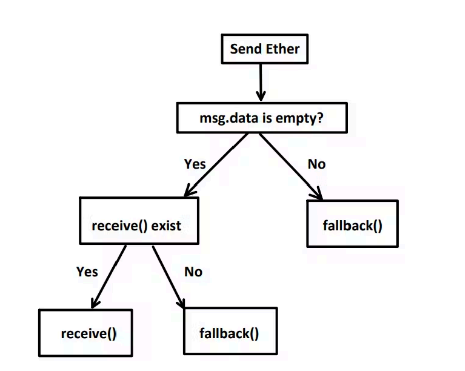

# 合约转账机制

## 转账类型

以太坊生态中有两类最常见的转账方式

1. ETH -> 非合约交易
2. Token（ERC20）-> 合约交易

## ETH 转账

### 接受 ETH

```solidity
// SPDX-License-Identifier: MIT
pragma solidity 0.8.28;
contract ReceiveEth {
event Receive(address sender, uint256 amount);
event Fallback(address sender, uint256 amount);
constructor() {}
receive() external payable {
emit Receive(msg.sender, msg.value);
}
fallback() external payable {
emit Fallback(msg.sender, msg.value);
}
}
```

receive 与 fallback 执行顺序：


合约作为 Ether 接收方条件：
   需要有 receive 或者 fallback 函数
    必须标记为 payable

## 发送 ETH

### 方法

send
transfer
call

### 代码

```solidity
// SPDX-License-Identifier: MIT
pragma solidity 0.8.28;
contract SendEth {
 function send(address payable _to, uint256_amount) public payable {
 _to.send(_amount);
 }
 function call(address _to, uint256_amount) public payable {
 _to.call{value:_amount}("");
 }
 function transfer(address payable _to, uint256_amount) public payable {
 _to.transfer(_amount);
 }
}
contract Receiver {
 event Receive(address sender, uint256 amount);
 uint256 public balance;

 constructor() {}
 receive() external payable{
 emit Receive(msg.sender, msg.value);
 balance = address(this).balance;
 }
}
```

### 对比

     gas 限制 失败回滚 推荐使用
send 2300gas 否 不推荐
transfer 2300gas 是 简单场景
call 无限制 否 复杂场景

## Token 转账

### 代码

```solidity
// SPDX-License-Identifier: MIT
pragma solidity ^0.8.28;
contract SimpleErc721 {
 mapping(uint256 => address) public owners;
 mapping(address => uint256) public balances;
 uint256 private _tokenId;
 event Transfer(address indexed from, address indexed to, uint256 indexed
tokenId);
 function mint(address to) public {
 uint256 tokenId =_tokenId;
 owners[tokenId] = to;
 balances[to] += 1;
 _tokenId++;
 emit Transfer(address(0), to, tokenId);
 }
 function safeTransferFrom(address from, address to, uint256 tokenId)
public {
 // check
 // update
 balances[from] -= 1;
 balances[to] += 1;
 owners[tokenId] = to;
 _checkOnERC721Received(from, to, tokenId);
 emit Transfer(from, to, tokenId);
 }
 function _checkOnERC721Received(address from, address to, uint256
tokenId) private {
 if (to.code.length > 0) {
 try ERC721Receiver(to).onERC721Received(msg.sender, from,
tokenId, "") returns (bytes4 retval) {
 require(retval ==
ERC721Receiver(to).onERC721Received.selector, "ERC721: invalid receiver");
 } catch {
 revert("ERC721: invalid receiver");
 }
 }
 }
}
interface ERC721Receiver {
 function onERC721Received(
 address operator,
 address from,
 uint256 tokenId,
 bytes calldata data
 ) external returns (bytes4);
}
```

### Token 资产与转账

ERC721 等资产对应的是合约中状态变量
调用 safeTransferFrom 时，执行 onERC721Received 回调
