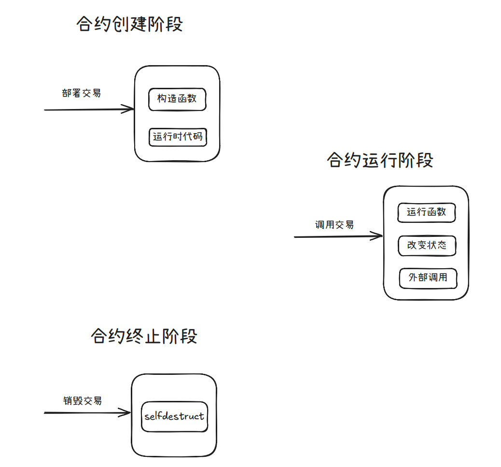

# 合约生命周期



## 阶段分类

合约创建阶段：通过部署交易，执行初始化代码，运行构造函数，最后生成运行时代码并上
链
合约运行阶段：通过调用交易，运行合约内部函数逻辑，进行状态改变以及执行外部调用
合约终止阶段：通过销毁交易，清除相关代码状态、转移ETH

## 构造函数

合约创建阶段通过构造函数初始化状态变量

构造函数特点
每个合约只能定义一个构造函数
构造函数在合约部署时仅执行一次，不在链上存储
构造函数可以接受参数

Solidity早期版本，构造函数需要与合约名相同，当前版本使用constructor 关键字

```solidity
// SPDX-License-Identifier: MIT
pragma solidity 0.4.20;
contract Coin {
 address public owner;
 function Coin() public {
 owner = msg.sender;
 }
}
// SPDX-License-Identifier: MIT
pragma solidity ^0.8.28;
contract Coin {
 address public owner;
 constructor() {
 owner = msg.sender;
 }
}
```

## 合约自毁

有一种方法可以使合约没有receive 或者 fallback函数时，让其强制接受Ether，即利用selfdestruct 的特性。
selfdestruct 可以清除合约的代码，并将该合约的所有 ETH 余额发送给指定地址（selfdestruct 的参
数）。

```solidity
// SPDX-License-Identifier: MIT
pragma solidity 0.8.28;
contract Destruct {
 function destruct() external {
 selfdestruct(payable(msg.sender));
 }
```

可以强制发送给对方 ETH，可能对某些合约逻辑判断产生问题
