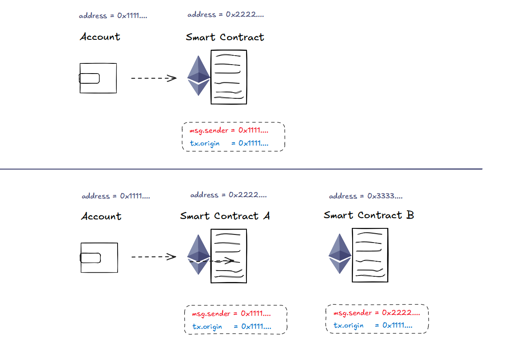

# 全局可用变量

全局可用变量是EVM提供的特殊变量，用以获取区块链状态、交易和执行环境的重要信息，可以在智能合约中直接访问

## 常用全局变量

```solidity
blockhash：获取指定区块哈希
block.number ： 当前区块号
block.chainid： 当前链ID
block.timestamp： 区块时间戳
block.gaslimit： 当前区块Gas限额
gasleft： 剩余的Gas数量
msg.data：完整的calldata
msg.sig：calldata的前4字节（函数标识符）
msg.sender：当前调用者地址
msg.value：发送ETH的数量(wei)
tx.gaspric：当前交易Gas价格
tx.origin： 当前交易的最初发起者地址
...
```

Units and Globally Available Variables
tx.origin 与 msg.sender
Account Smart Contract
msg.sender = 0x1111....
tx.origin = 0x1111....
Account Smart Contract A
msg.sender = 0x1111....
address = 0x1111....
tx.origin = 0x1111....
Smart Contract B
msg.sender = 0x2222....
tx.origin = 0x1111....
address = 0x2222.... address = 0x3333....
address = 0x1111.... address = 0x2222....

## tx.origin 与 msg.sender

tx.origin：最初发起交易的外部账户地址，无论交易经过多少个合约的调用， tx.origin 始
终是交易的发起者，即最初的外部账户地址。（外部帐户地址）
msg.sender：当前执行上下文中的调用者地址，即当前合约函数调用的直接来源（外部帐户地
址或合约地址）


