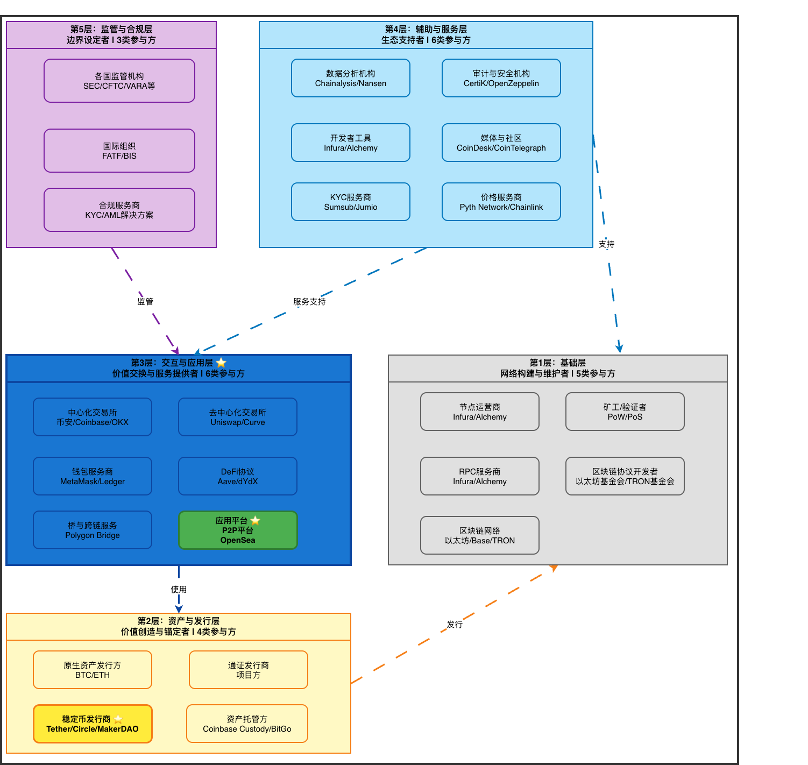

# 10.1 区块链生态参与方概述

## 执行摘要

### 一、参与方

区块链生态参与方按**5层模型**分类，共包含**24类主要参与方**。

#### 1.1 参与方分层架构图

#### 1.2 参与方分类统计表

| 层级 | 参与方类别数 | 主要参与方类型 |
|------|------------|--------------|
| 第1层：基础层 | 5类 | 节点运营商、矿工/验证者、RPC服务商、区块链协议开发者、区块链网络 |
| 第2层：资产与发行层 | 4类 | 原生资产发行方、通证发行商、稳定币发行商、资产托管方 |
| 第3层：交互与应用层 | 6类 | 中心化交易所、去中心化交易所、钱包服务商、DeFi协议、桥与跨链服务、应用平台 |
| 第4层：辅助与服务层 | 6类 | 数据分析机构、审计与安全机构、开发者工具、媒体与社区、KYC服务商、价格服务商 |
| 第5层：监管与合规层 | 3类 | 各国监管机构、国际组织、合规服务商 |
| **总计** | **24类** | - |

---

### 二、结构概述

#### 第1层：基础层 - 网络构建与维护者
**核心作用**：构建和维护区块链网络基础设施
- 节点运营商：存储账本、验证交易
- 矿工/验证者：生产区块、确认交易
- RPC服务商：提供节点访问接口
- 区块链协议开发者：维护和升级协议
- 区块链网络：以太坊、Base、TRON等

#### 第2层：资产与发行层 - 价值创造与锚定者
**核心作用**：创造和管理生态内流通的价值载体
- 原生资产发行方：BTC、ETH等
- 通证发行商：项目方发行的功能性代币
- **稳定币发行商** ⭐：Tether（USDT）、Circle（USDC）、MakerDAO（DAI）
- 资产托管方：Coinbase Custody、BitGo

#### 第3层：交互与应用层 - 价值交换与服务提供者
**核心作用**：提供价值交换和用户服务
- **中心化交易所（CEX）** ⭐：币安、Coinbase、OKX
- 去中心化交易所（DEX）：Uniswap、Curve
- 钱包服务商：MetaMask、Ledger
- DeFi协议：Aave、dYdX
- 桥与跨链服务：Polygon Bridge、Arbitrum Bridge
- **应用平台** ⭐：**我们的P2P平台**、OpenSea（NFT市场）

#### 第4层：辅助与服务层 - 生态支持者
**核心作用**：为其他层提供工具、数据和安全保障
- 数据分析机构：Chainalysis、Nansen
- 审计与安全机构：CertiK、OpenZeppelin
- 开发者工具：Infura、Alchemy、The Graph
- 媒体与社区：CoinDesk、CoinTelegraph
- KYC服务商：Sumsub、Jumio
- 价格服务商：Pyth Network、Chainlink

#### 第5层：监管与合规层 - 边界设定者
**核心作用**：制定规则，设定生态边界
- 各国监管机构：美国SEC/CFTC、欧盟各国、新加坡MAS、迪拜VARA
- 国际组织：FATF、BIS
- 合规服务商：提供KYC/AML解决方案

---

### 三、典型业务流程中的参与方交互

**场景：用户通过P2P平台进行稳定币与法币交易**

1. **第1层（基础层）**：区块链网络确认智能合约交易，节点运营商提供RPC服务
2. **第2层（资产与发行层）**：稳定币发行商发行的USDT/USDC作为交易媒介
3. **第3层（交互与应用层）**：P2P平台提供撮合服务，智能合约托管资金，用户钱包交互
4. **第4层（辅助与服务层）**：KYC服务商验证用户身份，价格服务商提供实时价格
5. **第5层（监管与合规层）**：监管机构监督平台合规运营

---

## 四、详细文档索引

各层的详细分析请参考以下文档：

- [10.1.1 第1层：基础层 - 网络构建与维护者](./10.1.1-第1层-基础层-网络构建与维护者.md)
- [10.1.2 第2层：资产与发行层 - 价值创造与锚定者](./10.1.2-第2层-资产与发行层-价值创造与锚定者.md) ⭐
- [10.1.3 第3层：交互与应用层 - 价值交换与服务提供者](./10.1.3-第3层-交互与应用层-价值交换与服务提供者.md) ⭐
- [10.1.4 第4层：辅助与服务层 - 生态支持者](./10.1.4-第4层-辅助与服务层-生态支持者.md)
- [10.1.5 第5层：监管与合规层 - 边界设定者](./10.1.5-第5层-监管与合规层-边界设定者.md)

---

## 五、参考资料

本文档采用的**5层模型**参考了以下权威机构的研究报告和行业标准：

### 7.1 国内权威机构

1. **中国信息通信研究院《区块链白皮书（2022年）》** 
   - **下载地址**：https://www.caict.ac.cn/kxyj/qwfb/bps/202212/P020230105572446062995.pdf

2. **可信区块链推进计划《Web3.0前瞻研究报告（2022年）》** 
   - **下载地址**：https://www.hulianhutongshequ.cn/upload/tank/report/2023/202303/1/2b7dd9a1f1114f4aa4119f03afeecea6.pdf

3. **中国信息通信研究院《区块链基础设施研究报告（2022年）》** 
   - **下载地址**：http://www.caict.ac.cn/kxyj/qwfb/ztbg/202207/P020220720381650932740.pdf

### 7.2 国际权威机构

4. **Messari - 加密货币研究平台**
   - 官网：https://messari.io/
   - 研究报告：https://messari.io/report/the-crypto-theses-2026#cryptomoney-is-the-foundation-of-the-industry-f4340711ac92

---

**文档版本**：v2.1  
**最后更新**：2026-01-26  
