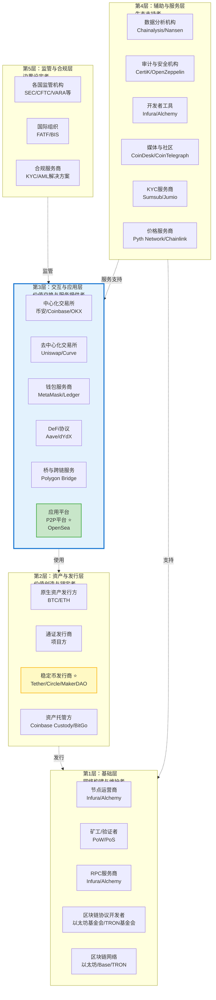

```mermaid
graph TB
    subgraph Layer5["第5层：监管与合规层<br/>边界设定者<br/>3类参与方"]
        L5A[各国监管机构<br/>SEC/CFTC/VARA等]
        L5B[国际组织<br/>FATF/BIS]
        L5C[合规服务商<br/>KYC/AML解决方案]
    end
    
    subgraph Layer4["第4层：辅助与服务层<br/>生态支持者<br/>6类参与方"]
        L4A[数据分析机构<br/>Chainalysis/Nansen]
        L4B[审计与安全机构<br/>CertiK/OpenZeppelin]
        L4C[开发者工具<br/>Infura/Alchemy]
        L4D[媒体与社区<br/>CoinDesk/CoinTelegraph]
        L4E[KYC服务商<br/>Sumsub/Jumio]
        L4F[价格服务商<br/>Pyth Network/Chainlink]
    end
    
    subgraph Layer3["第3层：交互与应用层<br/>价值交换与服务提供者<br/>6类参与方 ⭐"]
        L3A[中心化交易所<br/>币安/Coinbase/OKX]
        L3B[去中心化交易所<br/>Uniswap/Curve]
        L3C[钱包服务商<br/>MetaMask/Ledger]
        L3D[DeFi协议<br/>Aave/dYdX]
        L3E[桥与跨链服务<br/>Polygon Bridge]
        L3F["应用平台<br/>P2P平台 ⭐<br/>OpenSea"]
    end
    
    subgraph Layer2["第2层：资产与发行层<br/>价值创造与锚定者<br/>4类参与方"]
        L2A[原生资产发行方<br/>BTC/ETH]
        L2B[通证发行商<br/>项目方]
        L2C["稳定币发行商 ⭐<br/>Tether/Circle/MakerDAO"]
        L2D[资产托管方<br/>Coinbase Custody/BitGo]
    end
    
    subgraph Layer1["第1层：基础层<br/>网络构建与维护者<br/>5类参与方"]
        L1A[节点运营商<br/>Infura/Alchemy]
        L1B[矿工/验证者<br/>PoW/PoS]
        L1C[RPC服务商<br/>Infura/Alchemy]
        L1D[区块链协议开发者<br/>以太坊基金会/TRON基金会]
        L1E[区块链网络<br/>以太坊/Base/TRON]
    end
    
    Layer5 -.监管.-> Layer3
    Layer4 -.服务支持.-> Layer3
    Layer3 -.使用.-> Layer2
    Layer2 -.发行.-> Layer1
    Layer4 -.支持.-> Layer1
    
    style Layer3 fill:#e3f2fd,stroke:#1976d2,stroke-width:3px
    style L3F fill:#c8e6c9,stroke:#4caf50,stroke-width:2px
    style L2C fill:#fff9c4,stroke:#fbc02d,stroke-width:2px
```