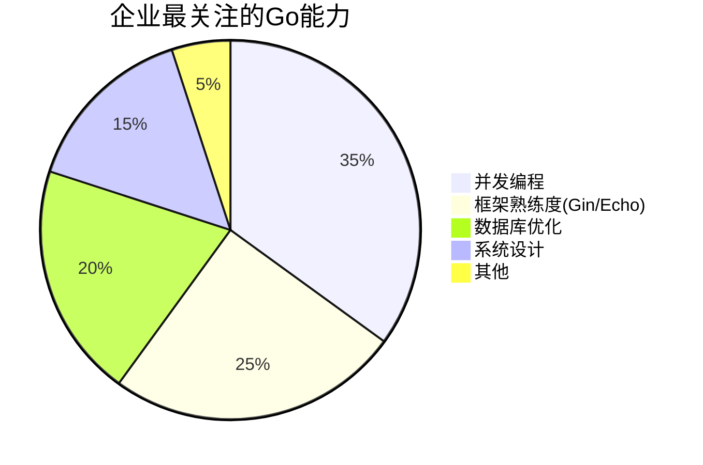
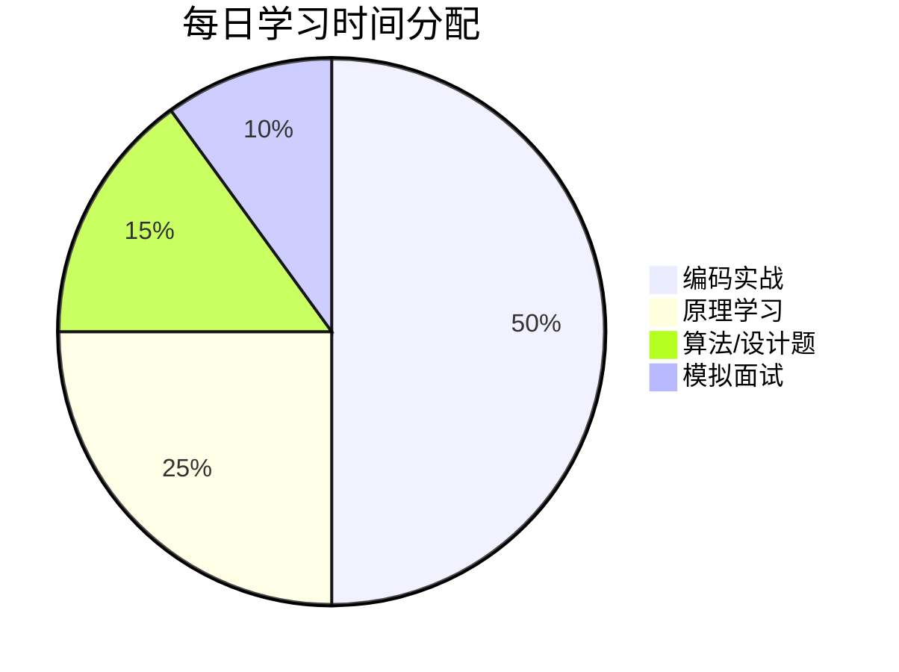

# go学习

```mermaid
pie
    title 企业最关注的Go能力
    "并发编程": 35
    "框架熟练度(Gin/Echo)" : 25
    "数据库优化" : 20
    "系统设计" : 15
    "其他": 5
```

```mermaid
pie 
    title 每日学习时间分配 
    "编码实战" : 50 
    "原理学习" : 25 
    "算法/设计题" : 15 
    "模拟面试": 10
```
