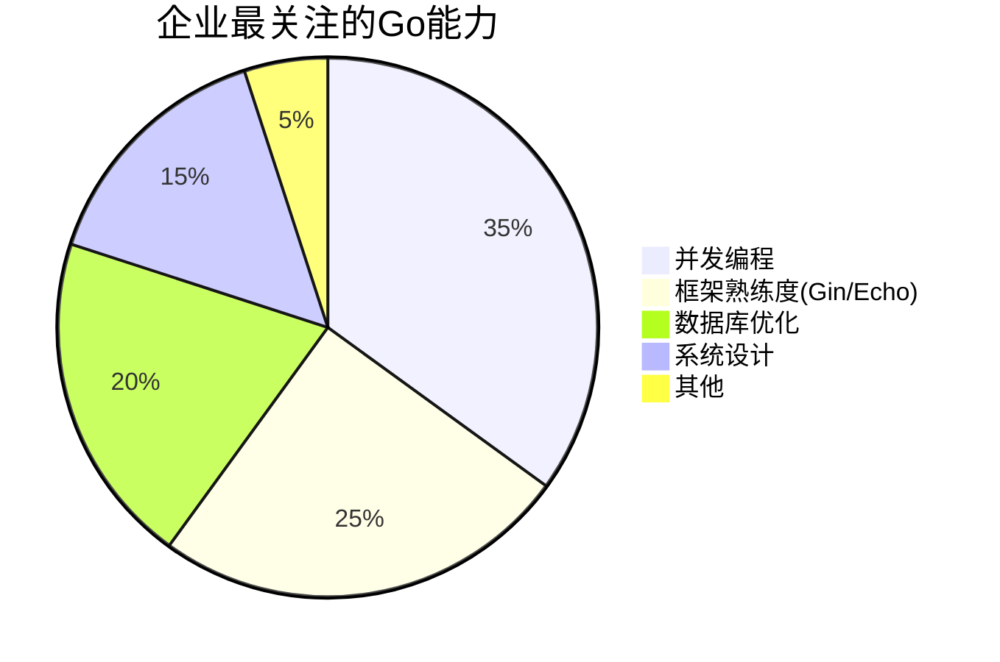
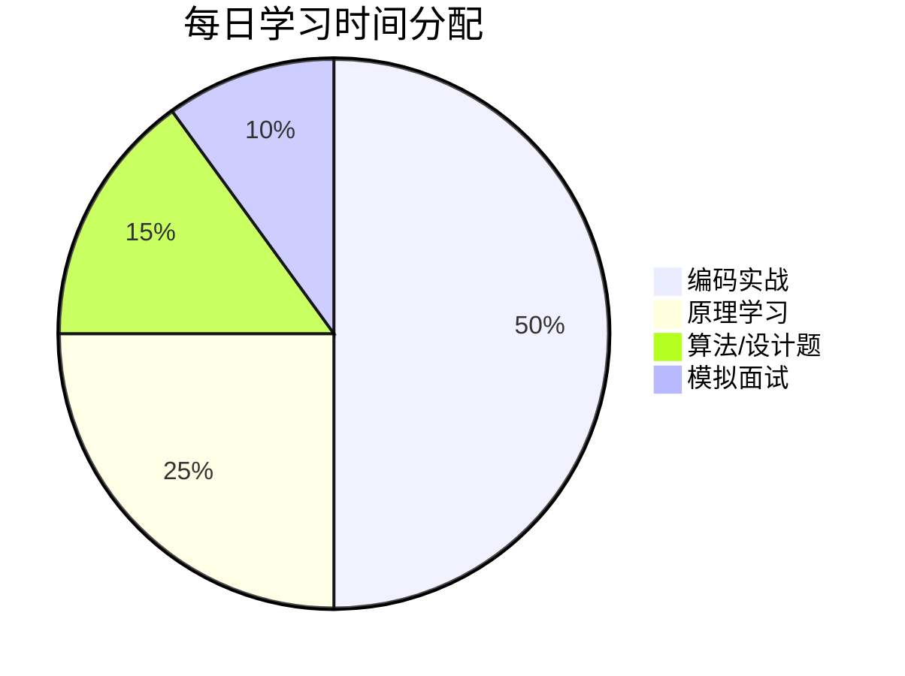

# go学习





## 简介与安装

## 一、为什么学习 Go？

简洁易学: 语法类似 C，但更现代简洁（无分号、类型推断、垃圾回收）。

高性能: 编译为本地机器码，执行效率接近 C/C++。

强大的并发: Goroutine（轻量级线程）和 Channel（通道）是核心，使并发编程简单高效。

丰富的标准库: 网络、文件、加密、测试等一应俱全。

优秀的工具链: go fmt（格式化）、go build（编译）、go test（测试）、go mod（依赖管理）等工具开箱即用。

云原生宠儿: Docker, Kubernetes, Prometheus, Etcd 等核心项目均用 Go 编写。

大厂支持: Google 创造，并被腾讯、字节、阿里、Uber、Twitch 等广泛使用。

## 二、学习步骤与核心内容

🌱###  1. 环境搭建 (5分钟搞定)

```text

* **下载安装:** 前往 [https://go.dev/dl/](https://go.dev/dl/) 下载对应操作系统的安装包。
* **配置环境变量:**
  * `GOROOT`: Go 的安装路径（通常自动设置）。
  * `GOPATH`: 你的工作区路径（存放项目、第三方包，Go 1.11+ 后重要性降低，但仍需设置）。
  * `PATH`: 添加 `$GOROOT/bin`。
* **验证:** 命令行运行 `go version`。
```

```bash
echo 'export GOPATH=$HOME/go-projects' >> ~/.bashrc
echo 'export PATH=$PATH:$GOPATH/bin' >> ~/.bashrc
source ~/.bashrc
```

### 📚 2. 基础语法 (1-2周)

```text

* **程序结构:** `package`, `import`, `func main()`。
* **变量与常量:** `var`, `const`, `:=`（短变量声明）。
* **基本数据类型:** `int`, `float64`, `bool`, `string`, `byte`, `rune`。
* **控制流:** `if/else`, `for`（无 `while`）, `switch`（功能强大），`break/continue`。
* **函数:** 声明、多返回值、命名返回值、变长参数 (`...T`)。
* **指针:** 概念、用法（比 C 简单安全）。
* **复合数据类型:**
  * **数组:** 固定长度，值类型。
  * **切片:** 动态数组，引用类型，**极其重要** (`[]T`, `make`, `append`, `len`, `cap`, 切片操作)。
  * **映射:** 字典/哈希表 (`map[K]V`, `make`, 操作)。
  * **结构体:** `struct` 定义和初始化。
* **方法:** 为类型（包括自定义类型）关联函数 (`func (r Receiver) MethodName(...) (...) { ... }`)。
```

### ⚡ 3. 核心特性深入 (1-2周)

```text

* **接口:** **Go 的灵魂之一！** 理解 `interface` 定义、隐式实现（Duck Typing）、空接口 (`interface{}` / `any`）、类型断言 (`value, ok := var.(Type)`, `switch v := var.(type)`）。
* **错误处理:** `error` 接口类型，`errors.New`, `fmt.Errorf`, 多返回值检查错误 (`if err != nil { ... }`), `panic` 和 `recover`（慎用）。
* **并发编程:** **Go 的杀手锏！**
  * `Goroutine`: 使用 `go` 关键字启动 (`go myFunction()`)。
  * `Channel`: `chan T` 类型，`make(chan T)` / `make(chan T, size)`。核心操作：发送 (`ch <- v`)、接收 (`v := <-ch`)、关闭 (`close(ch)`)。理解无缓冲和有缓冲通道的区别。
  * `select`: 多路复用通道操作。
  * `sync` 包: `WaitGroup` (等待一组 goroutine 完成), `Mutex` (互斥锁), `RWMutex` (读写锁), `Once` (只执行一次), `Cond` (条件变量) - 用于更复杂的同步场景。
  ```

### 📦 4. 标准库与常用包 (持续学习)

```text

* `fmt`: 格式化输入输出。
* `io` / `os`: 文件、I/O 操作。
* `net/http`: **HTTP 客户端和服务器端开发的核心。**
* `encoding/json`: JSON 编解码。
* `strconv`: 字符串与基本类型的转换。
* `time`: 时间日期操作。
* `testing`: 编写单元测试 (`go test`)。
* `regexp`: 正则表达式。
* `sync`: 同步原语 (见并发部分)。
* `context`: **请求上下文管理，用于超时、取消和传递值，在并发和网络编程中至关重要。**
* `database/sql`: 数据库操作的抽象接口 (需配合具体数据库驱动)。
```

### � 5. 依赖管理与模块化 (Go Modules) (重要)

```text

* **理解 `go mod`:** Go 1.11+ 引入的官方依赖管理方案。
* **核心命令:**
  * `go mod init <module_name>`: 初始化模块。
  * `go get <package_path>[@version]`: 添加/升级依赖。
  * `go mod tidy`: 清理未使用依赖，添加缺失依赖。
  * `go mod vendor`: (可选) 创建 vendor 目录。
* 文件 `go.mod` 和 `go.sum` 的作用。
```

### 🧪 6. 测试 (非常重要)

```text

* `testing` 包编写测试函数 (`func TestXxx(t *testing.T)`)。
* `go test -v ./...` 运行测试。
* 表驱动测试 (Table-Driven Tests)。
* 基准测试 (`func BenchmarkXxx(b *testing.B)`), `go test -bench=.`。
* 使用 `httptest` 包测试 HTTP 处理程序。
* 使用 `testify/assert` 等第三方库增强断言。
```

### 🚀 7. 进阶与实践 (持续投入)

text

* **反射 (`reflect` 包):** 高级特性，用于运行时操作类型和值，谨慎使用（如 JSON 库、ORM 框架）。
* **泛型 (Go 1.18+):** 使用 `[T any]` 等语法，提高代码复用性（如编写通用容器、算法）。
* **性能分析与优化:** 使用 `pprof` (`runtime/pprof`, `net/http/pprof`) 进行 CPU、内存分析。
* **Web 框架 (选学):** 了解 Gin, Echo, Fiber 等流行框架（标准库 `net/http` 已足够强大，框架提供路由、中间件等便利）。
* **ORM (选学):** 了解 GORM 等。
* **项目结构与最佳实践:**
  * 了解常见项目布局 (如 `cmd/`, `pkg/`, `internal/`, `api/`, `configs/`, `scripts/` 等目录含义)。
  * 代码组织、命名规范、错误处理策略、日志记录 (`log` 或 `zap`, `logrus` 等)。
  * 编写可测试的代码。
* **构建与部署:** 交叉编译 (`GOOS=linux GOARCH=amd64 go build`), 使用 Docker 容器化。
📚 三、优质学习资源
官方文档 (必读):

<https://go.dev/> - 官网

<https://go.dev/doc/> - 官方文档 (教程、Effective Go、语言规范、包文档)

<https://pkg.go.dev/std> - 标准库包文档 (极其重要，随时查！)

经典书籍:

《The Go Programming Language》 (Alan A. A. Donovan & Brian W. Kernighan): 俗称 "Go 圣经"，全面深入，适合系统学习。

《Go 语言实战》 (William Kennedy 等): 实战性强，涵盖并发、测试、标准库等。

《Go 语言高级编程》 (曹春晖): 深入理解 Go 底层机制（内存管理、调度、GC 等），适合进阶。

在线教程/课程:

Tour of Go: 官方交互式入门教程，快速上手语法。

Go by Example: 通过大量示例学习 Go 特性，清晰直观。

Go 语言编程之旅 (煎鱼): 国人写的优秀开源实战教程。

Effective Go: 官方最佳实践指南，必读！

50 Shades of Go: 常见陷阱和坑点。

各大 MOOC 平台 (Coursera, Udemy, 极客时间等): 搜索 Go 相关课程。

社区与资讯:

GitHub: 阅读优秀开源项目代码 (如 Kubernetes, Docker, Etcd, Prometheus, Gin, GORM 等)。

Reddit (/r/golang): 活跃的 Go 社区。

Gopher China: 国内最大的 Go 技术大会。

博客: 官方博客、知名 Gopher 的个人博客（如 Dave Cheney, Rob Pike, Russ Cox）。

Go 中文网 / Go 语言中文网: 国内社区资源。

开发工具:

编辑器/IDE: VS Code (Go 插件体验极佳), GoLand (功能强大，付费), Vim/Emacs (需配置)。

调试器: Delve (dlv)。
