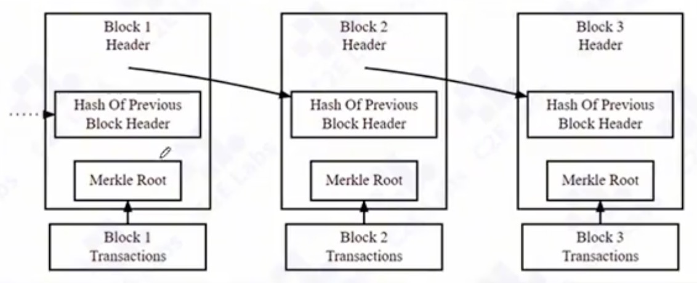
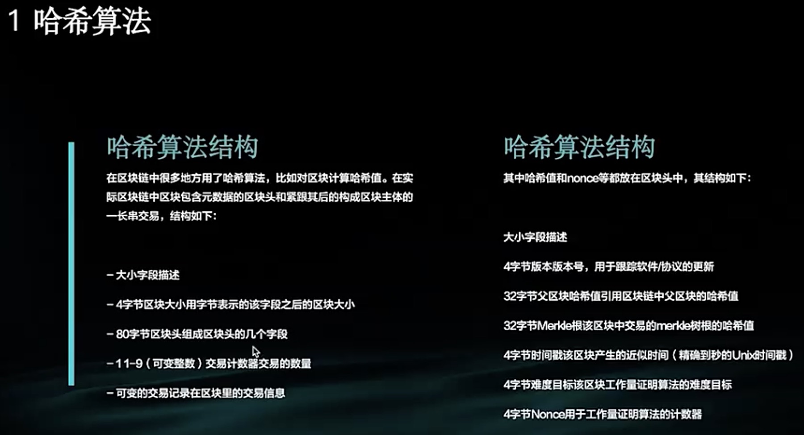
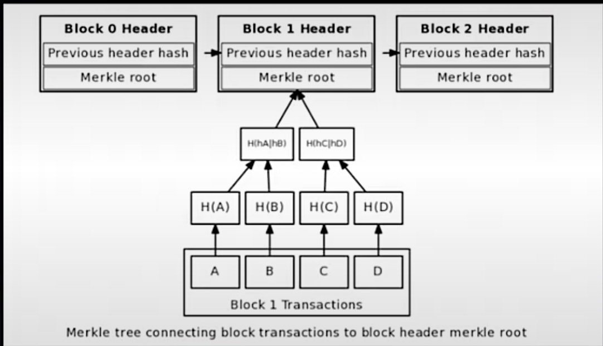
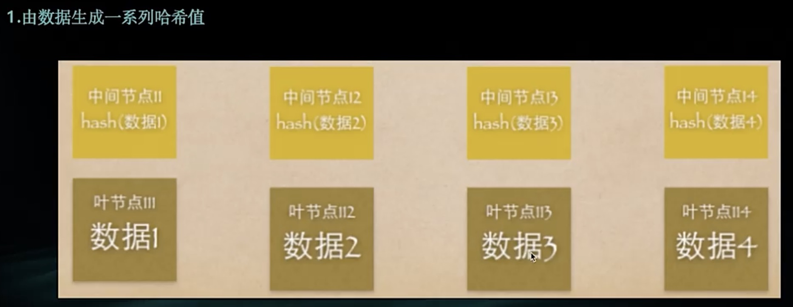
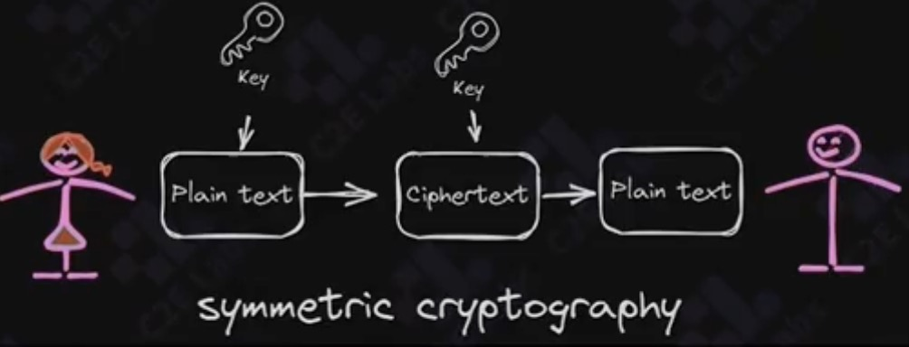
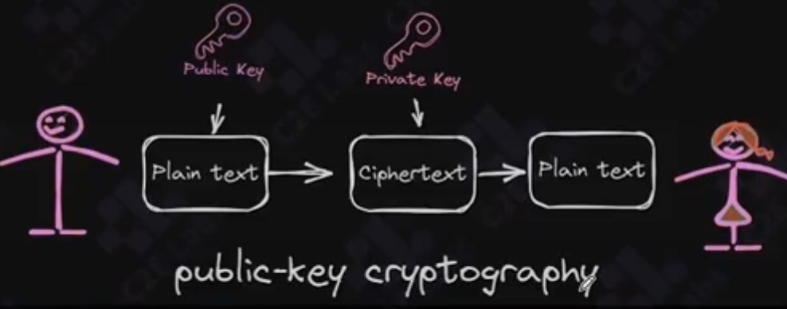
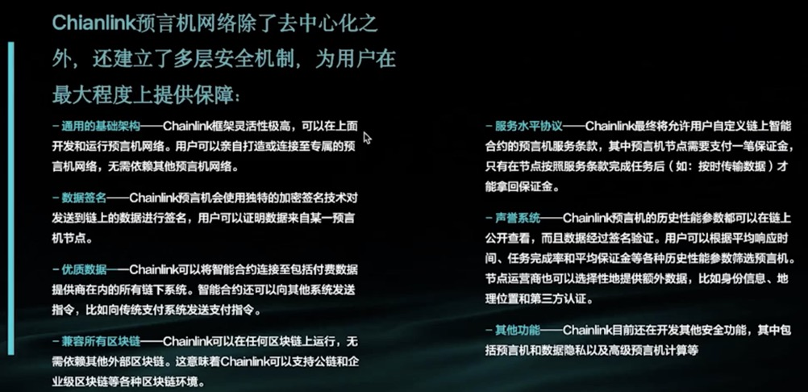

# web3

## 一、web3 与web2 技术栈对比

### web的发展历程

[web](./jpg/WeChat8436bbc424ed392a281ddffa14358e55.jpg)

web3重新定义了餐服分配和经济协作模式

#### 3 Web3.0的项目落地情况

1. 去中心化金融：

>uniswap:最大的去中心化交易所之一，允许用户直接交换加密货币
>compound、
>aave：领先的去中心化借贷平台，用户可以借入或借出加密资产
>makerDAO：稳定币DA的发行者，是DeFi生态系统的重要组成部分

2. 非同质化代币：

>OpenSea：最大的NFT交易市场，支持各种类型的数字收藏品
>Axie Infinity：Axie Infinity是一个NFT游戏，用户可以购买Axie，并使用Axie进行战斗和交易
>Bored Ape Yacht Club:是一个NFT收藏项目，代表了数字身份和社区新形式

3. 去中心化组织

>Compound:去中心化借贷协议，同时也是一个DAO
>Gitcoin:支持开源软件开发的DAO
>Uniswap DAO:管理Uniswap协议

4. 区块链基础设施

>Ethereum：最大的智能合约平台，支持大多数DeFi和NFT项目
>Polkadot：致力于实现跨链互操作性的区块链网络
>Chainlink:去中心化预言机网络，为智能合约提供外部数据

5. 去中心化社交

>Lens Protocol:去中心化社交图谱协议
>Farcaster:去中心化社交网络平台

### web3及Dapp架构

decentralized application

#### web3应用架构

去中心化：无集中式数据库或服务器
区块链：以太坊等区块链作为分布式状态机，由网络中的匿名节点共同维护
智能合约：区块链上的运行的程序，定义了后端逻辑，开源且无法更改
EVM：以太坊虚拟机，智能合约的环境

区块链：ethereum blockchain，以太坊区块链，被认为是“世界计算器”，一个可全局访问的状态机，
对等节点网络维护，状态的更改遵循共识规则的约束；只要是写入了数据，就会被记录，数据不能更新回去

#### 前端代码与区块链的交互

01. 节点交互：通过设置节点或使用第三方节点服务（infura，Alchemy,Quicknode）与区块链交互
02. JSON-RPC：前端与去快乐交互的同一协议
03. 身份验证：通过Metamask进行用户身份验证，签署交易
[交互](./jpg/WeChat5d7d17cf34799c3942f676018b296fcd.jpg)

#### 数据读取

the graph：链下索引解决方案，简化数据查询，前端可直接调用

#### Dapp架构

[dapp架构](./jpg/WeChat0a67d06d62830e7f144757d1dcfb89fd.jpg)

#### L2扩展方案

L2 Scalinng:通过侧链操作，降低成本并提高效率，然后将结果提交到主链

[L2](jpg/WeChat0fc16be89d765bbd0295a51fa7bf35e3.jpg)

### 技术转型 学习安排计划

交易流平台，底层迁移库

go,solidity，

## 二、web3生态应用概览

### 1、Bitcoin 到 Ethereum

1. 比特币BTC-区块链1.0

区块链是一种块链式存储、不可篡改、安全可信的去中心化分布是账本，
结合了分布式存储、点对点传输、共识机制、密码学等技术，通过不断增长的数据块链
记录交易和信息，确保数据的安全和透明。

1.1 比特去中心化与分布式账本
去中心化
无需许可
原生支付
无需信任

1.2 共识机制（算法） proof of work

共识算法的目的
>防止双重支付
>维护数据的一致性
>确保交易的有效性
>促进去中心化

pow(工作量证明)算法

工作量证明机制是比特币网络中确保交易安全性和防止双重弄支付的核心机制。
pow通过要求网络中的参与者完成一定量的计算工作来验证区块，这个过程既保证了区块链的去中心化，又防止了恶意攻击。

1.4 缺陷
扩展难题

1.5 硬分叉
从主链上分独立的链
结果：硬分叉出6种不同的加密货币，比特币现金、比特币黄金

2. 以太坊ETH-区块链2.0

定位：允许任何人在平台上建立和使用去中心化应用（DApps）并具备高度的灵活性和适应性

3. 智能合约

-智能合约是一段代码，包含人们设定的规则，运行在区块链中，确保所有参与者遵守这些规则

-实际应用：智能合约开启了区块链多实际应用场景，如供应链管理、金融合约等

-不可篡改性：结合区块链，智能合约的不可篡改性使其在解决行业痛点方面展现出巨大的潜力

4. 区块链的数据存储机制

**数据存储的本质**
-区块链并不直接存储数据，而是存储数据的标识。每个区块存储上一块的哈希值，形成链式结构
-不可篡改性：因为链的每个区块都依赖于前一个区块的哈希值，篡改任何数据都需要改整个链
**实际数据存储**
-文本、音频、视频、图片等数据任然存储在服务器的硬盘中，但其标识会记录在区块链上，通过不可篡改的链式结构保证数据的真实性和安全性

### 2、应用生态：ICO、NFT到Defi等应用热潮

#### 1.ICO

initial coin offering 首次代币发行

#### 2 NFT

Non-fUNGIBLE Token 非同质化代币
是一种基于区块链的代币，与比特币、以太坊等同质化代币不同，NFT具有独特性，每个NFT都是独一无二的，无法相互替代

2.5 NFT的优缺点
有点：
-稀缺性：NFT通过区块链技术确保每一个代币的独特性和稀缺性
-所有权保障：NFT确保了数字资产的所有权，可以防止盗版和篡改
-创作者收益：创作者可以通过二次销售获得办税收入，直接受益于作品的流通

缺点：
-生态尚不成熟：NFT市场处于早起，存在泡沫和不确定性
-高成本：在以太坊上创建和交易NFT可能涉及高昂的GAS费
-环境影响：NFT的生成和交易依赖区块链，能源消耗大，带来环境负担

#### 3.Defi

Decentralized Finance 去中心化金融

3.1 定义
是一种基于区块链技术的金融体系，通过智能合约提供金融服务，如借贷、交易、支付等，而无需传统金融中介机构

MakerDAOz最早的项目

3.3 原理

智能合约：defi 应用依赖智能合约自动执行金融协议，用户通过智能和约直接参与金融活动

去中心化交易所（DEX）用户可以在DEX上进行中心化代币交易，无需信任你第三方

借贷平台：用户可以在去中心化借贷平台（如Aave，Compound）上借贷资产，抵押加密货币来获取贷款或赚取利息

3.4 应用场景

去中心化借贷
去中心化交易（Uniswap、SushiSwap）,用户可以直接在链上进行代币交易，免去中介费用
稳定币USDT、DAI
流动性挖矿

3.5 优缺点

优点：
-无需中介：Defi通过智能合约消除了对传统金融中介的依赖，降低了成本，提高了效率
-透明性
-开放性：任何人制药有互联网链接和数字钱包，就可以参与DEFI,无需银行账户或者引用审查

缺点：
-智能合约风险：智能合约存在漏洞
-市场波动
-监管不确定

### 3、技术生态：Blockchain(layer1,layer2,Crosschain)

1. layer0：基础建设
2. layer1：传统的区块链都属于这里，提供基础架构，网络拥挤
3. layer2,
针对底层区块链扩容的一种链下解决方案，layer2是一个独立的区块链，但使用第一层的安全性保证
扩容主要思想是将原本layer1的交易放在链下（layer2）执行，并且layer2定期与layer1通信，将layer2的交易批量提交到layer1
3.2 比特币闪电网络
layer2上的一个主要的扩容方式是闪电网络（lightning network）为小额支付场景进行优化，在双方的链下建立一个通道
3.3 rollup
以太坊上主要的layer2扩容方案是rollup，其意思是卷起，核心思想是把由rollup层负责执行交易，然后许多笔交易压缩成一笔交易提交给以太坊
3.3.1 rollup的两种类型

3.3.2 侧链及其他

4. layer3
自定义功能
Crosschain

### 4.Cryptology 区块链中的密码学

#### 1 区块链密码学-加密哈希

>加密哈希的特性：
>>确定性
>>高效性
>>抗碰撞性
>>不可逆性

> 加密哈希在区块链中的应用

>>区块链不可篡改
>>地址生成
>>数字签名

##### 2 默克尔树

又叫哈希树，是一种树的数据结构，由一个根节点、一组中间节点和一组叶节点组成。最下面的叶节点包含存储数据或其哈希值，其上的节点是它的子节点内容的哈希值

2.2 默克尔树生成过程

2.3 默克尔树的特点

一般是二叉树，也可以是多叉树，特点：
树的根节点只取决于数据，和其中的更新顺序无关。换一个更新顺序，甚至从头计算树，并不会改变根节点；

当两个默克尔树的根节点相同时，则意味着代表的数据必然相同，用根节点校验可以大大减少数据的传输量以及计算的复杂度

默克树的一个分支也是默克树，可以作为独立进行校验

当区块链中的数据过多时，可以通过只保留默克树的根节点，删除其下的节点有效的节约存储空间

#### 3 区块链密码学-数字签名

3.1 定义
用于证实某数字内容的完整性和来源

对称加密
指加密和解密使用相同密钥的加密算法。在对称加密中，同一个密钥可以同时信息的加密
和解密，因此也称为单密钥算法或但密钥加密

非对称加密

公钥加密，是一种使用一对不同的密钥进行加密和解密的加密方法。这以对密钥包括一个公钥和一个
私钥。公钥可以公开，而私钥必须保密，反之亦然。非对称加密解决了密钥的分发和管理问题，广泛应用于需要安全
通信的场景中。

数字签名

数字签名（又称公钥数字签名）是只有信息的发送者才能产生的被人无法伪造的一段数字串，这段数字串同时也是对信息的发送者发送信息真实性的一个有效凭证

#### 4 智能合约基本概念

### 5.Oracle 预言机

1. Chainlink
去中心化的预言机网络，将智能合约安全地链接至区块链网络以外的数据和服务。现代经济中的传统系统一旦接入Chainlink预言机，就可以连通最前沿的区块链技术，让商业和社会流程变的更加安全、透明和高效。

2. 区块链的价值
消除对手方的风险

3. 智能合约的痛点
无法再接入链下数据和系统的同时规避对手方风险

4. 预言机问题的解决方案

4.1 chainlink的去中心化网络

将区块链智能合约安全可靠地链接至链下系统。建立独立的预言机网络，网络中的预言机从多个数据源共同获取数据，并将数据聚合，并经过验证的聚合数据传输至智能合约，触发合约的执行，在整个过程中规避了所有中心化分险

4.2 安全机制

4.3 应用场景

去中心化金融DeFi
保险
游戏
传统系统

### 6.Wallet & SmartContract

#### 1 钱包的基本概念

1.1 原理
加密体系：加密算法，加密秘钥，解密密钥
助记词，keystore和密码

1.2 公钥
转账地址，KKAK256HASH的40个字节的字符串

1.3 私钥

1.4 助记词
是私钥的另一种展现形式。

1.5 keystore
对私钥进行加密

1.6 密码
对私钥加密

#### 2 区块链钱包的功能

2.1 钱包
是区块链的入口，拥有包含资产管理与交易、参与项目生态建设、体验DApp应用等丰富的功能，可以满足各式各样的要求

2.2 创建区块链账户
区块链账户的创建过程较为复杂，钱包的存在可以帮助用户简化这些过程。一般创建完账户的过程中，钱吧都会引导用户进行私钥或助记词备份，然后再进行二次验证，以确保用户的备份的私钥或助记词的准确无误。在需要通过支付创建账户的区块链上，钱包一般会帮助用户使用传统支付工具完成支付过程，以降低用户的使用难度

2.4 加密资产的交易
当前钱包支持的加密资产交易主要包括以下三种情况：币币交易、交易所交易、OTC交易。
OTC(over the counter)交易就是在交易所外，由第三方担保，客户点对点交易的交易方式。
在区块链中的OTC，通常指的是场外用户之间法币与加密资产一对一的买卖交易。
当前OTC交易主要以交易所的OTC为主，也有部分钱包接入了提供该服务的第三方渠道商。例如TOkenPocket接入了币买卖的OTC服务，用户使用TP钱包时，可以很方便的将自己手中的加密资产卖出，换成法币，或是使用法币购买加密资产

2.5 参与生态建设
目前部分公链设计中，都激励生态中的用户积极参与公链生态建设。主要的形式有节点投票、公投、staking等，这些都可以通过钱包参与

2.6 体验DApp应用

目前一些大型DApp应用是以第三方独立APP的形式存在，当体验这些APP形式的DApp时，你同样需要钱包作为登录和交易授权的媒介

2.7 领取糖果奖励

糖果指的是区块链上的免费获得的TOKEN.
因为在钱包中可以快速登录去中心化交易所，所以很多用户领取糖果后可直接在交易所中卖出换成ETH，USDT等

2.8 资产增值
钱包天然具有金融属性，当前钱包已经集合了包括狂吃、理财、挖矿、项目投资等多种金融工具与功能，可以满足用户资产增值的需求

#### 3 区块链钱包的常见分类

3.1 用户是否掌握私钥
中心化钱包：用户不持有钱包私钥，私钥由第三方或服务商代保管。中心化钱包优势明显，简单易操作，忘记密码也可以找回，且交易效率很高，可以实时到账。但是在中心化钱包的私钥由平台控制，普通用户无法阻止平台做恶，而平台关闭后存储其中的资产也会消失
去中心化钱包：用户自行持有钱包私钥。如果私钥丢失，去中心化钱包将无法帮助用户回复，资金将永远丢失。但是去中心化的钱包很难被黑客攻击，用户不必担心钱包服务提供商的自我窃取

知名度比较高的几个去中心化钱包：
Coinbase:易用性交易，安全性中等，属于手机、电脑钱包
mToken:易用性交易，安全性中等，属于手机钱包
AToken:易用性一般，安全性较高，属于手机钱包
HyperPay:易用性一般，安全性中等，属于手机、硬件钱包
Jaxx:易用性较难，安全性中等，属于手机、硬件钱包

3.2 钱包是否接触网络
冷钱包：离线钱包，纸钱包、脑钱包、U盘、硬件钱包、智能手表和其他智能存储硬件。Trezor、Keepkey/Ledger/Bitcoin-core/Electrum/MyEtherWallet/Mew/Coldcard/Coldcard
热钱包：通过联网存储钱包，在线钱包，通常以App或网页的形式出现，由第三方或服务商开发完成。热钱包的私钥掌握在第三方或服务商手里
3.3 钱包的去中心化程度
全节点钱包
轻节点钱包
3.4 是否支持多币种
单币种
多币种
全币种

#### 3 智能合约的基本概念smart contract

是一种在区块链上自动执行的程序，他在满足预设条件时自动执行，旨在减少中介、降低成本、提高效率。智能合约的规则和条件直接被写入代码中，一旦部署在区块链上，他就可以自动执行，无法被篡改或停止

3.2 特点
自动化执行
不可篡改性
透明和可验证
安全

3.3 原理

创建和部署：开发人员私用编程语言（如solidity，用于以太坊）编写智能合约，将其部署在区块链上。

条件触发：智能合约会在特定的条件满足时被触发，通常通过区块链网络中的交易来触发

自动执行：合约的逻辑根据预设的条件自动执行，如资产你转移、投票结果计算等

结果记录：合约执行的结果记录在区块链上，所有节点都可以验证，确保数据的准确性和一致性

3.4 应用场景

金融服务
供应链管理
数字身份验证
自动化交易市场

---

### 项目demo目录

escrow 项目名称
artifacts
cache
contracts 合约
docs
ignition
node_modules 包
scripts 部署脚本
test 测试用例
uml
hardchat.config.js
package.json 配置文件
package-lock.json 系统自动生成
readme.md

### 未来进一步需要掌握的内容

1. 合约的常用库
2. 测试库的常用断言
3. 如何编写安全的合约
4. 对复杂业务功能的合约如何进行设计
5. 合约开发有哪些设计模式
6. 合约出现bug怎么办
7. 合约如何进行权限管理

需要补充的技能：智能合约，solidity,邀约怎么交互

2025.05.28
智能合约solidity46节课兑换券<https://appcnpfxxv91921.h5.xiaoeknow.com/random_giftcode?batch_id=7333641&activity_id=ic_8z0egRA4_grL8wbvmrC>

## 第一章 课程导学

### 2 什么是Web3.0

web3.0的特点：

### 3 Web3.0的项目落地情况

1. 去中心化金融：

>uniswap:最大的去中心化交易所之一，允许用户直接交换加密货币
>compound、
>aave：领先的去中心化借贷平台，用户可以借入或借出加密资产
>makerDAO：稳定币DA的发行者，是DeFi生态系统的重要组成部分

2. 非同质化代币：

>OpenSea：最大的NFT交易市场，支持各种类型的数字收藏品
>Axie Infinity：Axie Infinity是一个NFT游戏，用户可以购买Axie，并使用Axie进行战斗和交易
>Bored Ape Yacht Club:是一个NFT收藏项目，代表了数字身份和社区新形式

3. 去中心化组织

>Compound:去中心化借贷协议，同时也是一个DAO
>Gitcoin:支持开源软件开发的DAO
>Uniswap DAO:管理Uniswap协议

4. 区块链基础设施

>Ethereum：最大的智能合约平台，支持大多数DeFi和NFT项目
>Polkadot：致力于实现跨链互操作性的区块链网络
>Chainlink:去中心化预言机网络，为智能合约提供外部数据

5. 去中心化社交

>Lens Protocol:去中心化社交图谱协议
>Farcaster:去中心化社交网络平台

## 第二章 区块链的基础

### 4. 区块链核心概念及原理

#### 4.1 区块链的概念

#### 4.2 不可篡改、透明、去中心化

#### 4.3 区块链系统的核心概念

##### 4.3.1区块链结构

区块链是由一系列按照时间顺序排列的区块组成的，每个区块都包含两部分：区块头（header）和区块体（body）

> 区块链头部：
存储了区块的元信息，用来对区块内容进行标识、校验和说明等。
>>previous Block Address:前序节点的地址
>>timestamp:当前链创建的时间
>>nonce:随机数，用来对区块内容进行标识、校验和说明等。不同的链这个值不一样
>>Merkle Root:默克尔树根节点，用来对区块内容进行标识、校验和说明等。
> 区块体：包含了该区块打包的所有

##### 4.3.2交易信息

Merkle Tree:
Merkle树是区块链技术中一个重要的数据结构，它能够有效地验证大量数据的完整性

##### 4.3.3 区块链密码学

### 5. 初识btc和eth

#### 1 比特币的诞生

bitcoin a peer-to-peer electronnic cash system

##### 1.1 点对点数字先进系统

去中心化
密码学
pow激励
区块链技术

#### 2 以太坊的诞生

vitalik buterin 2013年提出想法
2015年7月以太坊主网诞生

##### BTC

第一个也是最知名的加密货币，由中本聪在2008年提出，2009年正式发布

去中心化：不受任何中央机构的控制
有限供应：总量限制在2100万个
区块链技术：使用pow共识机制
主要用途：价值存储和交易媒介

##### ETH

智能合约平台：支持去中心化应用（DApps）开发
可编程性：使用solidity等编程语言
共识机制：从POW过渡到POW+POS（权益证明）
主要用途：DeFi、NFT、代币发行

BTC vs ETH

|特性|比特币|以太坊|
|---|---|---
|主要目标|数字黄金，|去中心化应用平台|
|发行时间|2009|2015|
|共识机制|工作量证明（pow）|权益证明（PoS,自2022年起）|
|智能合约|有限支持|全面支持|
|交易速度|较慢（12min/区块）|较快(约12-14秒/区块)|
|通胀模型|固定供应，每4年减半|动态供应，通缩趋势|

### 6. DAPP和智能合约

### 7. 区块链钱包

## 第三章 项目1 solidity 特性
