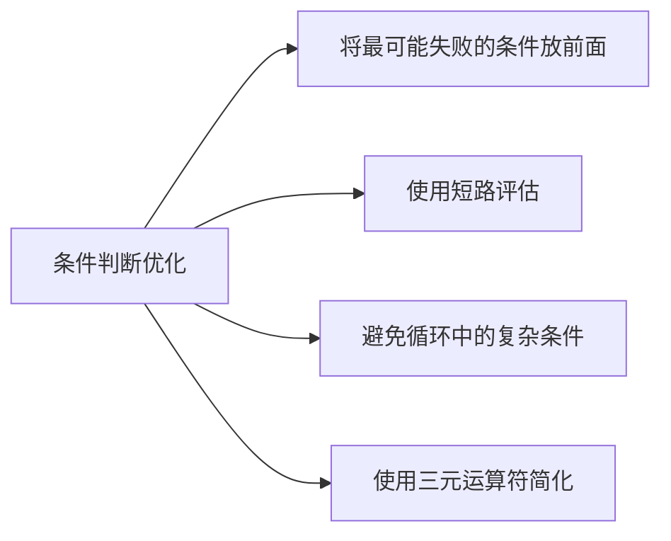

# 条件判断

在 Solidity 中，条件判断是实现智能合约逻辑的核心机制。

## 一、基础条件语句

### 1. if-else 结构

```solidity
function checkNumber(uint num) public pure returns (string memory) {
    if (num > 100) {
        return "Greater than 100";
    } else if (num > 50) {
        return "Greater than 50";
    } else {
        return "50 or less";
    }
}
```

### 2. 三元运算符

```solidity
function getFee(bool isMember) public pure returns (uint) {
    // 条件 ? 真值表达式 : 假值表达式
    return isMember ? 100 : 500; // 会员100，非会员500
}
```

## 二、错误处理条件语句

require，revert,assert这三个语句在solidity中扮演了至关重要的角色，尤其是在输入验证、状态检查、错误处理和合约安全性的方面。他们都用于在条件不满足时回滚整个交易（撤销所有状态更改，消耗的Gas不退，但剩余的Gas会退还给调用者）

### 1. require - 前置条件检查

```solidity
require(condition[, "error message"])
```

- 用途：主要用于验证输入参数或执行前的前置条件。例如检查用户输入的地址是否有效、用户余额是否足够、是否达到某个状态、调用者是否具有权限等。它是防御性编程的第一道防线。

- 行为：
- - 如果condition 为true，则程序正常执行
- - 如果condition 为false，则立即回滚交易
- - 可以提供一个可选的string 类型错误信息，帮助开发者或者用户理解失败原因（消耗额外Gas）

- Gas：当前条件是吧时，会退还剩余的Gas(减去执行到失败点所消耗的Gas)。使用错误消息会消耗更多的Gas。
- 最佳实践：将require放在函数开关或者关键操作之前，尽早验证输入和状态。

- 示例：

```solidity
function withdraw(uint256 _amount) public {
    // 前置条件1: 检查提现金额必须大于0
    require(_amount > 0, "Withdrawal amount must be greater than 0");
    // 前置条件2: 检查调用者余额是否足够
    require(balances[msg.sender] >= _amount, "Insufficient balance");

    // 如果通过检查，执行提现逻辑...
    balances[msg.sender] -= _amount;
    payable(msg.sender).transfer(_amount);
}
```

### 2. revert - 自定义错误回滚

revert([string memory reason])

- 用途: 提供了一种更灵活的、在代码逻辑中间无条件回滚交易的方式。通常与 if 语句结合使用，或者在复杂逻辑中遇到无法继续的情况时手动触发回滚。比 require(condition, "message") 更灵活，因为 revert 可以在任何地方调用，不局限于条件表达式。

- 行为: 直接回滚交易。

- Gas: 与 require 失败时类似，退还剩余 Gas。提供 reason 字符串也会消耗额外 Gas。

- 最佳实践: 当错误条件比较复杂（需要 if 块处理）或者需要在函数体中间回滚时使用。自 Solidity 0.8.4 起，revert 支持自定义错误类型 revert CustomError(arg1, arg2);，这比字符串错误消息更省 Gas 且能携带结构化数据。

```solidity
function complexOperation(uint256 _param) public {
    // ...一些逻辑...

    // 在中间某个复杂的检查点失败
    if (!someComplexCondition(_param)) {
        revert("Complex condition not met");
        // 或者使用自定义错误 (更推荐, 更省Gas)
        // revert ComplexConditionNotMet(_param, currentState);
    }

    // ...继续执行...
}

// 自定义错误类型 (定义在合约内或外部)
error ComplexConditionNotMet(uint256 providedParam, uint256 currentState);
```

### 3. assert - 内部一致性检查

assert(bool condition)

- 用途: 主要用于检查合约内部的“不可能”情况、不变量和严重的编程错误。它验证的是那些在正确编写的合约逻辑中永远不应该为 false 的条件。例如，检查算术运算后余额不能为负（使用了 SafeMath 后理论上不可能）、状态机处于非法状态等。

- 行为:

- - 如果 condition 为 true，程序继续执行。

- - 如果 condition 为 false，则立即回滚交易。这表示合约存在严重逻辑错误。

- Gas: 当条件失败时，不退还任何 Gas。所有提供的 Gas 都会被消耗掉。这是为了强调 assert 失败代表的是合约本身的致命错误，而不是外部输入或临时状态的问题。

- 最佳实践: 用于保护那些理论上永不该发生的状态。编译器有时会使用 assert 来检查某些内置规则（如数组下标越界、除以零 - 在 Solidity >=0.8.0 中除以零会导致 Panic 异常，其底层也类似 assert 失败）。谨慎使用，通常比 require 少得多。

```solidity
function transfer(address _to, uint256_amount) public {
    uint256 initialBalance = balances[msg.sender] + balances[_to];

    // 执行转账逻辑...
    balances[msg.sender] -= _amount;
    balances[_to] += _amount;

    // 后置条件/不变量检查: 总余额应该保持不变 (不可能为假)
    assert(balances[msg.sender] + balances[_to] == initialBalance);
}
```

require vs assert vs revert 总结表

|特性 |require(condition [, "message"]) | revert(["message"])/revert CustomError(...)| assert(condition)|
|----|----|-----|-----|
|主要用途|输入验证&前置条件|灵活的错误处理&复杂条件回滚|内部不变量检查&验证错误逻辑|
|条件检查|必须显式提供条件（condition）|无内置条件，通常与if一起用|必须显式提供条件（condition）|
|触发时机|条件失败时（false）|显式调用时|条件失败时（false）|
|错误消息|支持可选字符串消息|支持可选字符串消息或者更优的自定义错误|不支持自定义消息（编译器生成Panic）|
|失败Gas|退还剩余Gas|退还剩余Gas|消耗所有Gas(不退)|
|错误类型|Error(string)|Error(string)或CustomError（...）|Panic（uint256）特定错误码|
|使用场景|参数检查、权限、余额、状态有效性等|复杂条件失败、自定义错误处理|算数溢出（旧版）、不变量破坏、永远不改为条件|

## 三、三元运算符 (Ternary Operator)

这是一种简洁的单行条件表达式。

语法: condition ? expressionIfTrue : expressionIfFalse

用途: 根据 condition 的结果，选择并返回两个表达式中的一个的值。主要用于赋值或返回值。

注意: 两个分支的表达式类型必须兼容（能够隐式转换为同一个类型）。

## 四、重要注意事项和最佳实践

### Gas 消耗

 条件判断本身消耗 Gas 很少。但：

- require/revert 失败会回滚交易并退还剩余 Gas（消息字符串消耗额外 Gas）。

- assert 失败会消耗所有 Gas。

- 复杂的条件表达式（尤其是涉及大量存储读取或外部调用）会消耗更多 Gas。优化条件逻辑是 Gas 优化的重要方面。

### 短路求值 (Short-Circuiting): Solidity 的逻辑运算符 && 和 || 使用短路求值

- 对于 A && B：如果 A 为 false，则不会计算 B。

- 对于 A || B：如果 A 为 true，则不会计算 B。

- 利用这个特性，可以将检查成本低或更可能失败的条件放在前面，以节省 Gas（避免执行不必要的昂贵检查）。

### 安全性是首要目标

在智能合约中，条件判断（尤其是 require 和 revert）是保障安全性的基石

- 仔细检查所有外部输入。

- 遵循 Checks-Effects-Interactions 模式：先进行所有检查（Checks），然后更新合约状态（Effects），最后再与其他合约交互（Interactions）。这有助于防止重入攻击。

- 使用自定义错误 (Custom Errors): 在 Solidity >=0.8.4 中，优先使用 revert CustomError(...); 代替 require(condition, "message") 或 revert("message")，因为它显著节省 Gas 并且能传递结构化错误信息。

### 避免状态修改中的复杂条件

在状态变量赋值等关键操作周围，保持条件清晰简洁，避免引入难以察觉的逻辑错误

### 0 值的处理

Solidity 没有 null 或 undefined。地址 address(0) 常被用作无效地址。数字 0 是有效值。在条件判断中要明确区分 0 是否代表“无效”或“未设置”。

### 时间戳依赖 (block.timestamp)

使用 block.timestamp 做条件（如 require(block.timestamp > deadline)）时，要知道矿工可以在一定范围内（约 15 秒）操纵它。不要依赖它进行高精度或高价值的关键判定

### Gas优化总结



## 关键要点总结

### 条件判断类型

基础：if/else、三元运算符

错误处理：require、revert、assert

安全模式：

遵循 Checks-Effects-Interactions 顺序

使用 0.8.x 内置溢出保护

防止重入攻击

优化策略：

将最可能失败的条件放在前面

使用短路评估优化复杂条件

避免循环中的冗余条件检查

高级应用：

状态机模式管理状态转换

基于时间的条件控制

权限控制修饰器
