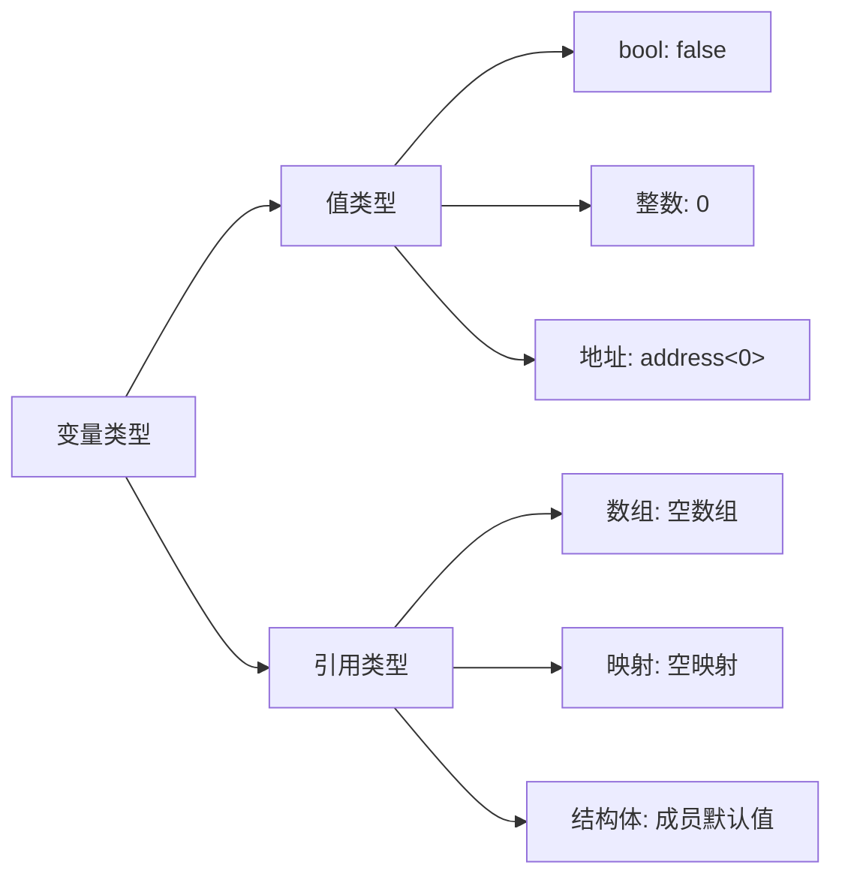
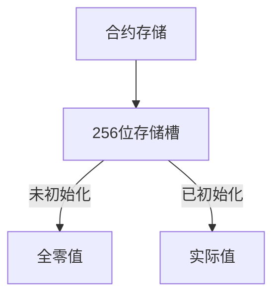

# solidity中的默认值

在Solidity中，所有变量在声明后都有默认值。这是由EVM的设计决定的，确保状态变量和局部变量在没有显式初始化时都有一个确定的值，避免未定义行为。下面详细解析Solidity中的默认值规则：

## 一、核心默认值规则



## 二、值类型默认值详解

### 1. `bool`布尔类型

```solidity
bool public defaultBool; // 默认值: false
```

### 2. 整数类型

- **`uint`** 和 **`int`** 所有变体（如`uint8`, `uint256`, `int16`等）: `0`

```solidity
int public defaultInt;      // 默认值: 0
uint public defaultUint;    // 默认值: 0
int8 public defaultInt8;    // 默认值: 0
uint256 public defaultUint256; // 默认值: 0
```

### 3. `address`地址类型

```solidity
address public defaultAddress; // 默认值: 0x0000000000000000000000000000000000000000
address payable public defaultPayable; // 同样为全零地址
```

### 4.字节类型

```solidity
bytes1 public defaultBytes1; // 默认值: 0x00
bytes32 public defaultBytes32; // 默认值: 0x0000...00 (32字节全零)
```

### 5. 枚举类型 (enum)

```solidity
enum Status { Pending, Approved, Rejected }
Status public defaultStatus; // 默认值: Status.Pending (第一个元素)
```

## 三、引用类型默认值详解

### 1. 固定大小数组

```solidity
uint[5] public fixedArray;
// 默认值: [0, 0, 0, 0, 0]
```

### 2. 动态大小数组

```solidity
uint[] public dynamicArray;
// 默认值: 空数组 (length = 0)
```

### 3. 映射 (mapping)

```solidity
mapping(address => uint) public balances;
// 默认值: "空映射" - 任何未设置的键返回值类型的默认值
// 例如: balances[0x123...] 返回 0
```

### 4. 结构体 (struct)

```solidity
struct User {
    address wallet;
    uint balance;
    bool isActive;
}

User public defaultUser;
/*默认值:
{
    wallet: address(0),
    balance: 0,
    isActive: false
}
*/
```

### 5. 字符串 (string)

```solidity
string public defaultString; // 默认值: 空字符串 ""
```

## 四、特殊类型默认值

### 1. 函数类型

- **`function`**（函数类型）:

- 内部函数（`internal`）: 默认指向合约中的第一个函数（实际上不可用，通常需要显式初始化）

- 外部函数（`external`）: 由零地址和函数选择器0组成，即`address(0)`和`bytes4(0)`

```solidity
function() external public defaultFunction;
// 默认值: 指向空函数 (调用会失败)
```

### 2. 合约类型

```solidity
MyContract public defaultContract;
// 默认值: 零地址合约 (address(0))
```

### 3. 字节数组 (bytes)

```solidity
bytes public dynamicBytes; // 默认值: 空字节数组 (0x)
```

## 五、默认值的底层原理

### 1. EVM 存储机制



- 关键概念：EVM 使用稀疏存储，未显式设置的存储位置默认为全零

- Gas 影响：第一次写入存储槽消耗 22,100 Gas，后续修改消耗 5,000 Gas

### 2. 内存 (memory) 与存储 (storage) 差异

|特性 |存储 (storage)| 内存 (memory)|
|-----|-----|-----|
默认值 全零 未定义
初始化 自动初始化 必须显式初始化
生命周期 永久 函数执行期间
Gas 成本 高 低

```solidity
function memoryExample() public pure {

    uint memoryVar; // ⚠️ 危险：未初始化，值未定义！
    // 正确做法：
    uint initialized = 0; // 必须显式初始化
}
```

## 六、默认值的安全风险

### 1. 未初始化状态风险

```solidity
contract PaymentContract {
    address public payee; // 默认 address(0)

    function withdraw() public {
        // 如果忘记设置payee，资金会发送到零地址(永久锁定)
        payable(payee).transfer(address(this).balance);
    }
}
解决方案：

```solidity
constructor(address _payee) {
    require(_payee != address(0), "Invalid payee");
    payee = _payee;
}
```

### 2. 整数默认值风险

```solidity
mapping(address => uint) public balances;

function transfer(address to, uint amount) public {
    // 如果发送方余额为0（默认值），检查会通过！
    require(balances[msg.sender] >= amount, "Insufficient balance");

    balances[msg.sender] -= amount;
    balances[to] += amount; // 接收方余额从0开始
}
```

解决方案：

```solidity
// 使用SafeMath或0.8.x内置检查
require(balances[msg.sender] >= amount && amount > 0, "Invalid amount");
```

### 3. 结构体默认值风险

```solidity
struct BankAccount {
    bool isActive; // 默认false
    uint balance;
}

mapping(address => BankAccount) public accounts;

function withdraw(uint amount) public {
    BankAccount storage acc = accounts[msg.sender];
    // 新账户isActive=false，但检查不会失败！
    require(acc.isActive, "Account inactive");
    require(acc.balance >= amount, "Insufficient balance");

    acc.balance -= amount;
    payable(msg.sender).transfer(amount);
}
```

解决方案：

```solidity
function openAccount() public {
    require(!accounts[msg.sender].isActive, "Account exists");
    accounts[msg.sender] = BankAccount(true, 0);
}
```

## 七、默认值的最佳实践

### 1. 显式初始化原则

```solidity
// 不推荐
uint public totalSupply;

// 推荐
uint public totalSupply = 0; // 显式初始化
```

### 2. 构造函数初始化

```solidity
contract SafeContract {
    address public owner;
    uint public creationTimestamp;

    constructor() {
        owner = msg.sender; // 覆盖默认值address(0)
        creationTimestamp = block.timestamp; // 覆盖默认值0
    }
}
```

### 3. 使用不可变量 (immutable)

```solidity
contract ImmutableExample {
    address public immutable owner;
    uint public immutable maxSupply = 1000000;

    constructor() {
        owner = msg.sender; // 构造函数中设置一次
    }
}
```

### 4. 默认值检查模式

```solidity
modifier notDefaultAddress(address addr) {
    require(addr != address(0), "Address cannot be zero");
    _;
}

function setBeneficiary(address beneficiary)
    external
    notDefaultAddress(beneficiary)
{
    // ...
}
```

## 八、默认值测试方法

### 1. Remix IDE 测试

```javascript
// 在Remix控制台测试
await contract.defaultAddress()
// 返回: '0x0000000000000000000000000000000000000000'

await contract.defaultUint()
// 返回: BigNumber { _hex: '0x00',_isBigNumber: true }
```

### 2. Hardhat 测试用例

```javascript
describe("Default Values", function () {
  it("Should return default values", async function () {
    const Contract = await ethers.getContractFactory("DefaultValues");
    const contract = await Contract.deploy();

    expect(await contract.defaultBool()).to.equal(false);
    expect(await contract.defaultAddress()).to.equal(ethers.constants.AddressZero);
    expect(await contract.defaultUint()).to.equal(0);

    // 测试动态数组默认长度
    const arrayLength = await contract.getDynamicArrayLength();
    expect(arrayLength).to.equal(0);
  });
});
```

## 九、高级应用场景

### 1. 利用默认值优化 Gas

```solidity
contract GasOptimization {
    struct Account {
        uint balance;
        uint lastUpdate;
    }

    mapping(address => Account) public accounts;

    function resetAccount(address user) public {
        // 删除操作会将状态重置为默认值
        delete accounts[user];
        // 比手动设置更节省Gas:
        // accounts[user] = Account(0, 0);
    }
}
```

### 2. 代理合约中的存储槽

```solidity
contract Proxy {
    address implementation;

    constructor(address _impl) {
        implementation =_impl;
    }

    fallback() external payable {
        // 利用默认存储槽保留机制
        address impl = implementation;
        assembly {
            // ...
        }
    }
}
```

### 3. 默认值在工厂模式中的应用

```solidity
contract UserFactory {
    struct User {
        uint id;
        string name;
    }

    User[] public users;

    function createUser(string memory name) public {
        // 自动获得id = 数组索引
        users.push(User({
            id: users.length, // 默认从0开始
            name: name
        }));
    }
}
```

## 十、总结与关键点

### 默认值规则

所有值类型：0/false/空地址

引用类型：空数组/空映射/空结构体

枚举：第一个元素

### 安全第一

永远不要假设变量已初始化

关键状态在构造函数中显式设置

对地址进行零地址检查

### Gas 优化

使用 delete 重置状态变量

利用默认值减少初始写入

优先使用内存变量进行计算

### 最佳实践

```solidity
// 安全初始化模板
contract SafeTemplate {
    address public immutable owner;
    uint public totalSupply = 0; // 显式初始化
    mapping(address => uint) public balances;

    constructor() {
        owner = msg.sender; // 覆盖默认值
    }
    
    function safeTransfer(address to, uint amount) public {
        require(to != address(0), "Invalid recipient"); // 零地址检查
        require(balances[msg.sender] >= amount && amount > 0, "Invalid amount");
        
        balances[msg.sender] -= amount;
        balances[to] += amount; // 依赖默认值初始化
    }
}
```

### 测试准则

编写测试验证所有状态变量的默认值

检查边界条件（如零地址、零值传输）

使用静态分析工具检测未初始化变量

----

### 5. 关键注意事项

1. **状态变量自动初始化**：状态变量在合约创建时自动初始化为默认值。

2. **局部变量必须手动初始化**：在函数内的局部变量（存储在memory或栈上）必须显式初始化，否则编译器会报错。

3. **映射的默认行为**：访问映射中不存在的键不会抛出错误，而是返回值类型的默认值。

4. **结构体的默认值**：当结构体作为状态变量时，其所有成员被初始化为默认值；在函数内作为局部变量（storage或memory）时，必须显式初始化。

5. **函数类型**：默认的函数变量（内部或外部）指向无效的函数，调用会导致revert。

### 6. 安全考虑

- **未初始化局部变量**：Solidity编译器会强制要求初始化局部变量，避免未定义行为。

- **映射的默认值陷阱**：不要依赖映射返回0来表示键不存在，因为0可能是有效值。如果需要区分，可以使用额外的状态变量（如`mapping(address => bool) public exists`）或考虑使用结构体包装（包含一个`exists`标志）。

- **结构体初始化**：在函数内创建结构体实例时，必须初始化所有字段，否则会编译错误。

### 7. 最佳实践

- 显式初始化：虽然状态变量有默认值，但显式初始化可提高代码可读性。

- 避免依赖默认值：在关键逻辑中，显式设置值，避免因默认值导致逻辑错误。

- 使用构造函数初始化：在构造函数中设置初始状态，特别是对于复杂的引用类型。

### 8. 测试默认值

在Remix中部署上述合约，并调用获取函数，观察返回的默认值。例如：

- `defaultBool` 返回 `false`

- `defaultAddress` 返回 `0x0000000000000000000000000000000000000000`

- `getBalance` 传入任意地址返回0

理解Solidity的默认值机制对于编写安全、可靠的智能合约至关重要，尤其是在处理状态变量和映射时

----
