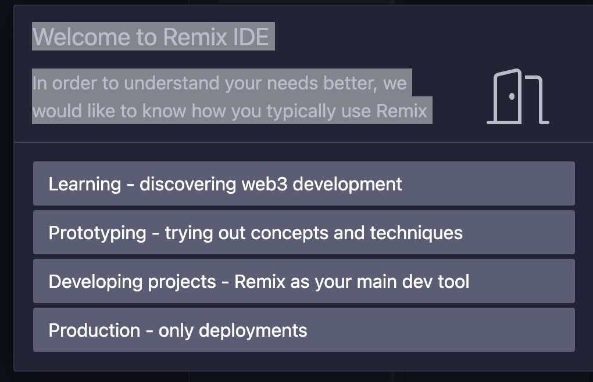
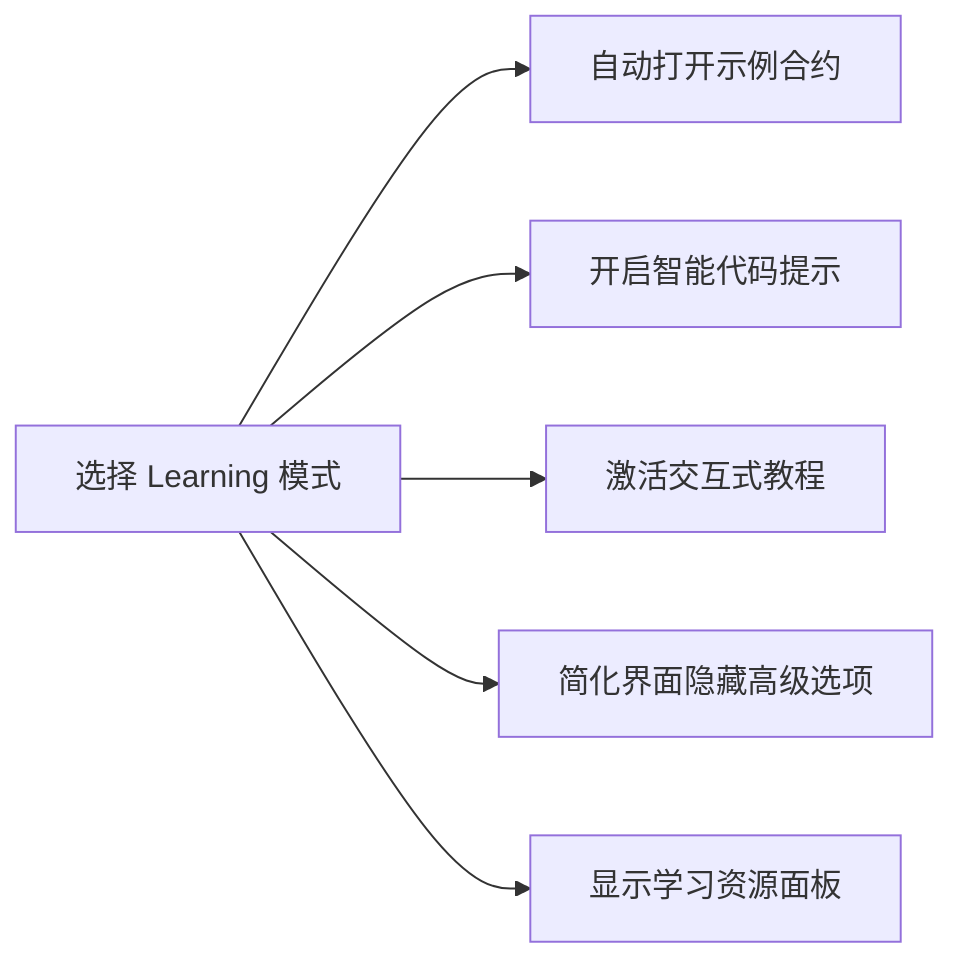
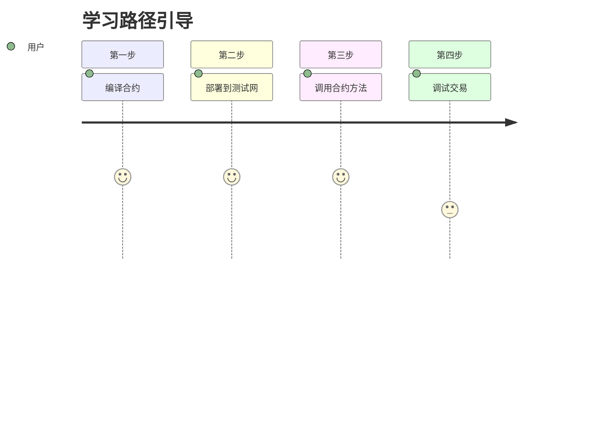
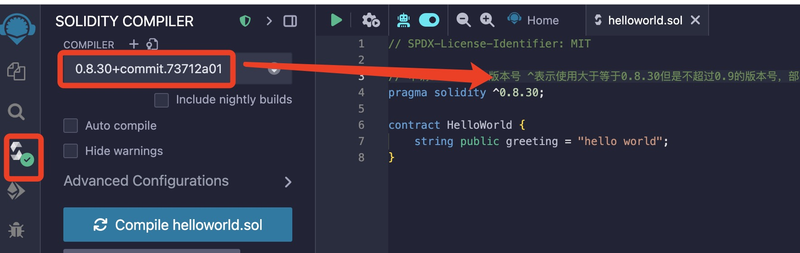
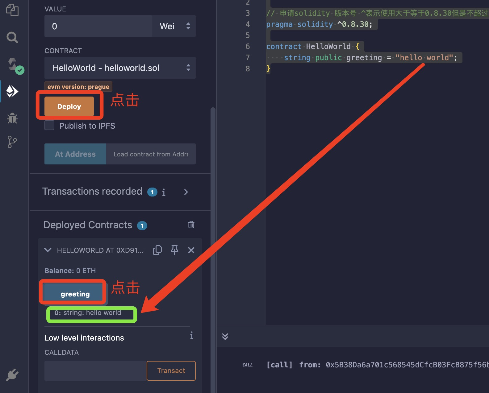
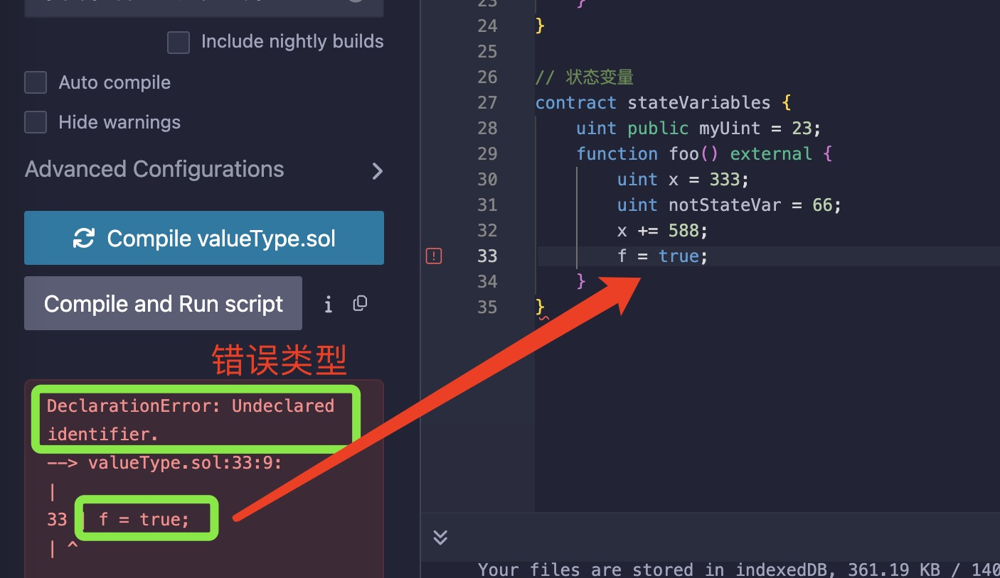
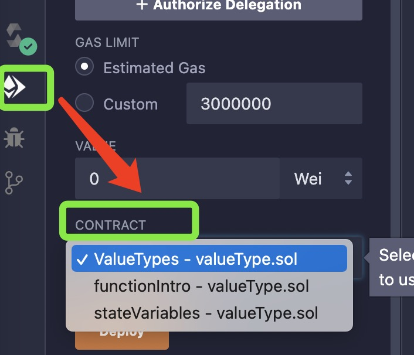

# solidity 基础

## 入门

使用Remix IDE：在浏览器中直接编写、部署和测试合约

网址：<https://remix.ethereum.org/>



这个弹窗是 Remix IDE 的用户场景调研，目的是根据您的使用目的提供更优化的界面配置。以下是每个选项的详细解释和选择建议：
选项深度解析

|选项 |适用人群| Remix 行为 |推荐指数|
|-----|------|------------|------|
|learning - discovering web3 development(学习Web3开发)|Solidity初学者 区块链入门学习者|• 自动加载教学合约 • 开启代码提示和错误检查 • 显示交互式教程• 简化界面| ⭐⭐⭐⭐⭐ 最适合|
|prototyping - trying out concepts(原型设计/概念验证)| 有经验的开发者 测试新想法的工程师| • 提供快速测试模板 • 优化部署流程 • 开启调试工具 • 保留高级功能| ⭐⭐⭐⭐|
|developing projects - main dev tool(项目开发/主力工具)| 专业合约开发者 团队协作项目|• 激活完整插件系统• 连接本地开发环境• 开启版本控制集成• 显示专业调试面板 |⭐⭐⭐|
|production - only deployments(生产环境部署) |运维工程师只需部署合约 |• 隐藏开发工具• 突出部署面板• 简化界面• 默认连接主网| ⭐⭐|

✅ 最佳选择建议
选择 → learning - discovering web3 development
这是最符合您当前学习Solidity需求的选项，选择后将获得：



各模式功能对比

|功能| Learning模式| Prototyping模式| Project模式| Production模式|
|---|--------|-------|-----|-----|
|示例合约| ✅ 自动加载| ⚠️ 手动选择 |❌ 不加载 |❌ 不加载|
|代码提示| ✅ 加强版| ✅ 标准| ✅ 标准| ❌ 关闭|
|实时错误检查| ✅ 详细提示| ✅ 开启| ✅ 开启| ⚠️ 仅语法|
|交互教程| ✅ 显示| ❌ 隐藏| ❌ 隐藏| ❌ 隐藏|
|测试网部署| ✅ 一键部署| ✅ 简化流程| ✅ 完整流程| ❌ 不提供|
|主网部署| ❌ 禁用| ⚠️ 警告提示| ✅ 完整流程| ✅ 直接打开|
|调试工具| ⚠️ 基础版| ✅ 完整| ✅ 高级| ❌ 隐藏|
|插件系统| ⚠️ 限教学插件| ✅ 部分开启| ✅ 全功能| ❌ 关闭|

💡 为什么强烈推荐 Learning 模式？
1、教学合约自动加载

提供 1_Storage.sol, 2_Owner.sol 等经典教学合约

每个合约都有详细的代码注释
2、交互式学习引导



3、安全防护机制

禁止主网部署操作

高风险操作需要二次确认

自动检测常见安全漏洞

4、学习资源整合

右侧面板显示Solidity文档

错误提示附带学习链接

集成ETH官方学习资源
⚠️ 注意事项
选择后可随时更改：通过左下角设置齿轮 > Manage Profile 修改

所有核心功能都可用：只是界面布局和默认配置不同

建议开启额外功能：

```solidity
// 在Learning模式下建议手动激活

- 文件管理器 (File Explorers)
- Solidity编译器 (Solidity Compiler)
- 部署与交互 (Deploy & Run Transactions)
- 调试器 (Debugger)
```

选择 learning 模式后，您将获得最友好的学习环境，Remix 会像导师一样引导您完成每个学习步骤，是快速掌握 Solidity 开发的最佳起点！

选择完成之后就可以开启我们的第一个hello world 代码了:

```solidity
// SPDX-License-Identifier: MIT

// 申请solidity 版本号 ^表示使用大于等于0.8.30但是不超过0.9的版本号，部署主网的时候需要使用固定版本号
pragma solidity ^0.8.30;

contract HelloWorld {
    string public greeting = "hello world";
}
```



部署代码：


点击相应的按钮，就可以看到定义的内容

## 数据类型详解

solidity的数据类型系统既包含传统编程语言的常见类型，也有区块链特有的类型。

### 一、values值类型（直接存储值）

1. bool 布尔型

```solidity
bool public isActive = ture
bool public isCompleted = false
function toggle() public {
    isActive = !isActive
}
```

2. 整型 （int/uint）

```solidity
// 无符号整型（非负）
uint8 public smallValue = 255;  // 0到255
uint256 public largeValue = 2**256 - 1; 0到2^256-1

// 有符号整数
int8 public negative = -18; // -128到127
int public standardInt = -1; // 等同于int256

// 使用SafeMath 防止溢出（solidity 0.8已内置）
function safeAdd(uint a, uint b) public pure returns(uint){
    return a + b;
}
```

3. 地址类型（address）

```solidity
address public user = 0x5B38Da6a701c568545dCfcB03FcB875f56beddC4;
address payable public payableAddress = payable(user); // 可接收ETH地址

// 地址属性

function getBalance() public view returns(uint){
    return payableAddress.balance;  // 获取ETH余额
}
```

4. 固定大小字节数组（bytes1-bytes32）

```solidity
bytes1 public a = hex"61"; 十六进制表示，相当于a
bytes4 public selector = bytes4(keccak256("transfer(address,uint256)"));
bytes32 public hash = keccak256(abi.encodePacked("Hello World"));
```

5. 枚举（enum）

```solidity
enum OrderStatus { Created, Paid, Shipped, Completed}

OrderStatus public status = OrderStatus.Created;

function shipOrder() public {
    require(status == OrderStatus.Paid, "Not paid yet");
    status = OrderStatus.Shipped;
}
```

### 二、引用类型（存储数据位置）

1. 数组（Array）

```solidity
// 存储数组
uint[] public dynamicArray; // 动态数组
uint[5] public fixedArray; // 固定数组

// 内存数组
function processArray(uint[] memory input) public pure returns(uint[] memory){
    uint[] memory output = new uint[](input.length);
    for (uint i = 0; i < input.length; i++) {
        output[i] = input[i] *2;
    }
    return output;
}
```

2. 结构体（struct）

```solidity
struct User{
    address wallet;
    string name;
    uint256 balance;
    bool isActive;
}

User public currentUser;


function createUser(string memeory _name) public {
    currentUser = User({
        wallet:msg.sender,
        name:_name,
        balance:0,
        isActive:true
    });
}
```

3. 映射（Mapplinng）

```solidity
mapping(address => uint) public balances;
mapping(uint => string) public idToName;

function register(string memory name) public{
    balances[msg.sender] = 100; //初始余额
    idToName[1] = name;
}
```

### 三、特殊类型

1. 字符串（string）

```solidity
string public gerrting = "hello world";
function concatenate(string memory a, string memory b) public pure returns(string memory){
    return string(abi.encodePacked(a,b))
}
function toBytes(string memory str) public pure returns (bytes memory){
    return bytes(str); // 字符串转字节数组
}
```

2. 动态字节数组（bytes）

```solidity
bytes public dynamicBytes;

function setBytes() public{
    dynamicBytes = "abc";
    dynamicBytes.push('d'); // 添加新字节
}
```

### 高级类型

1. 函数类型（function types）

```solidity
function(uint) internal pure returns (uint) mathFunction;

function double(uint x) public pure returns (uint) {
    return x * 2;
}

function setFunction() public {
    mathFunction = double;
}

function apply(uint x) public view returns (uint) {
    return mathFunction(x);
}
```

2. 合约类型（contract types）

```solidity
solidity
interface IERC20 {
    function transfer(address to, uint amount) external returns (bool);
}

function sendToken(IERC20 token, address to, uint amount) public {
    require(token.transfer(to, amount), "Transfer failed");
}
```

### 五、数据位置说明符

|位置| 存储位置| 修改性| Gas成本| 使用场景|
|----|-------|------|-------|--------|
|storage| 区块链| 可修改| 高 |状态变量|
|memory| 临时内存| 可修改| 中| 函数参数，临时变量|
|calldata |调用数据| 只读| 低 |外部函数参数，优化Gas用|

```solidity
function processData(

    uint[] calldata input, // 只读，Gas更优
    uint[] memory temp     // 可修改的内存数组
) public returns (uint[] memory) {
    // storage 操作
    dynamicArray = input;

    // memory 操作
    for(uint i=0; i<temp.length; i++) {
        temp[i] *= 2;
    }
    
    return temp;
}
```

### 六、类型转换

1. 隐式转换

```solidity
uint8 a = 100;
uint16 b = a; // 自动扩展为更大类型
```

2. 显式转换

```solidity
uint32 c = 0xffffffff;
uint16 d = uint16(c); // 截断为低16位
```

3. 地址转换

```solidity
address payable wallet = payable(0x123...);
uint160 rawAddress = uint160(wallet);
```

### 七、常量与不可变量

```solidity
uint256 constant MAX_SUPPLY = 1000000; // 编译时确定
uint256 immutable deployTime;          // 部署时确定

constructor() {
    deployTime = block.timestamp; // 只能在构造函数设置
}
```

数据类型选择指南

|使用场景 |推荐类型| 原因说明|
|--------|-------|-------|
|货币金额| uint256| 标准选择，避免精度问题|
|时间戳/区块号| uint256| 大范围存储|
|用户地址| address/address| payable 专门类型|
|状态标志| bool| 布尔值最合适|
|数据哈希| bytes32| 固定大小，Gas优化|
|用户信息| struct| 结构化数据|
|地址到余额映射| mapping(address => uint) |高效键值存储|
|动态数据集合| array| 需要索引访问时|
|合约交互| 接口类型| 类型安全的方法调用|

## 变量分类

在solidity中，变量根据存储位置可以分为三类：
状态变量（state variables）、局部变量（local variables）、全局变量（gloable variables）

### 状态变量（state variables）

定义：直接声明在合约内部、函数外部的变量（合约的“成员变量”）。
存储位置：永久存储在区块链存储（storage）中。

特点：

- 持久化：数据永久写入区块链，生命周期与合约相同，只要合约存在，状态变量就会一直存在。
- 高Gas消耗：修改操作消耗大量的Gas（存储操作是区块链上最昂贵的操作之一）（约20000Gas/次）
- 默认初始化：未赋值时，使用其类型的零值（例如：uint 为0，bool 为false）
- 可以设置可见性（public，private,internal）
- 全局作用域：在合约所有函数中可访问

示例：

```solidity
contract SimpleStorage {
    uint public stateCounter; // 状态变量
    address owner;  // 默认internal 可见性
}

```

### 局部变量（local variables）

定义：在函数内部声明的变量。
存储位置：

- 值类型（如 uint,bool）和引用类型（如数组、结构体）可以存储在内存（memory）或存储在栈（stack）中。
- 引用类型必须显示指定存储位置（memory或storage）
- 函数执行后销毁

特点：

- 临时性：仅在函数执行期间存在
- 作用域限制：仅在其所在的函数作用域内有效
- 低Gas消耗：不写入区块链，仅消耗计算Gas
- 必须显式初始化：没有默认值，使用前必须赋值

**示例**：

```solidity

function calculate() public pure returns (uint) {

uint localVar = 10; // 局部变量（值类型，存储在栈中）
uint[] memory arr = new uint[](3);  // 内存变量（引用类型）

return localVar * 2;

}

function processArray() public {

uint[] memory tempArray = new uint[](3); // 局部变量（引用类型，存储在内存中）

tempArray[0] = 1;

// 函数结束后 tempArray 被销毁

}

```

### 全局变量（gloable variables）

定义：由以太坊虚拟机（EVM）或solidity预定义的变量，提供区块链环境信息。
存储位置：特殊存储（如交易上下文、区块上下文等），无需声明
特点：

- 只读性：不可修改
- 环境生命：提供交易、区块、调用者等区块运行时信息
- 在合约的任何地方可直接使用
- 免声明：无需声明即可使用
- 零Gas读取：读取不消耗Gas（但用于计算会消耗）

**常用全局变量**：

| 变量名 | 类型 | 描述 |
|--------|------|------|
| `msg.sender` | `address` | 当前函数调用者地址 |
| `msg.value` | `uint` | 随调用发送的以太币数量（单位：wei） |
| `block.timestamp` | `uint` | 当前区块的时间戳（Unix 时间） |
| `block.number` | `uint` | 当前区块号 |
| `tx.origin` | `address` | 交易原始发起者地址（慎用，有安全风险） |
| `gasleft()` | `uint256` | 剩余 Gas 量（函数） |

**示例**：

```solidity

function recordSender() public {

address caller = msg.sender; // 使用全局变量

// ... 记录调用者

}

```

### 三种变量对比表

|特性| 状态变量 |局部变量 |全局变量 |
|------|----------|----------|----------|
| 声明位置 |合约顶部（函数外） |函数内部 |预定义 |
生命周期 |合约存在期间，永久存储 |函数执行期间 | 即时 |
Gas 成本 |高|低 |0（只读） |
作用域 |整个合约  |函数/代码块内部 |全局
可修改性 |可读写|可读写|只读
初始化 |有默认值|必须显式初始化|自动存在
存储位置 |Storage |Memory/Stack | 特殊上下文

### 关键注意事项

1. **状态变量 vs 局部变量**：

- 状态变量写入区块链，局部变量仅临时存在

- 避免误将临时数据写入状态变量（浪费 Gas）

2. **存储位置陷阱**：

```solidity

function unsafe() public {

User storage user = users[msg.sender]; // 指向 Storage 的引用

user.balance = 0; // 实际修改了状态变量！

}

```

局部变量使用 `storage` 引用类型时，实际指向状态变量存储位置。

3. **全局变量安全**：

- `tx.origin` 不要用于权限检查（可能被钓鱼攻击），应使用 `msg.sender`

- `block.timestamp` 不可靠（矿工可在一定范围内调整）

> 💡 **最佳实践**：
>
> - 状态变量最小化（减少Gas消耗）
> - 复杂计算优先使用局部变量处理中间计算
> - 状态变量仅存储最终必要数据
> - 全局变量用于获取链上环境信息
> - 引用类型明确指定memory 或storage
> - 权限检查使用msg.sender 而非tx.origin

---
如果不提前声明变量就会报错：


这个错误信息表明在你的 Solidity 文件中存在一个 未声明的标识符 问题。具体分析如下：

错误解读：
text
declarationError: Undeclared identifier.
--> valueType.soll:33:9:
|
33|f=true;
错误类型：Undeclared identifier（未声明的标识符）

位置：文件 valueType.soll 的第 33 行第 9 列

问题代码：f = true;

错误原因：
在代码 f = true; 中，编译器无法识别标识符 f，因为：

变量未声明：
变量 f 在使用前未被声明（例如缺少 bool f; 这样的声明）。

作用域错误：

f 可能在其他合约/函数中声明，但在当前作用域不可访问。

如果 f 是状态变量，可能未在合约顶层声明。

拼写错误：
变量名拼写错误（例如之前声明的是 flag，但使用时写成了 f）。

---

在部署合约的时候，可以在下拉菜单里面选择自己需要部署的合约：


掌握调试工具：

Remix调试器

Tenderly交易分析

Hardhat console.log
