# 合约部署

1、部署的时候，先部署Helper合约，然后在部署代理合约proxy
2、在Helper合约中调用getBttecode1，拿到contract1的creationcode
3、点击copy，拿到creationcode
4. 将前面拿到的creationcode传入到proxy合约的deploy,
5、点击deploy事件，就能通过代理合约部署我们的合约
6、点击下方控制台的请求信息，在最新的交易里面会有事件发出，
7、在logs数据里面的args就是新部署的合约地址
8、复制这个地址0x50C0890B4d4d1f1CBe0495ABdAa29d646e406677
9、找到合约1contract1,将地址填入at address,load合约1，然后点击at address

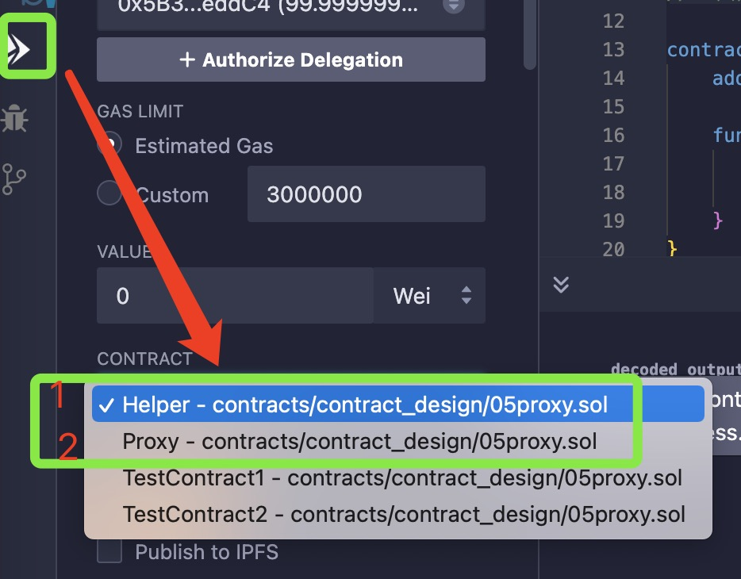

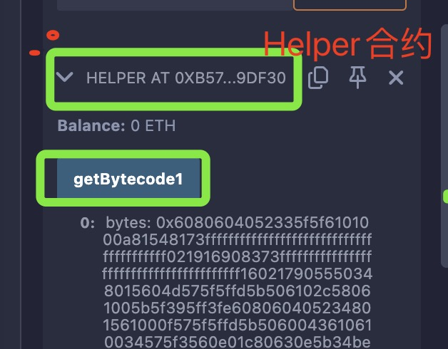

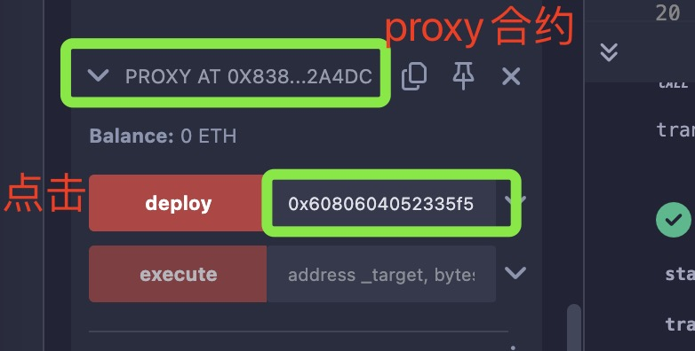

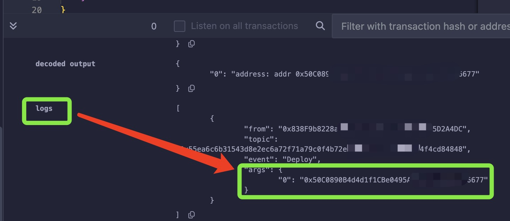

复制参数，勾选合约1
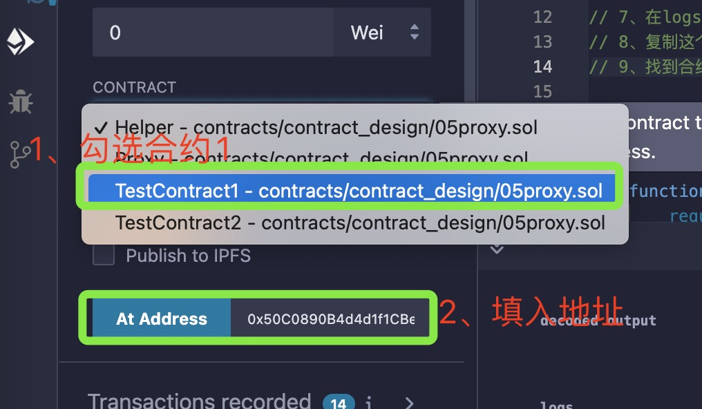

注意：这里只需要加载合约1，不需要部署，然后直接点击at address按钮
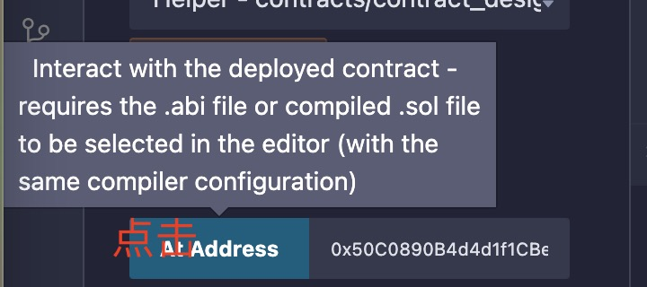

10、下拉到最底部，就可以看到合约1的部署结果,
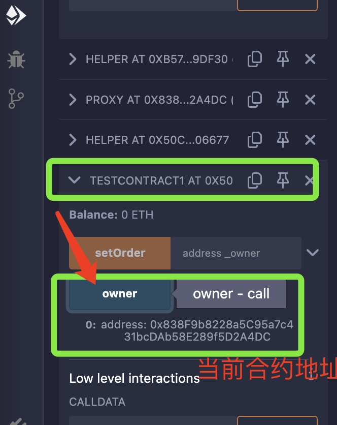

11、点击owner,可以看到当前合约地址，并且这个地址和代理合约的地址是一样的
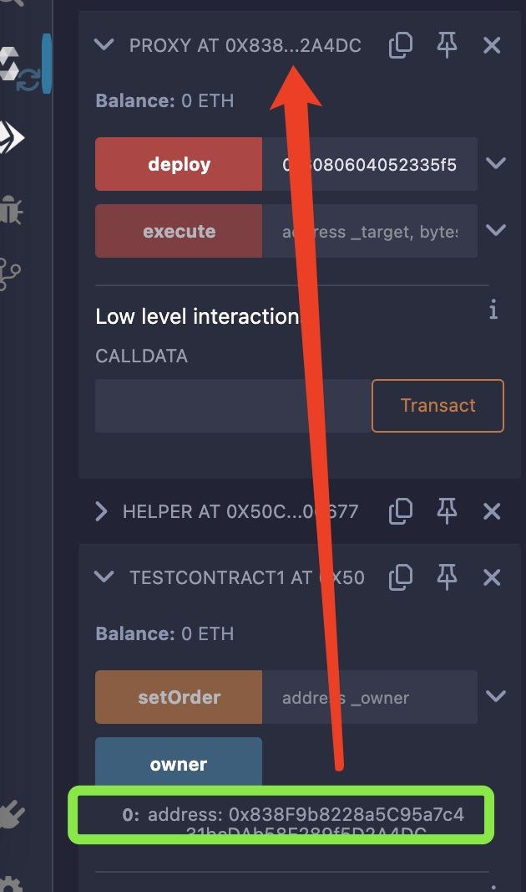

12.1、必须用proxy地址来调用setOwner
12.2、先执行execute函数，参数是目标合约地址（合约1的地址），同时调用setOwner的byte字节
12.3 调用Helper合约的getCalldata，传入当前我们想要设置的地址
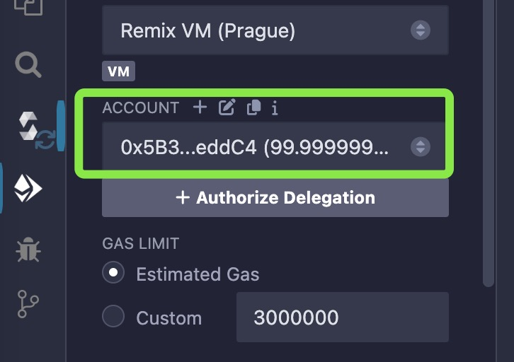

12.4 找到Helper合约，将地址填入getCalldata，点击运行，拿到构造出的calldata
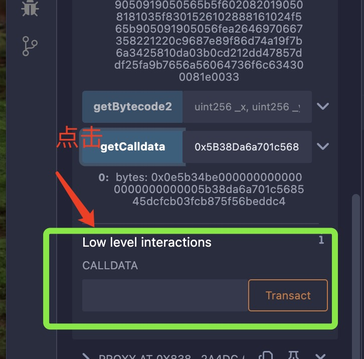

12.5 在Proxy合约中，找到execute，这里需要两个参数

12.6 将前面构造的calldata地址复制给_data参数，将contract1的地址复制给target参数

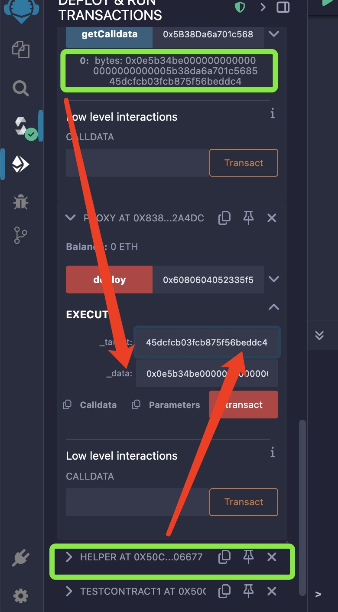

12.7 点击transact按钮调用
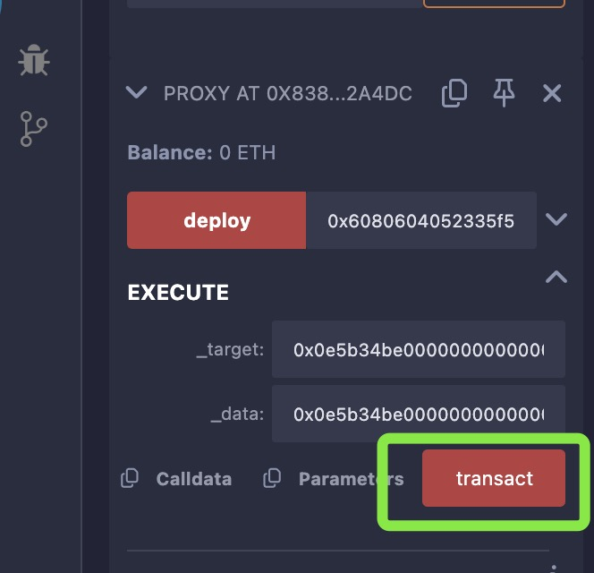

13、调用合约2，在Helper合约里面调用getBttecode2，这里需要传入两个参数，
14、点击call调用，获取calldata
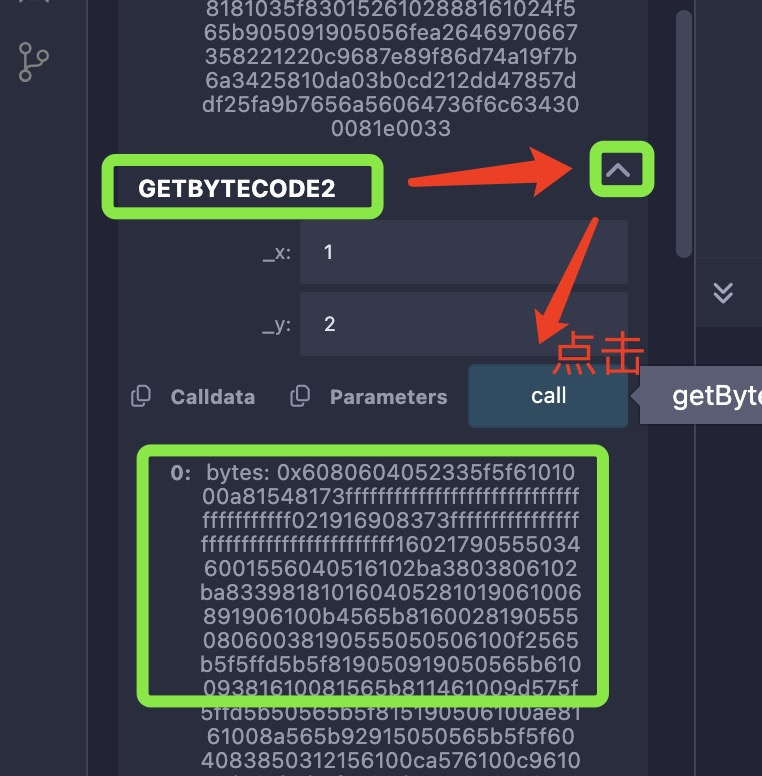

15、将复制到的calldata填入到proxy合约的deploy
16、设置value值，可以转以太到账户
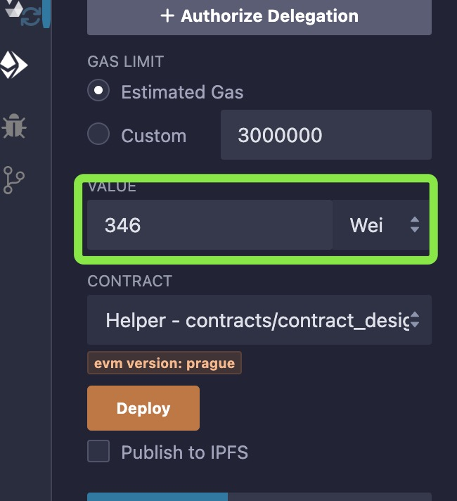

17、点击proxy合约的deploy，就能通过代理合约部署我们的合约
// 18、点击下方控制台的请求信息，在最新的交易里面会有事件发出，
// 19、在logs数据里面的args就是新部署的合约地址
// 20、复制这个地址0x1de4617aa308F4070E12d01018bAf6f681448B4F
// 21、找到合约1contract2,将地址填入at address,load合约2，然后点击at address
// 22、下拉到最底部，就可以看到合约2的部署结果,
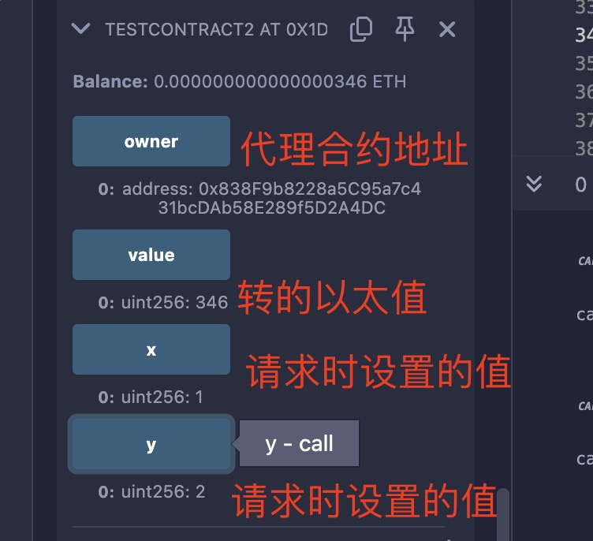
