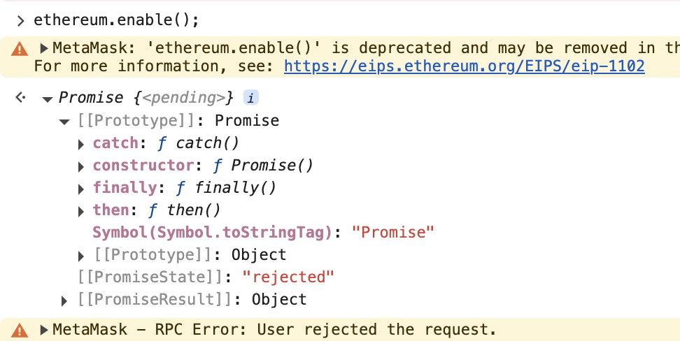

# 验证签名（小狐狸钱包）

小狐狸钱包（Metamask）是一个基于浏览器的区块链钱包，它允许用户管理他们的资产和进行交易。小狐狸钱包使用 Ethereum 签名协议（EIP-712）来验证签名。

## 安装小狐狸钱包

安装 MetaMask：访问 [MetaMask](https://metamask.io/) 官网 下载并安装扩展。

## 验证签名的合约

```solidity
// SPDX-License-Identifier: MIT

// 申请solidity 版本号 ^表示使用大于等于0.8.7但是不超过0.9的版本号，部署主网的时候需要使用固定版本号
pragma solidity ^0.8.7;

/*
0. message

1. hash(message)
3. sign(hash(message),private key) | offchain
4. ecrecover(hash(message),signature) == signer 链上进行
*/

contract VerifySig {

    // 先调用getMessageHash拿到签名信息
    function getMessageHash(string memory _msg) public pure returns (bytes32){
        return  keccak256(abi.encodePacked(_msg));
    }


    function getEthSignedMessageHash(bytes32 _msgHash) public pure returns (bytes32){
        return keccak256(abi.encodePacked("\x19Ethereum Signed Message:\n32", _msgHash));
    }

    function _splitSignature(bytes memory _sig)internal pure returns (bytes32 r, bytes32 s, uint8 v) {
        // 确定入参字节长度 32+32+1
        require(_sig.length == 65, "invalid signature length");

        // _sig前32个字节存储的是signature的长度，需要跳过
        assembly {
            r := mload(add(_sig, 32)) // 跳过前32个字节存储的是signature的长度
            s := mload(add(_sig, 64)) // 跳过前32个字节存储的是signature的长度，和32位r的长度
            v := byte(0, mload(add(_sig, 96))) // 跳过前32个字节存储的是signature的长度，和32位r的长度,32位s的长度
        }
    }


    function recover(bytes32 _ethSignedMessageHash, bytes memory _sig) 
        public pure returns (address)
    {
        // 对签名进行拆分
        (bytes32 r, bytes32 s, uint8 v) = _splitSignature(_sig);
        
        // 调用ecrecover，会返回一个地址
        return ecrecover(_ethSignedMessageHash, v, r, s);
    }


    function verify(address _signer, string memory _message, bytes memory _sig)
        external pure returns (bool)
    {
        // 2、对消息进行哈希
        bytes32 messageHash = getMessageHash(_message);

        // 3、在合约上进行签名，对messageHash进行加工
        // 在evm链上进行hash
        bytes32 ethSignedMessageHash = getEthSignedMessageHash(messageHash);
        
        // 4、
        return recover(ethSignedMessageHash, _sig) == _signer;
    }

    
}
```

## 执行流程

1. 先调用getMessageHash拿到签名信息，

aaa
拿到可以直接进行keccak256的哈希

2. 打开F12调用控制台

调用ethereum.enable()方法
成功返回promise对象，


对象中有一个字段
promiseState{
   pending:初始状态，操作尚未完成
   fulfilled:操作成功完成，已解析值
   rejected:操作失败，被拒绝
}

指定做签名
account ="0x5B38Da6a701c568545dCfcB03FcB875f56beddC4"

拿到签名信息
hash="0xb9a5dc0048db9a7d13548781df3cd4b2334606391f75f40c14225a92f4cb3537"
使用小狐狸发起请求：
ethereum.request({
    method:"personal_sign",
    params:[account,hash]
})

点击sign可以拿到签名，
然后调用vecover和verify函数
将签名hash传入getEthSignedMessageHash函数，
拿到加工过的以太坊哈希_ethSignedMessageHash=0x90c13e8b64ff0312113e46dd8f83c71a6a6d7c68cf4ec2d1288f153b917bccad
将以太坊签名和签名信息传入recover函数，拿到签名地址和传入的账户地址进行比较，如果一致，说明前面成功
