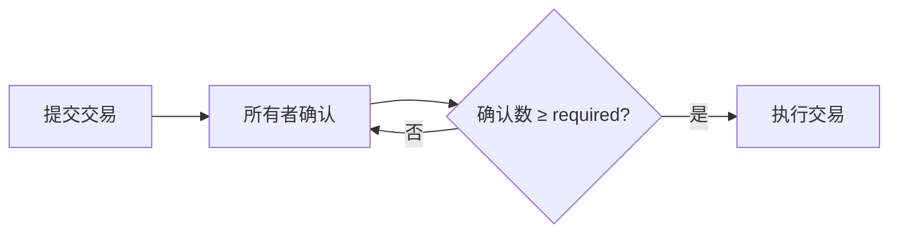

# 多签钱包（Multi-signature Wallet）

---------

1. 合约定义
2. 事件定义
◦ Deposit 事件：当以太币存⼊钱包时触发
◦ Submit 事件：当提交交易时触发
◦ Approve 事件：当交易被批准时触发
◦ Execute 事件：当交易被执⾏时触发
◦ Revoke 事件：当批准被撤销时触发
3. 状态变量
◦ owners ：存储所有者地址的数组
◦ isOwner ：检查某地址是否为所有者的映射
◦ required ：执⾏交易所需的最少批准数
◦ transactions ：存储所有交易的数组
◦ approve ：存储每个交易被每个所有者批准情况的映射
4. 结构体定义
◦ Transaction 结构体：包含交易⽬标地址、发送⾦额、交易数据和执⾏状态
5. 构造函数
◦ 初始化所有者数组和所需的批准数
◦ 确保所有者地址有效且唯⼀
◦ 设置状态变量
6. 以太币接收功能
◦ receive 函数：接收以太币并触发 Deposit 事件
7. 交易提交
◦ submit 函数：提交新交易
◦ 使⽤ onlyOwner 修饰符限制只有所有者可以调⽤
8. 交易批准
◦ approve 函数：批准交易
◦ 使⽤ txExists 、 notApproved 和 notExecuted 修饰符确保交易存在、未被批准且未
被执⾏
9. 交易执⾏
◦ execute 函数：执⾏已批准的交易
◦ 确认批准数量⾜够
◦ 使⽤低级调⽤执⾏交易
◦ 更新交易执⾏状态
10. 批准撤销
◦ revoke 函数：撤销已批准的交易
◦ 确认交易存在、未被执⾏且已被当前所有者批准

-------

在Solidity中实现多签钱包（Multi-signature Wallet） 是一种常见的安全方案，它要求交易必须获得多个所有者（地址）的批准才能执行。以下是核心概念和实现要点：

## 一个基本的多签钱包通常包括以下功能

1. 创建钱包时指定一组所有者（地址）和所需的签名数量（阈值）。

2. 提交交易：任何所有者可以提交一个交易（例如，向某个地址转账一定数量的以太币或调用某个合约）。

3. 确认交易：其他所有者可以对已提交的交易进行确认，当确认数达到阈值时，交易就可以被执行。

4. 执行交易：执行已经获得足够确认的交易。

## 二、核心逻辑

### 所有者管理

预定义一组所有者地址（address[] owners）

设定最小确认阈值（uint required），例如 2/3 多数通过

### 2、交易流程



### 关键结构体

```solidity
struct Transaction {
    address to;
    uint value;
    bytes data;
    bool executed;
    uint confirmCount;
}
```

## 二、基础合约示例

```solidity
pragma solidity ^0.8.0;

contract MultiSigWallet {
    address[] public owners;
    uint public required;
    Transaction[] public transactions;
    mapping(uint => mapping(address => bool)) public confirmations;

    struct Transaction {
        address to;
        uint value;
        bytes data;
        bool executed;
    }

    event Submission(uint indexed txId);
    event Confirmation(address indexed sender, uint indexed txId);
    event Execution(uint indexed txId);

    modifier onlyOwner() {
        require(isOwner(msg.sender), "Not owner");
        _;
    }

    constructor(address[] memory _owners, uint _required) {
        require(_owners.length > 0, "No owners");
        require(_required > 0 && _required <= _owners.length, "Invalid required number");
        owners = _owners;
        required = _required;
    }

    function submitTransaction(address _to, uint _value, bytes memory _data) public onlyOwner {
        uint txId = transactions.length;
        transactions.push(Transaction(_to, _value, _data, false));
        emit Submission(txId);
    }

    function confirmTransaction(uint _txId) public onlyOwner {
        require(!confirmations[_txId][msg.sender], "Already confirmed");
        confirmations[_txId][msg.sender] = true;
        emit Confirmation(msg.sender, _txId);
        
        if (isConfirmed(_txId)) {
            executeTransaction(_txId);
        }
    }

    function executeTransaction(uint _txId) internal {
        Transaction storage txn = transactions[_txId];
        require(!txn.executed, "Already executed");
        require(isConfirmed(_txId), "Insufficient confirmations");
        
        (bool success, ) = txn.to.call{value: txn.value}(txn.data);
        require(success, "Execution failed");
        
        txn.executed = true;
        emit Execution(_txId);
    }

    function isConfirmed(uint _txId) public view returns (bool) {
        uint count = 0;
        for (uint i = 0; i < owners.length; i++) {
            if (confirmations[_txId][owners[i]]) count++;
        }
        return count >= required;
    }

    function isOwner(address _addr) private view returns (bool) {
        for (uint i = 0; i < owners.length; i++) {
            if (owners[i] == _addr) return true;
        }
        return false;
    }

    receive() external payable {} // 接收ETH
}
```

## 三、关键安全机制

### 重入攻击防护

使用call而非transfer发送ETH，但需检查返回值（避免使用过时的send/transfer）

### 权限控制

关键函数通过onlyOwner修饰符限制

防止重复确认（confirmations映射记录）

### 交易验证

执行前检查：isConfirmed()验证签名数

状态标记：executed防止重复执行

## 四、优化建议

### 更换所有者机制

添加多签投票修改owners或required的功能

### Gas优化

使用assembly进行数组长度检查

事件替代状态变量存储（如确认记录）

### 链下签名支持

集成EIP-712实现离线签名（如Gnosis Safe）

## 五、推荐实践

### 成熟方案

直接使用审计过的合约库：

Gnosis Safe Contracts

OpenZeppelin Governor

### 开发工具

Hardhat插件：@gnosis.pm/safe-contracts

测试库：@openzeppelin/test-helpers

⚠️ 警告：自行实现多签钱包需严格审计！建议优先使用经过实战检验的解决方案如Gnosis Safe。
