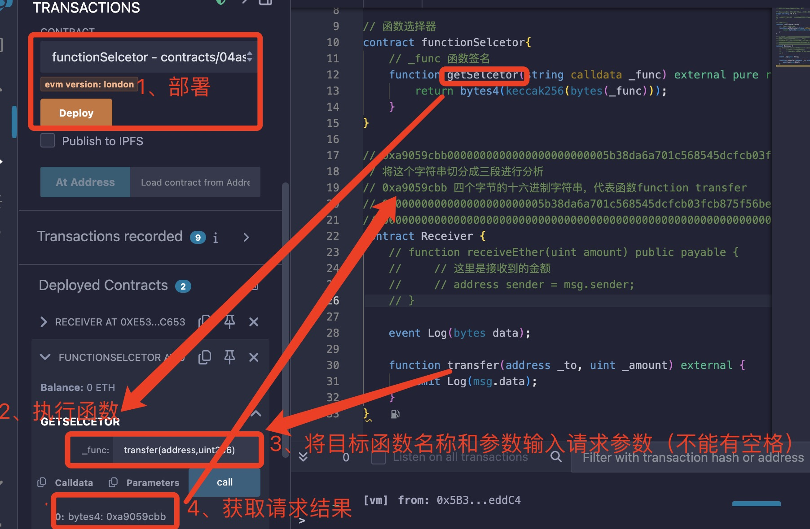

# 函数选择器（Function Selector）

在Solidity中，函数选择器是一个4字节（32位）的哈希值，用来标识一个智能合约中的函数。当通过合约调用一个函数时，实际上是通过消息调用（message call）发送了一段数据（calldata），这段数据的前4个字节就是函数选择器，后面跟着的是函数参数。它用于在智能合约调用中精确指定要执行的函数。是 Ethereum 虚拟机（EVM）处理合约调用的核心机制。

## 核心概念

### 生成方式

函数选择器的计算方式是对函数签名的Keccak256哈希值取前4个字节（高位在左，大端序）。

函数签名 = 函数名(参数类型1,参数类型2,...)
例如：transfer(address,uint256)。

### 计算示例

```solidity
// 函数签名: "transfer(address,uint256)"
bytes4 selector = bytes4(keccak256("transfer(address,uint256)"));
```

计算过程：

keccak256("transfer(address,uint256)") → 0xa9059cbb...

取前 4 字节：0xa9059cbb

### 调用数据（calldata）结构

EVM 调用合约时的 msg.data 格式：

```text
[4字节选择器][参数编码（按ABI规则）]
```

例如调用 transfer(0xabc..., 100)：

```text
0xa9059cbb... (选择器)
0x0000...abc (address参数)
0x0000...064 (uint256参数=100)
```

## Solidity 中的操作方式

### 1. 直接获取选择器

```solidity
// 方法1：通过函数签名计算
bytes4 selector = bytes4(keccak256("transfer(address,uint256)"));

// 方法2：使用.selector属性（推荐）
bytes4 selector = this.transfer.selector; // 0xa9059cbb
```

### 2. 动态调用函数

```solidity
address contractAddr = ...;
(bool success, ) = contractAddr.call(
    abi.encodeWithSelector( // 使用选择器编码调用数据
        this.transfer.selector,
        msg.sender,
        100
    )
);
```

### 3. 函数选择器冲突

不同函数可能生成相同的选择器（概率极低，但需警惕）：

```solidity
// 以下两个函数选择器相同（编译器会报错）
function collate_propagate_storage(bytes16) external;
function burn(uint256) external;
```

编译器会检查并阻止选择器冲突。

## 常见用途

### 代理合约（Proxy）

通过选择器转发调用到逻辑合约：

```solidity
fallback() external payable {
    address logic = ...;
    assembly {
        calldatacopy(0, 0, calldatasize())
        let result := delegatecall(gas(), logic, 0, calldatasize(), 0, 0)
        returndatacopy(0, 0, returndatasize())
        switch result
        case 0 { revert(0, returndatasize()) }
        default { return(0, returndatasize()) }
    }
}
```

### 接口验证

检查目标合约是否支持某函数：

```solidity
function supportsTransfer(address _contract) public view returns (bool) {
    bytes memory data = abi.encodeWithSelector(this.transfer.selector);
    (bool success,) =_contract.staticcall(data);
    return success;
}
```

### 函数路由

在单个合约中根据选择器路由逻辑：

```solidity
mapping(bytes4 => address) internal _handlers;

fallback() external payable {
    address handler = _handlers[msg.sig]; // msg.sig 即选择器
    require(handler != address(0));
    assembly {
        // 路由调用
    }
}
```

## 重要注意事项

### 大小写敏感

transfer ≠ Transfer，签名必须严格匹配。

### 参数类型必须精确

uint 需写为 uint256，byte 需写为 bytes1。

### 避免选择器冲突

编译器 0.8.0+ 会自动检测冲突并报错。

### 特殊函数的选择器

receive() 函数：0x00000000

fallback() 函数：当不匹配其他函数时触发。

## 总结

关键点| 说明
| --- | --- |
本质 |4 字节的函数唯一标识符
生成方式| keccak256(函数签名) 的前 4 字节
Solidity 操作| .selector 属性或 abi.encodeWithSelector()
核心用途| 代理合约、动态调用、函数路由
冲突风险| 概率极低，但编译器会强制检查

通过函数选择器，Solidity 实现了灵活的函数调用机制，是智能合约组合与升级的基础。

--

验证函数选择器签名

