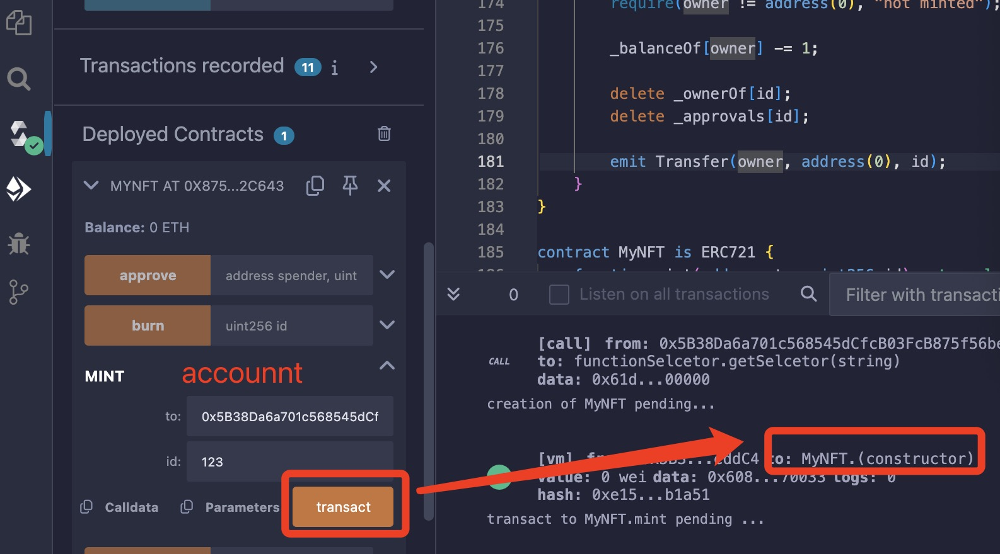
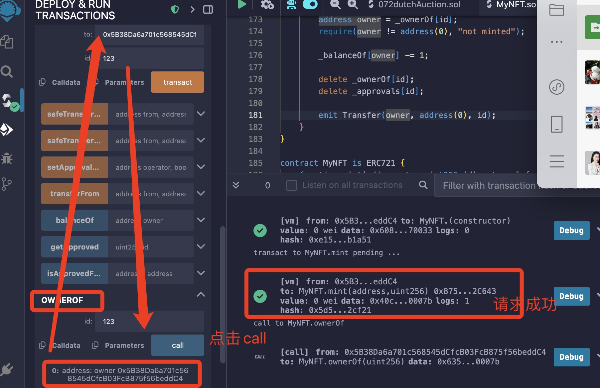
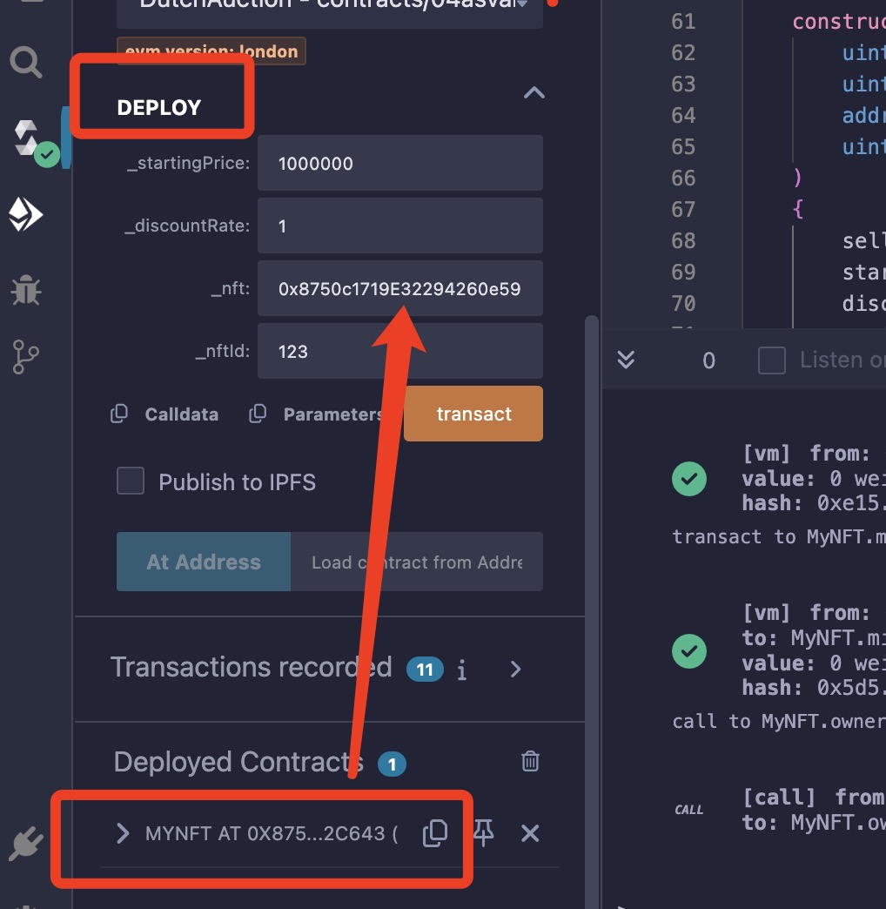

# 荷兰拍卖（Dutch Auction）

荷兰拍卖是一种价格随时间递减的拍卖方式，直到有竞标者接受当前价格为止。

----
部署荷兰拍卖合约

1. 部署MyNFT合约

- 铸造NFT
  - 调用mint() 创建一个NFT
- - - 参数:
- - - - 接收者 to :当前account
- - - - NFT id : 123


在ownerOf函数进行验证


2. 部署 DutchAuction.sol

部署之前需要再deploy里面传入参数


_nft:前面部署的MyNFT合约地址
_nftId: mint()创建的NFT id 123

3. 测试 DutchAuction.sol

- 调用getPrice()函数 可以获取当前价格
- 调用MyNFT合约的approve()函数,卖家将NFT委托到拍卖合约
  参数:
    spender:DutchAuction合约地址
     id:NFT id 123

- 更换账户
- 将之前调用getPrice()函数 获取的价格值传入价格，
- 调用buy()函数,买家购买NFT

---

## 核心逻辑

### 价格递减

起始价 > 保留价，价格随时间线性下降

### 结束条件

有人以当前价格出价

达到保留价后无人出价则流拍

## 智能合约示例

```solidity
// SPDX-License-Identifier: MIT
pragma solidity ^0.8.0;

import "@openzeppelin/contracts/token/ERC721/IERC721.sol";

contract DutchAuction {
    IERC721 public immutable nft;
    uint256 public immutable tokenId;

    address payable public seller;
    uint256 public startingPrice;
    uint256 public reservePrice;
    uint256 public startAt;
    uint256 public expiresAt;
    uint256 public priceDropRate; // 每秒降价金额

    constructor(
        address _nft,
        uint256 _tokenId,
        uint256 _startingPrice,
        uint256 _reservePrice,
        uint256 _priceDropRate,
        uint256 _duration
    ) {
        nft = IERC721(_nft);
        tokenId = _tokenId;
        seller = payable(msg.sender);
        startingPrice = _startingPrice;
        reservePrice = _reservePrice;
        priceDropRate = _priceDropRate;
        startAt = block.timestamp;
        expiresAt = block.timestamp + _duration;
    }

    // 获取当前价格
    function getCurrentPrice() public view returns (uint256) {
        uint256 timeElapsed = block.timestamp - startAt;
        uint256 discount = priceDropRate * timeElapsed;
        uint256 currentPrice = startingPrice > discount 
            ? startingPrice - discount 
            : reservePrice;
        
        return currentPrice > reservePrice ? currentPrice : reservePrice;
    }

    // 出价购买
    function buy() external payable {
        require(block.timestamp < expiresAt, "Auction expired");
        require(nft.ownerOf(tokenId) == address(this), "NFT not available");
        
        uint256 currentPrice = getCurrentPrice();
        require(msg.value >= currentPrice, "Insufficient funds");
        
        // 转移NFT
        nft.safeTransferFrom(address(this), msg.sender, tokenId);
        
        // 退款多余金额
        if (msg.value > currentPrice) {
            payable(msg.sender).transfer(msg.value - currentPrice);
        }
        
        // 转账给卖家
        seller.transfer(currentPrice);
        
        // 销毁合约
        selfdestruct(seller);
    }

    // 流拍后取回NFT
    function withdrawNFT() external {
        require(block.timestamp >= expiresAt, "Auction not ended");
        require(msg.sender == seller, "Only seller");
        require(nft.ownerOf(tokenId) == address(this), "NFT already sold");
        
        nft.safeTransferFrom(address(this), seller, tokenId);
        selfdestruct(seller);
    }
}
```

## 关键组件说明

### 价格计算

```solidity
currentPrice = startingPrice - (priceDropRate * timeElapsed)
```

价格随时间线性下降，最低不低于保留价

### 拍卖流程

部署合约时设置参数（起拍价、保留价、降价速度、持续时间）

卖家需预先批准合约转移NFT

买家调用buy()支付≥当前价格的ETH

超时后卖家可收回NFT

### 安全特性

使用payable安全转账

时间校验防止过期交易

自毁合约回收Gas

## 常见优化方向

### 价格曲线

指数级递减（加速降价）

阶梯式降价（离散价格点）

### 批量拍卖

```solidity
mapping(uint256 => Auction) public auctions; // 多NFT支持
```

手续费机制：

```solidity
uint256 fee = currentPrice * 3 / 100; // 3%手续费
platform.transfer(fee);
seller.transfer(currentPrice - fee);
```

### 链下签名

```solidity
function buyWithSignature(bytes calldata sig) external {
    // 验证签名加速交易
}
```

## 安全注意事项

重入攻击防护：使用Checks-Effects-Interactions模式

精度处理：用wei单位避免小数

时间源：依赖block.timestamp而非区块号

NFT安全：使用safeTransferFrom检查接收方

荷兰拍卖适用于NFT发售（如Art Blocks）、代币发行（如ENS）等场景，通过动态定价机制提高市场效率。实际部署时建议结合OpenZeppelin库进行安全强化。

---

## 在Solidity中实现荷兰拍卖，通常需要以下组件

1. 拍卖物品（例如：一个NFT或一组代币）

2. 拍卖开始时间

3. 起始价格（较高）

4. 结束价格（保留价）

5. 价格递减的速率（或持续时间和价格下降函数）

6. 拍卖结束条件（有人出价或时间结束）

## 设计思路

我们假设拍卖一个NFT（ERC721）。拍卖由NFT的所有者发起。

拍卖开始后，价格从起始价格开始，随着时间线性（或非线性）下降，直到达到结束价格。

竞标者可以在价格下降过程中随时出价（以当前价格购买），一旦有人出价，拍卖立即结束，该竞标者获得NFT，并支付当前价格。

如果时间到了而没有人出价，拍卖结束，NFT返回给所有者（或者流拍）。

## 步骤

1. 初始化拍卖：设置拍卖物品（NFT合约地址和tokenId）、起始价格、结束价格、拍卖持续时间（或价格下降函数）。

2. 开始拍卖：记录开始时间。

3. 竞标：任何人都可以调用竞标函数，该函数会检查当前价格是否大于等于竞标者发送的金额（或者直接使用当前价格计算）。

注意：通常，竞标者需要发送足够的以太币来覆盖当前价格。

4. 当竞标被接受时：

- 拍卖状态标记为结束

- NFT从合约转移到竞标者

- 资金转给拍卖发起人

5. 如果拍卖时间结束（达到结束时间）而无人竞标，则允许拍卖发起人取回NFT。

注意事项：

- 防止重入攻击

- 使用安全的转账方式（例如：call来转账以太币，并检查返回值）

- 考虑拍卖已经开始但未有人出价的情况下，拍卖结束后需要取回NFT。
