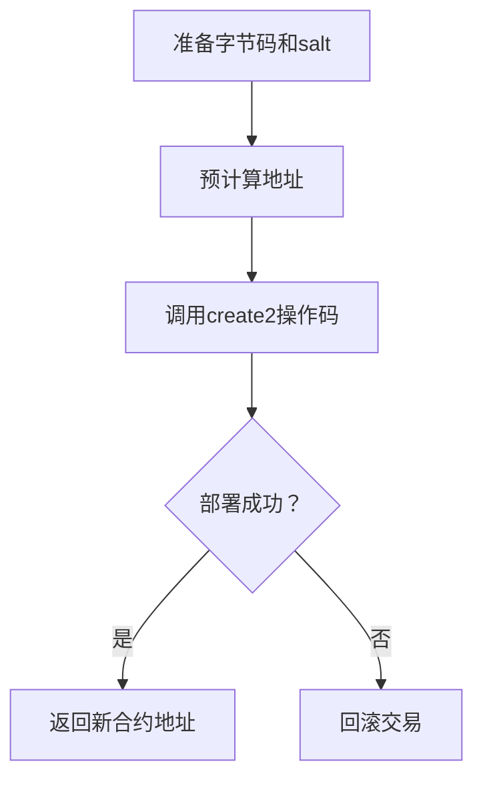

# Create 2

## 概念

create2 是以太坊虚拟机（EVM）的操作码，允许`预先计算合约地址`后再部署合约。与传统的 create（依赖部署者地址和 nonce）不同，create2 通过以下参数确定地址：

- 部署者合约地址
- 盐值（salt，自定义的任意 bytes32 值）
- 待部署合约的字节码（bytecode）

地址计算公式：

```solidity
address = keccak256(0xFF ++ deployerAddr ++ salt ++ keccak256(bytecode))[12:]
```

## 2. 核心功能

地址预计算：部署前即可确定合约地址。

状态无关性：地址不受部署者 nonce 影响。

唯一性保证：相同字节码 + 相同 salt 只能部署一次。

重放保护：防止重复部署到同一地址。

## 3. 实现步骤

获取待部署合约的字节码：包含构造函数参数。

选择盐值（salt）：任意 bytes32 值（需唯一）。

预计算地址：使用公式计算目标地址。

使用内联汇编部署：调用 create2 操作码。

## 4. 具体流程



## 5. 关键功能说明

盐值（salt）：控制地址生成的任意值，确保相同输入生成相同地址。

字节码（bytecode）：必须包含构造函数参数（通过 abi.encodePacked 拼接）。

地址冲突：相同 deployer + salt + bytecode 组合只能部署一次。

Gas 成本：与 create 类似，但需额外计算地址的哈希。

## 完整合约代码示例

### 示例结构

待部署的合约：SimpleStorage.sol

工厂合约：Create2Factory.sol（使用 create2 部署）

#### 1. 待部署合约 (SimpleStorage.sol)

```solidity
// SPDX-License-Identifier: MIT
pragma solidity ^0.8.0;

contract SimpleStorage {
    uint256 public data;

    constructor(uint256 _data) {
        data = _data;
    }
}
```

#### 2. 工厂合约 (Create2Factory.sol)

```solidity
// SPDX-License-Identifier: MIT
pragma solidity ^0.8.0;

contract Create2Factory {
    event Deployed(address addr, uint256 salt);

    // 计算目标地址
    function computeAddress(
        bytes32 salt,
        bytes memory bytecode
    ) public view returns (address) {
        bytes32 hash = keccak256(
            abi.encodePacked(
                bytes1(0xff), // 固定前缀
                address(this), // 部署者地址（本工厂合约）
                salt,         // 自定义盐值
                keccak256(bytecode) // 字节码哈希
            )
        );
        return address(uint160(uint256(hash)));
    }

    // 使用 create2 部署合约
    function deploy(
        bytes32 salt,
        bytes memory bytecode
    ) public returns (address) {
        address deployedAddr;
        
        // 内联汇编调用 create2
        assembly {
            deployedAddr := create2(
                0,              // 不发送 ETH
                add(bytecode, 0x20), // 字节码起始位置（跳过长度字段）
                mload(bytecode),     // 字节码长度
                salt            // 盐值
            )
        }

        require(deployedAddr != address(0), "Deployment failed");
        emit Deployed(deployedAddr, uint256(salt));
        return deployedAddr;
    }

    // 获取 SimpleStorage 的字节码（含构造函数参数）
    function getBytecode(uint256 _data) public pure returns (bytes memory) {
        bytes memory bytecode = type(SimpleStorage).creationCode;
        return abi.encodePacked(bytecode, abi.encode(_data));
    }
}
```

## 使用流程

### 预计算地址

```solidity
bytes32 salt = bytes32(0x1234...); // 自定义盐值
bytes memory bytecode = factory.getBytecode(42); // 带参数 _data=42
address precomputed = factory.computeAddress(salt, bytecode);
```

### 部署合约

```solidity
address deployed = factory.deploy(salt, bytecode);
require(deployed == precomputed, "Address mismatch"); // 验证地址一致性
```

## 注意事项

字节码必须包含构造函数参数：使用 abi.encodePacked 拼接合约创建码和参数。

盐值唯一性：相同盐值 + 相同字节码只能部署一次。

Gas 优化：预计算地址可减少链上交互成本。

应用场景：无信任地址交互、状态通道、合约升级模式（如代理合约逻辑层部署）。

通过 create2，开发者能实现更灵活的合约部署策略，尤其适用于需要预先知道合约地址的复杂应用架构。
