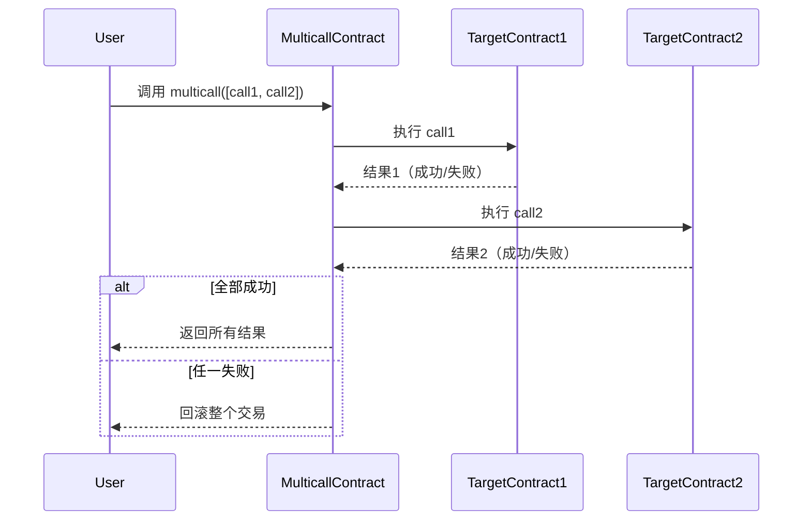

# 多次调用（Multicall）

## 概念

多次调用（Multicall）是一种在单笔交易中执行多个函数调用的技术。它通过将多个调用的数据打包成一个数组，在合约内部循环执行，实现原子性操作（全部成功或全部失败），同时节省 Gas 费用并减少区块链负载。

## 核心功能

### 原子性执行

所有调用成功：交易生效。

任一调用失败：整个交易回滚。

### Gas 优化

减少交易签名和区块头开销。

### 批量操作

适用于批量转账、授权、数据查询等场景。

### 避免前端竞态条件

确保多个操作按顺序执行。

## 实现步骤

### 定义调用结构体

包含目标地址和调用数据。

### 主函数逻辑

- 循环处理每个调用。
- 使用底层 call 执行。
- 验证调用结果。

### 错误处理

任一失败则整体回滚。

### 返回结果（可选）

收集每个调用的返回值。

## 具体流程



## 关键功能说明

### 结构体定义

```solidity
struct Call {
    address target;   // 目标合约地址
    bytes data;       // 编码后的调用数据
}
```

### 底层调用

使用 target.call(data) 执行调用，返回 (bool success, bytes result)。

### 原子性保证

通过 require(success, "Call failed") 实现单点失败回滚。

### 结果聚合

动态数组 results 收集每个调用的返回值。

## 完整合约代码

```solidity
// SPDX-License-Identifier: MIT
pragma solidity ^0.8.0;

contract Multicall {
    // 定义调用结构
    struct Call {
        address target;
        bytes data;
    }

    /**
     * 执行多次调用（原子化操作）
     * @param calls 调用结构体数组
     * @return results 所有调用的返回数据
     */
    function multicall(Call[] calldata calls) external payable returns (bytes[] memory results) {
        results = new bytes[](calls.length);
        
        for (uint256 i = 0; i < calls.length; i++) {
            // 检查目标地址是否为合约
            require(isContract(calls[i].target), "Target is not a contract");
            
            // 执行底层调用
            (bool success, bytes memory result) = calls[i].target.call(calls[i].data);
            
            // 确保调用成功（原子性核心）
            require(success, "Call failed");
            
            results[i] = result;
        }
        return results;
    }

    // 检查地址是否为合约
    function isContract(address addr) internal view returns (bool) {
        uint256 size;
        assembly {
            size := extcodesize(addr)
        }
        return size > 0;
    }

    // 接收以太币（可选）
    receive() external payable {}
}
```

## 使用示例

```solidity
// 假设有两个目标合约
contract ContractA {
    function foo(uint x) public pure returns (uint) {
        return x * 2;
    }
}

contract ContractB {
    function bar(string memory s) public pure returns (string memory) {
        return string(abi.encodePacked("Hello ", s));
    }
}

// 前端调用伪代码
function executeMulticall() {
    // 1. 准备调用数据
    bytes memory dataA = abi.encodeWithSignature("foo(uint256)", 42);
    bytes memory dataB = abi.encodeWithSignature("bar(string)", "World");

    // 2. 构建Call数组
    Multicall.Call[] memory calls = new Multicall.Call[](2);
    calls[0] = Multicall.Call(contractAAddress, dataA);
    calls[1] = Multicall.Call(contractBAddress, dataB);

    // 3. 执行Multicall
    bytes[] memory results = multicallContract.multicall(calls);

    // 4. 解码结果
    uint resultA = abi.decode(results[0], (uint)); // 84
    string memory resultB = abi.decode(results[1], (string)); // "Hello World"
}
```

## 安全注意事项

### 重入攻击风险

若调用的合约包含恶意代码，需使用重入锁（如 OpenZeppelin 的 ReentrancyGuard）。

### Gas 限制

单笔交易 Gas 上限可能限制批量操作数量。

### 地址验证

通过 isContract 防止 EOA 调用失败。

### 返回值处理

动态解析需注意数据类型匹配。

实际应用：Uniswap V3 的 Multicall.sol 是经典实现，支持带 ETH 转账的调用。
