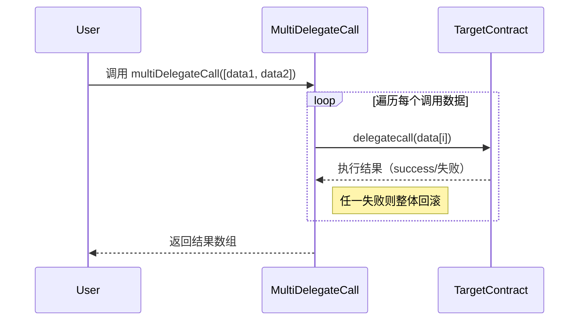

# 多次委托调用（Multi DelegateCall）

## 概念

多次委托调用（Multi-DelegateCall）是一种允许用户通过单次交易执行多个函数调用的模式，同时保持原始调用者（msg.sender）的上下文。核心是组合使用 delegatecall 和批量执行机制：

- delegatecall：目标合约的代码在调用合约的上下文中执行（共享存储，保持 msg.sender 和 msg.value）。

- 批量执行：将多个函数调用数据打包，通过一次交易统一执行。

## 功能

原子性操作：所有调用要么全部成功，要么全部回滚。

节省 Gas：多个操作合并到一笔交易，减少基础开销。

统一上下文：所有子调用共享相同的 msg.sender 和存储状态。

可组合性：支持任意函数调用（包括跨合约调用）。

## 实现步骤

用户准备数据：构造多个函数调用的 bytes[] 数据（目标函数 + 参数）。

调用入口函数：用户调用主合约的 multiDelegateCall 函数并传入数据。

循环执行委托调用：合约遍历数据数组，对每个数据执行 delegatecall。

错误处理：任一调用失败则整体回滚（原子性保证）。

返回结果：收集每个调用的执行结果（可选）。

## 具体流程



## 关键功能说明

### delegatecall 上下文保留

子调用中的 msg.sender 始终是原始调用者（用户）。

子调用修改的是主合约的存储（非目标合约存储）。

### 原子性保证

使用 require(success) 确保单个调用失败时整体回滚。

### 数据编码

用户需预先通过 abi.encodeWithSelector 编码函数调用数据。

### 安全限制

主合约不应暴露敏感函数（避免被恶意组合调用）。

确保目标合约的存储布局与主合约兼容（防止存储冲突）。

## 完整合约代码

```solidity
// SPDX-License-Identifier: MIT
pragma solidity ^0.8.0;

contract MultiDelegateCall {
    error DelegateCallFailed(); // 自定义错误类型

    /**
     * @dev 执行多次委托调用（原子化操作）
     * @param data 函数调用数据的数组（每个元素对应一次调用）
     * @return results 每个调用的执行结果（true=成功）
     */
    function multiDelegateCall(
        bytes[] calldata data
    ) external payable returns (bool[] memory results) {
        results = new bool[](data.length);
        
        for (uint256 i = 0; i < data.length; i++) {
            // 使用 delegatecall 执行调用（共享当前合约的存储）
            (bool success, ) = address(this).delegatecall(data[i]);
            
            // 严格模式：任一失败则整体回滚
            if (!success) revert DelegateCallFailed();
            
            results[i] = success;
        }
    }

    // 示例功能函数：可被委托调用
    function updateValue(uint256 newValue) external {
        value = newValue;
    }

    uint256 public value; // 存储变量（由子调用修改）
}
```

## 使用示例

### 构造调用数据（使用 ethers.js 或 web3.js）

```javascript
const data1 = contract.interface.encodeFunctionData("updateValue", [100]);
const data2 = contract.interface.encodeFunctionData("updateValue", [200]);
```

### 执行批量调用

```javascript
await contract.multiDelegateCall([data1, data2]);
```

结果：value 被依次修改为 100 和 200（原子化执行）。

## 注意事项

### 存储冲突

目标函数的存储布局必须与主合约一致（避免插槽覆盖）。

### Gas 限制

批量调用可能触及区块 Gas 上限。

### 重入风险

若子调用涉及外部合约，需防范重入攻击（如添加防重入锁）。

### 授权安全

避免在子调用中暴露敏感函数（如 selfdestruct）。

通过合理设计，多次委托调用能显著提升复杂操作的效率和用户体验，尤其适用于 DeFi 协议中的批量交易场景。

# 多次委托调用（Multi-DelegateCall）和多次调用（Multi-Call）的区别与联系

## 核心区别

|特性|多次委托调用 (Multi-DelegateCall)| 多次调用 (Multi-Call)|
|-------|--------------|-----------------|
| 执行上下文|所有调用在`主合约上下文`执行| 每个调用在`目标合约上下文`执行|
|存储修改| 修改调用（主）合约的存储| 修改目标合约的存储|
|msg.sender|始终是原始调用者|是调用合约地址（非原始调用者）|
|msg.value|共享同一个msg.value|每个调用独立处理 value|
|原子性|天然原子性（一个失败全部回滚）| 需要额外实现原子性保证（一个失败全部回滚）|
|适用操作| 同一合约的多个操作| 多个合约的多个操作|
|主要用途|原子化修改主合约状态| 批量读取/跨合约操|

## 关键联系

### 批量执行核心思想

两者都通过单笔交易执行多个操作，减少 Gas 消耗和提升用户体验。

### 数据打包方式

都使用 bytes[] 打包调用数据：

```solidity
// 共享数据结构
bytes[] memory calls = new bytes[](2);
calls[0] = abi.encodeWithSelector(...);
calls[1] = abi.encodeWithSelector(...);
```

### 循环执行模式

基础执行结构相似：

```solidity
for (uint i; i < calls.length; i++) {
    (bool success, ) = ... // delegatecall 或 call
    require(success);
}
```

## 场景对比分析

### 案例：用户资产管理系统

```solidity
contract AssetManager {
    mapping(address => uint) public balances;

    // 使用多次委托调用
    function batchUpdate(uint[] calldata amounts) external {
        bytes[] memory calls = new bytes[](amounts.length);
        for(uint i; i<amounts.length; i++) {
            calls[i] = abi.encodeWithSelector(
                this.updateBalance.selector, 
                amounts[i]
            );
        }
        multiDelegateCall(calls);
    }
    
    // 使用多次调用
    function batchTransfer(address[] calldata tokens, uint[] calldata amounts) external {
        for(uint i; i<tokens.length; i++) {
            ERC20(tokens[i]).transferFrom(msg.sender, address(this), amounts[i]);
        }
    }
    
    function updateBalance(uint amount) external {
        balances[msg.sender] += amount; // msg.sender 是原始用户
    }
}
```

### 执行差异

#### 委托调用

✅ batchUpdate 修改的是 AssetManager 的存储

✅ updateBalance 中的 msg.sender 是真实用户

❌ 只能调用主合约内函数

#### 普通多次调用

✅ 可调用任意外部合约（如 ERC20）

❌ transferFrom 中的 msg.sender 是 AssetManager 合约地址

❌ 需要单独授权

## 混合解决方案

结合两者优势实现跨合约原子操作：

```solidity
function atomicOperations(
    bytes[] calldata delegateCalls, // 修改主状态
    address[] calldata targets,     // 外部合约
    bytes[] calldata calls          // 外部调用
) external payable {
    // 1. 执行委托调用（修改主合约状态）
    for(uint i; i<delegateCalls.length; i++) {
        (bool success, ) = address(this).delegatecall(delegateCalls[i]);
        require(success, "Delegate call failed");
    }

    // 2. 执行外部调用
    for(uint i; i<targets.length; i++) {
        (bool success, ) = targets[i].call(calls[i]);
        require(success, "External call failed");
    }
}
```

## 如何选择

场景 推荐方案 原因
修改主合约的多个状态变量 ✅ 多次委托调用 原子性保证+保留原始调用者上下文
批量读取多个合约数据 ✅ 多次调用 无需修改状态，更安全经济
跨合约操作需原子性 ⚠️ 混合方案 需谨慎设计防重入和错误处理
用户授权下的批量代币操作 ✅ 多次调用 天然支持外部合约，配合 approve 使用
⚠️ 风险提示：委托调用会暴露主合约存储，必须严格验证调用数据，避免引入任意代码执行漏洞。
