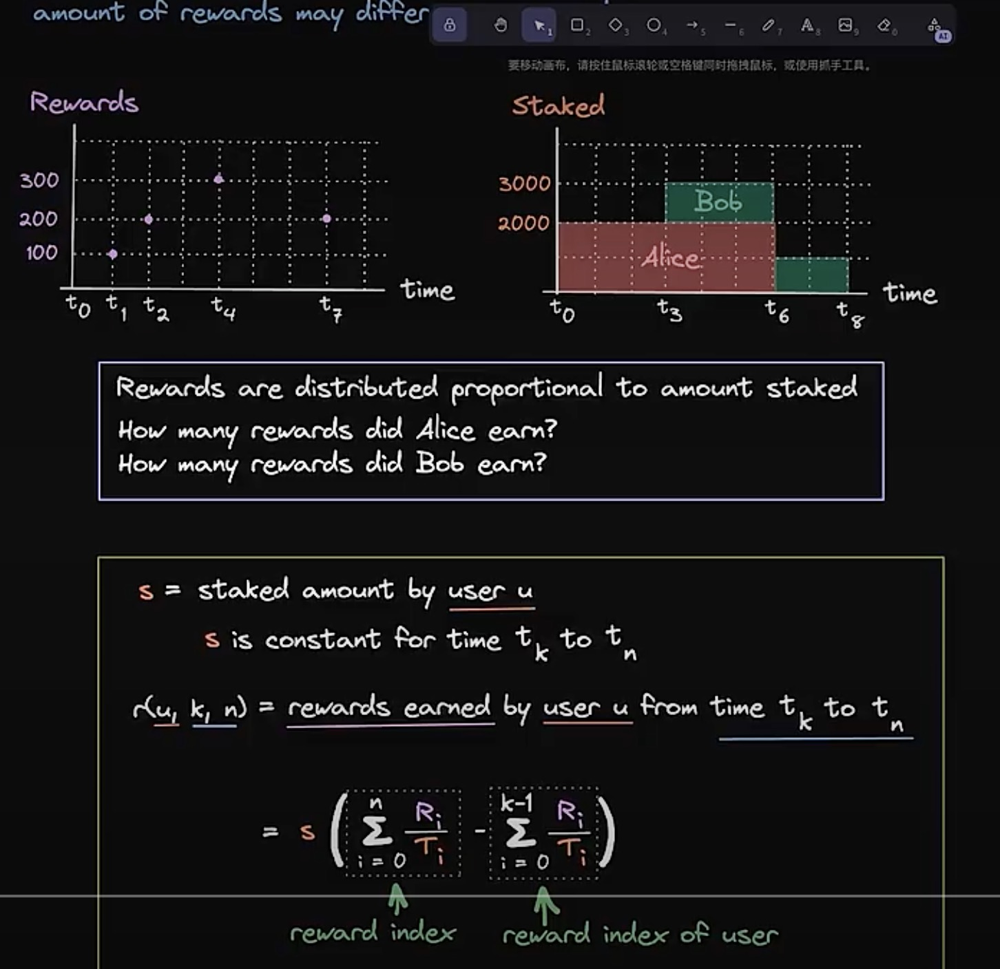

# 离散质押奖励系统

## 概念

离散质押奖励是一种按事件触发的奖励分配机制（如质押/解押时），与连续计算的质押系统不同。奖励在用户操作时即时计算并分配，适用于Gas优化场景和确定性奖励分配。

## 核心功能

质押代币：用户存入代币参与质押
奖励计算：在操作时按质押时间计算奖励

领取奖励：自动发放待领取奖励

解押代币：取回本金并结算奖励

奖励注入：管理员向资金池注入奖励

## 实现步骤 & 具体流程

### 初始化合约

设置质押代币和奖励代币

初始化奖励参数

### 用户质押

```solidity
function stake(uint256 amount) external {
    _updateReward(msg.sender); // 更新奖励
    _stake(amount); // 执行质押
}
```

### 奖励计算（关键）

```solidity
reward = (userBalance * (currentRewardPerToken - userLastRewardPerToken)) / PRECISION
```

### 用户解押

```solidity
function unstake(uint256 amount) external {
    _updateReward(msg.sender); // 结算奖励
    _unstake(amount); // 解押代币
}
```

### 奖励注入

```solidity
function notifyReward(uint256 reward) external onlyOwner {
    _injectReward(reward); // 注入新奖励
}
```

## 关键功能说明

### 奖励精度处理

使用 PRECISION = 1e18 避免浮点数误差

```solidity
uint256 public constant PRECISION = 1e18;
```

### 按时间加权计算

全局变量跟踪累计奖励：

```solidity
uint256 public rewardPerTokenStored;
```

### 用户状态更新

记录每个用户的上次奖励状态：

```solidity
mapping(address => uint256) public userRewardPerTokenPaid;
```

### 安全机制

重入锁（ReentrancyGuard）

精确数学检查（SafeMath）

## 完整合约代码

```solidity
// SPDX-License-Identifier: MIT
pragma solidity ^0.8.0;

import "@openzeppelin/contracts/token/ERC20/IERC20.sol";
import "@openzeppelin/contracts/security/ReentrancyGuard.sol";
import "@openzeppelin/contracts/access/Ownable.sol";

contract DiscreteStaking is ReentrancyGuard, Ownable {
    IERC20 public immutable stakingToken;
    IERC20 public immutable rewardsToken;

    uint256 public constant PRECISION = 1e18;
    uint256 public rewardRate;
    uint256 public lastUpdateTime;
    uint256 public rewardPerTokenStored;
    
    mapping(address => uint256) private _balances;
    mapping(address => uint256) public userRewardPerTokenPaid;
    mapping(address => uint256) public rewards;

    event Staked(address indexed user, uint256 amount);
    event Unstaked(address indexed user, uint256 amount);
    event RewardPaid(address indexed user, uint256 reward);
    event RewardAdded(uint256 reward);

    constructor(address _stakingToken, address _rewardsToken) {
        stakingToken = IERC20(_stakingToken);
        rewardsToken = IERC20(_rewardsToken);
    }

    // 核心：更新全局奖励累计值
    modifier updateReward(address account) {
        rewardPerTokenStored = rewardPerToken();
        lastUpdateTime = block.timestamp;
        if (account != address(0)) {
            rewards[account] = earned(account);
            userRewardPerTokenPaid[account] = rewardPerTokenStored;
        }
        _;
    }

    // 计算当前每token的奖励
    function rewardPerToken() public view returns (uint256) {
        if (totalSupply() == 0) return rewardPerTokenStored;
        return rewardPerTokenStored + (
            (block.timestamp - lastUpdateTime) * rewardRate * PRECISION / totalSupply()
        );
    }

    // 计算用户待领取奖励
    function earned(address account) public view returns (uint256) {
        return _balances[account] * (rewardPerToken() - userRewardPerTokenPaid[account]) 
            / PRECISION + rewards[account];
    }

    // 质押入口
    function stake(uint256 amount) external nonReentrant updateReward(msg.sender) {
        require(amount > 0, "Amount must > 0");
        _balances[msg.sender] += amount;
        stakingToken.transferFrom(msg.sender, address(this), amount);
        emit Staked(msg.sender, amount);
    }

    // 解押入口（自动领取奖励）
    function unstake(uint256 amount) public nonReentrant updateReward(msg.sender) {
        require(amount > 0, "Amount must > 0");
        _balances[msg.sender] -= amount;
        stakingToken.transfer(msg.sender, amount);
        _getReward(); // 自动领取奖励
        emit Unstaked(msg.sender, amount);
    }

    // 领取奖励
    function claimReward() public nonReentrant updateReward(msg.sender) {
        _getReward();
    }

    // 内部：执行奖励发放
    function _getReward() internal {
        uint256 reward = rewards[msg.sender];
        if (reward > 0) {
            rewards[msg.sender] = 0;
            rewardsToken.transfer(msg.sender, reward);
            emit RewardPaid(msg.sender, reward);
        }
    }

    // 管理员注入奖励
    function notifyReward(uint256 reward) external onlyOwner updateReward(address(0)) {
        require(reward > 0, "Invalid reward");
        rewardsToken.transferFrom(msg.sender, address(this), reward);
        rewardRate = reward / 7 days; // 按7天线性释放
        lastUpdateTime = block.timestamp;
        emit RewardAdded(reward);
    }

    function totalSupply() public view returns (uint256) {
        return IERC20(stakingToken).balanceOf(address(this));
    }

    function balanceOf(address account) public view returns (uint256) {
        return _balances[account];
    }
}
```

## 关键设计解析

### 离散计算优势

仅用户操作时计算奖励（节省Gas）
避免全局状态持续更新

### 奖励分配公式

```text
userReward = balance * (currentRewardPerToken - lastUserRewardPerToken)
```

### 安全特性

使用OpenZeppelin的ReentrancyGuard防重入

精确的数学计算（PRECISION机制）

权限隔离（仅owner可注入奖励）

### Gas优化

状态变量紧凑布局

避免循环计算

部署说明：需传入质押代币和奖励代币地址，首次使用需向合约注入奖励资金（调用notifyReward）

---

离散质押


[](./WeChatf4bbe8a0e433e011cf8934eb181956ae.jpg)

[](./WeChat11d483c756ea39e4dc05b0e9d05b6ca9.jpg)
