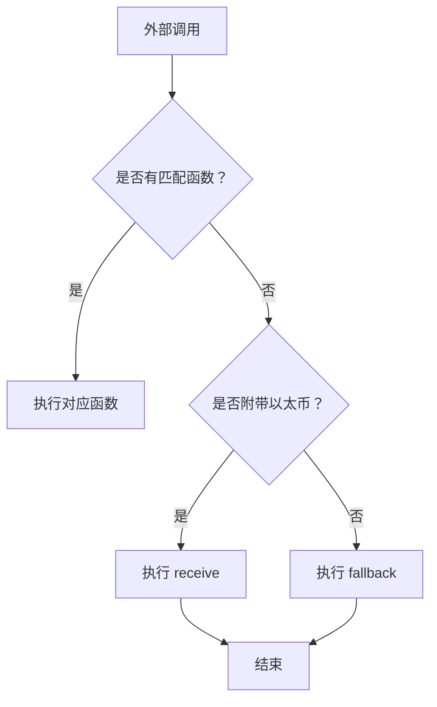

# Solidity 输入输出与回退函数详解

## 一、核心概念

### 输入（函数参数）

定义在函数括号内的变量，用于接收外部传入的数据

支持值类型（uint, address等）和引用类型（array, struct）

示例：function transfer(address _to, uint_amount)

### 输出（返回值）

通过 returns 关键字声明返回值类型

可返回单个或多个值

示例：returns (uint balance, bool success)

### 回退函数（Fallback）

特殊函数，在以下情况触发：

- 调用合约中不存在的函数
- 向合约发送以太币（无数据）

两种形式：

- receive()：仅处理纯以太币转账
- fallback()：处理无效调用

## 二、关键功能说明

功能 |触发条件| 限制
|-|-|-|
receive() |调用附带以太币且 msg.data 为空| 必须声明为 payable
fallback()| 调用匹配不到函数或 msg.data 无效 |可声明为 payable

## 三、实现步骤与流程

### 输入输出实现

```solidity
// 输入参数与返回值示例
function calculate(uint input) public pure returns (uint) {
    return input * 2; // 返回处理结果
}
```

### 回退函数实现流程



四、完整合约代码

```solidity
// SPDX-License-Identifier: MIT
pragma solidity ^0.8.0;

contract PaymentHandler {
    // 事件记录
    event Received(address sender, uint amount);
    event FallbackCalled(bytes data);

    // 存储最近付款人
    address public lastPayer;
    
    // 接收纯以太币转账（无数据）
    receive() external payable {
        lastPayer = msg.sender;
        emit Received(msg.sender, msg.value);
    }
    
    // 处理无效调用
    fallback() external payable {
        emit FallbackCalled(msg.data);
    }
    
    // 带输入的普通函数
    function transfer(address payable recipient, uint amount) external {
        require(amount <= address(this).balance, "Insufficient balance");
        recipient.transfer(amount);
    }
    
    // 多输出函数
    function getBalance() public view returns (uint contractBalance, uint gasLeft) {
        return (address(this).balance, gasleft());
    }
}
```

## 五、关键特性解析

### 回退函数安全实践

始终验证 msg.value

避免复杂逻辑（Gas 限制）

非支付场景移除 payable 修饰符

### 输入输出高级用法

```solidity
// 多返回值解构
(uint balance, ) = getBalance(); // 忽略第二个返回值

// 结构体输入
struct Transaction {
    address to;
    uint amount;
}
function batchTransfer(Transaction[] calldata transactions) external {...}
```

### Gas 优化技巧

使用 calldata 替代 memory 存储位置

返回值使用固定大小数组

避免回退函数中的状态修改

⚠️ 注意：当合约需要接收以太币时，必须至少包含 receive() 或 payable fallback()，否则交易会被拒绝（revert）。

## 六、测试建议

### 使用 Foundry 测试回退场景

```solidity
// 测试无效调用触发 fallback
function testFallback() public {
    (bool success, ) = address(paymentHandler).call("invalid");
    assertTrue(success);
}

// 测试以太币转账触发 receive
function testReceive() public {
    vm.deal(address(this), 1 ether);
    (bool success, ) = address(paymentHandler).call{value: 1 ether}("");
    assertEq(paymentHandler.lastPayer(), address(this));
}
```

## fallback中接收输入与返回数据

在 Solidity 中，fallback 函数可以接收输入数据和返回输出数据，这是处理未知调用的关键机制。以下是详细实现指南：

## 一、Fallback 函数数据交互原理

### 输入数据

通过 msg.data 全局变量访问原始调用数据（bytes 类型）

包含函数选择器（前4字节）和参数编码

### 输出数据

使用 return 返回 bytes 类型数据

需符合 ABI 编码规范

## 二、完整实现步骤

```solidity
// SPDX-License-Identifier: MIT
pragma solidity ^0.8.0;

contract SmartFallback {
    event FallbackTriggered(bytes input, uint value);

    // 接收纯以太币转账（无数据）
    receive() external payable {}
    
    // 带数据处理功能的 fallback
    fallback(bytes calldata _input) external payable returns (bytes memory) {
        emit FallbackTriggered(_input, msg.value);
        
        // 1. 输入数据处理示例
        uint8 action = abi.decode(_input[4:5], (uint8)); // 解码第5字节
        
        // 2. 根据输入执行逻辑
        if (action == 1) {
            // 返回调用者地址的 ABI 编码
            return abi.encode(msg.sender);
        } 
        else if (action == 2) {
            // 返回合约余额和输入数据长度
            return abi.encode(
                address(this).balance,
                _input.length
            );
        }
        else {
            // 默认返回错误信息
            return abi.encode("Invalid action");
        }
    }
}
```

## 三、关键操作解析

### 1. 输入数据处理

```solidity
// 解码输入参数（跳过4字节函数选择器）
(bytes32 id, uint amount) = abi.decode(_input[4:], (bytes32, uint));

// 直接访问原始数据
require(_input.length >= 36, "Invalid data"); // 4字节选择器+32字节参数
```

### 2. 输出数据构造

```solidity
// 返回多个值的标准方式
return abi.encodeWithSelector(
    bytes4(keccak256("response(uint256,address)")),
    block.number,
    msg.sender
);

// 返回错误信息（符合ERC-20/ERC-721标准）
if(!condition) {
    return abi.encodeWithSignature(
        "Error(string)",
        "Invalid operation"
    );
}
```

## 四、交互测试方法

### 1. 使用 web3.js 调用

```javascript
const data = web3.eth.abi.encodeFunctionCall({
    name: 'invalidFunction', // 不存在的函数
    type: 'function',
    inputs: [{type: 'uint8', name: 'action'}]
}, [2]); // 输入 action=2

// 发送调用
const result = await contract.methods['0x'+'00'.repeat(4)]() // 无效函数选择器
    .send({data, value: web3.utils.toWei('0.1', 'ether')});

// 解码返回值
const [balance, length] = web3.eth.abi.decodeParameters(
    ['uint256', 'uint256'],
    result.returnData
);
```

### 2. 使用 Solidity 测试

```solidity
function testFallback() public {
    // 构造输入数据（action=1）
    bytes memory input = abi.encodeWithSignature(
        "invalid()", // 无效函数签名
        bytes1(uint8(1)) // 附加参数

    (bool success, bytes memory data) = address(target).call{value: 1 ether}(input);

    require(success, "Call failed");
    address returnedAddr = abi.decode(data, (address));
    assertEq(returnedAddr, address(this));
}
```

## 五、核心注意事项

### Gas 限制

Fallback 函数有 2300 gas 限制（当由 transfer/send 触发时）

使用 call 时可指定更高 gas：addr.call{gas: 1000000}(data)

### 安全实践

```solidity
fallback(bytes calldata _input) external payable {
    // 禁止未知合约调用
    require(msg.sender == tx.origin, "Contracts not allowed");

    // 防止重入攻击
    uint256 initialGas = gasleft();
    // ... 执行逻辑 ...
    require(gasleft() > initialGas * 90 / 100, "Gas check failed");
}
```

### ABI 编码规范

数据类型| 编码方式
|-|-|
uint256 |32字节大端序
address| 20字节右补零
string| 长度前缀 + UTF8 字节
结构体 |递归编码成员

## 六、高级应用场景

### 1. 代理合约转发

```solidity
address immutable implementation;

fallback(bytes calldata _input) external payable returns (bytes memory) {
    (bool success, bytes memory data) = implementation.delegatecall(_input);
    if(!success) {
        // 获取底层错误信息
        assembly { revert(add(data, 32), mload(data)) }
    }
    return data;
}
```

### 2. 多签钱包处理

```solidity
fallback(bytes calldata input) external payable {
    require(msg.sender == owner, "Unauthorized");

    // 解析多签指令：0x[4字节魔法字节][32字节交易ID]
    bytes4 magic = bytes4(input[0:4]);
    bytes32 txId = bytes32(input[4:36]);

    if(magic == 0xCONFIRM) {
        confirmTransaction(txId);
        return abi.encode(true);
    }
}
```

关键点：Fallback 函数中返回的数据必须符合 ABI 编码规范，调用方才能正确解码。对于复杂交互，建议实现标准错误处理（如 ERC-2771），并使用 OpenZeppelin 的 Bytes 库进行安全操作。
