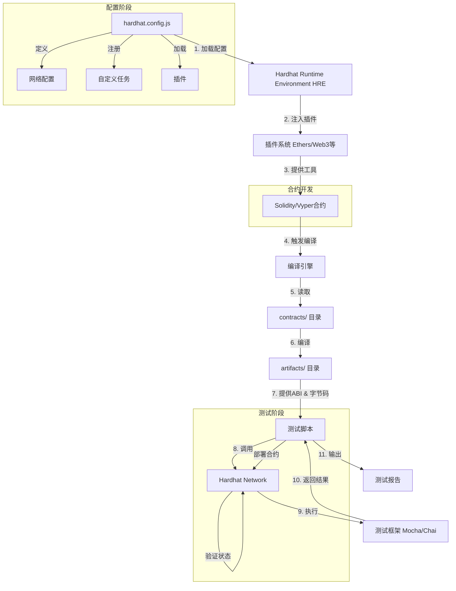
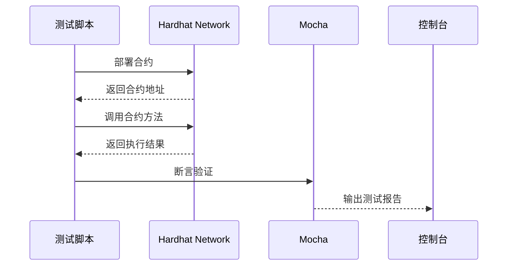

# Hardhat 的调用过程

Hardhat 的调用过程主要围绕其任务（Task）系统展开，任务执行时会加载 Hardhat Runtime Environment (HRE) 并提供完整的开发环境。以下是详细调用流程：

## 1. 初始化配置

当执行 npx hardhat <task> 命令时：

- 加载 hardhat.config.js（或 .ts）配置文件。
- 解析配置中的网络、插件、自定义任务等。
- 初始化 Hardhat Runtime Environment (HRE)，注入所有插件和工具（如 ethers.js、web3.js）。

## 2. 任务执行流程

(1) 内置任务示例：compile

```bash
npx hardhat compile
```

- 步骤 1：调用内置 compile 任务。
- 步骤 2：HRE 检查 contracts/ 目录中的 Solidity 文件。
- 步骤 3：使用配置的 Solidity 编译器（如 solc）编译合约。
- 步骤 4：生成 ABI 和字节码，保存到 artifacts/ 目录。

(2) 自定义任务
在 hardhat.config.js 中定义任务：

```javascript
task("deploy", "Deploy a contract")
  .addParam("contract", "Contract name")
  .setAction(async (taskArgs, hre) => {
    const Contract = await hre.ethers.getContractFactory(taskArgs.contract);
    const contract = await Contract.deploy();
    await contract.deployed();
    console.log("Deployed to:", contract.address);
  });
```

调用命令：

```bash
npx hardhat deploy --contract MyToken
```

- 步骤 1：解析参数 --contract MyToken。
- 步骤 2：执行 setAction 中的逻辑，使用 hre.ethers 部署合约。

3. 插件集成
插件（如 @nomicfoundation/hardhat-ethers）通过 HRE 注入功能：

```javascript
// hardhat.config.js
require("@nomicfoundation/hardhat-ethers");

// 任务中直接使用 ethers
task("balance", "Get ETH balance")
  .setAction(async (_, hre) => {
    const [account] = await hre.ethers.getSigners();
    const balance = await hre.ethers.provider.getBalance(account.address);
    console.log("Balance:", hre.ethers.formatEther(balance));
  });
```

## 4. 测试调用流程

运行测试（使用 hardhat test）：

```javascript
// test/sample-test.js
const { expect } = require("chai");

describe("Token", () => {
  it("Should deploy", async () => {
    const Token = await ethers.getContractFactory("Token");
    const token = await Token.deploy();
    expect(await token.name()).to.equal("MyToken");
  });
});
```

- 步骤 1：启动内置 Hardhat Network（本地测试链）。
- 步骤 2：编译合约并部署到测试链。
- 步骤 3：执行测试脚本，通过 ethers.js 与合约交互。

## 5. 部署到真实网络

### 配置网络并部署

```javascript
// hardhat.config.js
module.exports = {
  networks: {
    sepolia: {
      url: "<https://sepolia.infura.io/v3/><API_KEY>",
      accounts: [privateKey],
    },
  },
};
```

### 调用部署脚本

```bash
npx hardhat run scripts/deploy.js --network sepolia
```

- 步骤 1：连接 Sepolia 网络节点（通过 Infura）。
- 步骤 2：用私钥签名交易并部署合约。

## 关键概念总结

组件| 作用
| --- | --- |
Hardhat 配置文件 | 定义网络、插件、编译器版本、自定义任务等。
Hardhat Runtime (HRE) | 全局环境，集成所有插件和工具（ethers、web3、artifacts）。
任务（Task）|  执行单元（如编译、测试、部署），支持参数化和依赖管理。
插件系统|  扩展 Hardhat 功能（如集成 Ethers.js、Tenderly 等）。
内置网络|  默认的 hardhat 网络用于本地测试，支持分叉主网。

## 调试技巧

使用 console.log 在合约中打印调试信息（通过 hardhat/console.sol）。
通过 npx hardhat node 启动本地节点，实时查看交易和事件。
利用 --verbose 标志输出详细日志。

通过理解任务驱动的执行流程和 HRE 的核心作用，可以高效利用 Hardhat 进行开发、测试和部署。

## 详细的 Hardhat 从合约配置到测试的调用流程图

## 展示了各组件之间的交互关系



## 详细流程解析

### 配置加载 (hardhat.config.js)

```javascript
// 示例配置
require("@nomicfoundation/hardhat-ethers");
module.exports = {
  solidity: "0.8.24",
  networks: {
    sepolia: { url: "<https://eth-sepolia.g.alchemy.com>", accounts: [privateKey] }
  }
};
```

- 加载网络配置
- 注册插件（如 hardhat-ethers）
- 定义编译器版本

### HRE 初始化

- 创建 Hardhat Runtime Environment (HRE) 全局对象
- 注入所有配置的插件和工具

### 合约开发 (contracts/)

```solidity
// contracts/Token.sol
pragma solidity ^0.8.24;
contract Token {
    function balanceOf(address) public view returns (uint) { ... }
}
```

### 编译流程

```bash
npx hardhat compile
```

- 触发 Solidity 编译器
- 生成 ABI/字节码到 artifacts/
- 创建类型声明文件 (*.d.ts)

### 测试执行 (test/)

```javascript
// test/token.test.js
const { expect } = require("chai");
describe("Token", () => {
  it("should return balance", async () => {
    const Token = await ethers.getContractFactory("Token");
    const token = await Token.deploy(); // 部署到 Hardhat Network
    expect(await token.balanceOf(someAddress)).to.equal(100);
  });
});
```

### 测试环境交互



## 关键路径说明

阶段 |输入 |输出 |工具依赖
|---|-----|----|-----
配置| hardhat.config.js |初始化的 HRE| Node.js 环境
编译| Solidity/Vyper 文件| artifacts/*.json |solc/vyper 编译器
测试| 测试脚本 + artifacts| 测试报告| Hardhat Network, Ethers.js, Mocha
部署| artifacts + 网络配置 |链上合约地址| Ethers.js, 网络提供商(Infura/Alchemy)

### 特殊流程说明

#### 本地节点交互

```bash
npx hardhat node
```

- 启动本地 JSON-RPC 服务器
- 测试脚本通过 <http://localhost:8545> 连接

#### 主网分叉测试

```javascript
// hardhat.config.js
networks: {
  hardhat: {
    forking: { url: "<https://eth-mainnet.alchemyapi.io>" }
  }
}
```

- 在本地模拟主网状态

- 测试合约与真实协议的交互

#### 代码覆盖率

```bash
npx hardhat coverage
```

- 使用 solidity-coverage 插件
- 生成 coverage.json 和 HTML 报告

这个流程展示了 Hardhat 如何通过配置驱动整个开发周期，从合约编写到自动化测试，所有组件通过 HRE 无缝集成。
