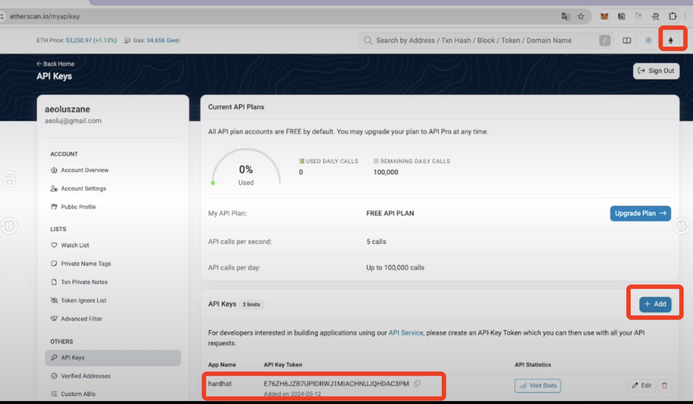

# 合约验证

```bash
npm install -D @nomicfoundation/hardhat-verify
```

<https://hardhat.org/hardhat-runner/plugins/nomicfoundation-hardhat-verify#what>

```bash
npx hardhat verify --network sepolia DEPLOYED_CONTRACT_ADDRESS
```

在etherscan上注册，拿到账户，可以申请之后，拿到apikey
etherscan: <https://etherscan.io/>
apikey


⽹⻚上⼿动验证（⽹⻚上有更多交互，要填的参数也⽐较
多）
合约版本：0.8.24
验证要注意填上合约编译后的evm target

自动验证
hardhat配置

----

合约验证是区块链开发（尤其是EVM兼容链）中一个至关重要且强烈推荐的环节，它关乎合约的透明度、安全性和可信度。

## 什么是合约验证？

合约验证就是将你部署在区块链上的智能合约的编译后的字节码(Bytecode) 与你提供的源代码(Solidity/Vyper等) 进行匹配的过程。验证成功后，区块链浏览器（如 Etherscan, BscScan, Polygonscan, Snowtrace 等）会：

公开显示合约的源代码：任何人都可以查看、阅读和审计合约的实际逻辑。

提供友好的交互界面：在浏览器中直接与合约的读写函数交互（Read Contract / Write Contract）。

支持事件日志解析：能正确解码和显示合约发出的事件(Events)。

标记为“已验证”：在合约地址页面显示一个绿色的对勾或“Verified”标签，显著提升用户和开发者对该合约的信任度。

展示ABI：自动生成并展示合约的ABI（应用程序二进制接口），方便其他应用集成。

## 为什么合约验证如此重要？（核心价值）

### 建立信任与透明度 (Trust & Transparency)

用户信任： 用户（代币持有者、流动性提供者、协议使用者）可以亲自验证合约的行为是否与项目方声称的一致。避免“黑盒”操作，减少诈骗和Rug Pull的可能性。

审计补充： 虽然专业审计是金标准，但验证让审计结果公开可查，并且允许社区持续监督。审计报告通常引用已验证的源代码。

开源精神： 体现了区块链和DeFi的开源、可验证的核心精神。

### 安全增强 (Security Enhancement)

社区审计： 公开的源代码允许全球开发者社区和研究人员持续审查，有助于发现潜在的漏洞或后门，即使是经过专业审计的合约也可能被社区发现新问题。

快速响应： 如果发现漏洞，社区和项目方可以更快地基于可见的代码进行诊断和响应（如部署修复补丁或暂停合约）。

### 提升可用性与开发体验 (Usability & Developer Experience)

交互便利： 用户无需通过命令行或自定义脚本，直接在熟悉的区块链浏览器界面与合约交互（读取数据、发送交易）。

集成简化： 其他开发者或项目可以轻松查看合约的ABI和源代码，理解其接口和功能，便于集成。

调试辅助： 交易失败时，浏览器能提供更精确的错误信息（基于源代码），有助于调试。

### 项目可信度与合法性 (Credibility & Legitimacy)

一个“已验证”的标签是项目方技术能力和诚意的基本信号。未经验证的合约通常会引起高度怀疑，严重影响项目声誉和采用率。

对于DeFi协议、NFT项目、代币发行等，合约验证几乎是最低要求。

## 合约验证如何工作？（技术流程）

### 开发者准备

编写智能合约源代码（.sol, .vy）。

使用特定版本的编译器（solc, vyper）和特定设置（优化器启用与否、优化次数runs）编译合约，生成：

- 字节码(Bytecode)：部署到链上的实际机器码。

- 部署字节码(Deployed Bytecode)：部署后存储在链上的合约代码（是字节码的一部分）。

- 元数据(Metadata)：包含编译器版本、设置、源代码哈希等信息的JSON文件（通常嵌入在字节码末尾或单独生成）。

### 部署

将包含字节码的交易发送到区块链网络进行部署。部署后获得合约地址。

### 提交验证请求

开发者通过区块链浏览器的UI、API或插件（如Hardhat Etherscan Plugin, Truffle Flattener + Manual Upload）提交：

- 合约地址

- 合约名称

- 编译器版本（必须与编译部署时使用的完全一致）

- 优化设置（是否启用优化器，optimizer runs值，必须与编译部署时完全一致）

- 源代码：可以是单个文件，或经过“扁平化”(Flatten)处理后的单个文件（解决多文件依赖），或包含多个文件的ZIP包（现代工具和浏览器支持多文件上传）。

- 构造函数参数(Constructor Arguments) （如果有，需要ABI编码后提供）。

- 库地址(Contract Libraries Addresses) （如果合约使用了外部库，需要提供库合约地址）。

### 浏览器验证过程

重新编译： 浏览器后端的验证服务使用开发者提供的完全相同的编译器版本和设置，对提供的源代码进行重新编译。

字节码比对： 将重新编译生成的部署字节码(Deployed Bytecode) 与链上该合约地址存储的实际部署字节码进行逐字节比对。

元数据校验： 检查重新编译生成的元数据哈希是否与链上字节码中嵌入的（或提供的）元数据哈希匹配（这间接验证了源代码和编译设置）。

完全匹配： 如果重新编译生成的部署字节码完全等于链上的部署字节码，并且元数据校验通过，则验证成功。

### 结果

成功： 合约状态变为“已验证”，源代码、ABI、读写接口在浏览器上公开。

失败： 浏览器会返回错误信息（最常见的原因是编译器版本、优化设置、源代码内容或库地址不匹配）。

## 常见验证失败原因分析

### 编译器版本不匹配

提交验证时选择的solc或vyper版本与实际编译部署时使用的版本不同。必须精确匹配（包括小版本号，如0.8.20+commit.a1b79de6）。

### 优化器设置不匹配

是否启用了优化器（--optimize）不同。

优化器运行次数(--optimize-runs / optimizer runs)不同。这个值会影响生成的字节码。

### 源代码不一致

提交验证的源代码文件内容与编译部署时使用的文件内容有差异（即使是空格、注释或无关紧要格式的改变，只要改变了源代码哈希就不行）。

未正确“扁平化”多文件项目，导致浏览器无法正确解析依赖关系。

提交了错误的文件。

### 构造函数参数错误

提供的构造函数参数值错误。

参数未按要求的顺序进行ABI编码。

遗漏了构造函数参数（即使参数是默认值，有时也需要显式提供编码）。

### 库地址不匹配

合约中引用了外部库，但提交验证时没有提供该库的地址。

提供的库地址不是该库合约在同一链上实际部署的地址。

库合约本身未经验证（通常不影响主合约字节码匹配，但最好一并验证库）。

### 元数据哈希问题

编译时使用了不同的设置（如不同的源文件路径），导致元数据内容改变，其哈希值也随之改变，无法匹配链上嵌入的哈希。

一些高级设置（如viaIR）可能影响元数据。

### 链选择错误

在主网编译部署的合约，提交到了测试网的验证器（或反之），导致字节码无法匹配

### 工具配置错误

使用Hardhat/Truffle等框架的插件时，配置文件(hardhat.config.js, truffle-config.js)中的设置（编译器版本、优化器设置）与实际部署编译时生效的设置不一致

### 特殊合约类型

代理合约、使用CREATE2部署的合约、带自毁逻辑的合约等可能需要额外的步骤或注意点

## 最佳实践

### 锁定依赖和版本

使用package.json (NPM) 或requirements.txt (Python) 等明确记录所有依赖（包括编译器版本）。

在配置文件中精确指定Solidity/Vyper编译器版本。

### 明确记录编译设置

在配置文件（如hardhat.config.js）中清晰设置优化器（enabled: true/false, runs: number）。

部署脚本应使用这些配置。

### 自动化验证

强烈推荐使用开发框架的插件进行自动化验证：

- Hardhat: @nomicfoundation/hardhat-verify

- Truffle: truffle-plugin-verify + truffle-flattener (或使用Truffle Dashboard结合浏览器手动验证)

自动化脚本能确保提交的参数（编译器版本、优化设置、库地址）与部署时完全一致。

### 妥善管理库

如果使用库，先部署并验证库合约。

在主合约部署脚本和验证请求中准确提供库地址。

### 正确提供构造函数参数

在部署脚本中记录或打印出构造函数参数的ABI编码值。

使用插件通常能自动处理。

### 处理多文件合约

使用插件通常能自动处理依赖。

手动验证时，使用truffle-flattener或hardhat flatten生成单文件，并确保生成过程正确无误。

现代浏览器支持多文件上传（.zip），这通常是更好的选择，能保留原始结构和注释。

### 验证后检查

在浏览器上仔细查看验证后的代码，确保显示正确，没有意外引入的额外内容（扁平化有时可能引入不相关的License注释）。

### 及时验证

部署后尽快验证，避免遗忘或丢失关键信息（如构造函数参数）

### 考虑代理模式

如果合约需要升级，使用标准代理模式（如Transparent Proxy, UUPS）。验证时通常需要验证代理合约的实现逻辑合约地址(implementation address)和代理合约本身（如果其包含管理逻辑）

## 工具推荐

### 开发框架插件

Hardhat: @nomicfoundation/hardhat-verify

Truffle: truffle-plugin-verify

### 代码扁平化

truffle-flattener

hardhat flatten (内置命令)

### ABI 编码构造函数参数

插件通常自动处理。

手动工具：cast (Foundry), web3.js, ethers.js, 在线ABI编码器。

### 区块链浏览器

Etherscan (Ethereum)

BscScan (BNB Smart Chain)

Polygonscan (Polygon POS)

Snowtrace (Avalanche C-Chain)

FTMScan (Fantom Opera)

Arbiscan (Arbitrum One/Nova)

Optimistic Etherscan (Optimism)

Basescan (Base)

Etc.

## 总结

智能合约验证绝非可有可无的步骤，而是DeFi、NFT、DAO等区块链应用安全、透明和可信赖的基石。它：

赋予用户权力： 让用户能亲自验证代码。

增强安全性： 通过社区监督补充专业审计。

提升项目可信度： “已验证”标签是基本信誉标志。

优化开发体验： 提供便捷的交互和集成方式。

忽略验证会带来巨大的信任危机和安全风险。遵循最佳实践，尤其是利用自动化工具（Hardhat/Truffle插件），可以显著降低验证过程的复杂度和出错概率，确保你的合约以透明可信的方式运行在链上。务必在部署后第一时间完成验证。

----

## hardhat合约验证

使用 Hardhat 进行智能合约验证是一个高效且标准化的流程。它通过 **`@nomicfoundation/hardhat-verify`** 插件（原 `@nomiclabs/hardhat-etherscan` 的继承者）实现自动化，极大简化了操作并减少了人为错误。以下是详细步骤和最佳实践：

---

### **核心步骤**

#### **1. 安装验证插件**

```bash
npm install --save-dev @nomicfoundation/hardhat-verify
```

#### **2. 配置 `hardhat.config.js`**

```javascript
require("@nomicfoundation/hardhat-toolbox");
require("@nomicfoundation/hardhat-verify"); // 引入插件

module.exports = {
  solidity: "0.8.24",
  networks: {
    sepolia: {
      url: "https://sepolia.infura.io/v3/YOUR_INFURA_KEY",
      accounts: [PRIVATE_KEY],
    },
    mainnet: { ... } // 类似配置
  },
  etherscan: {
    apiKey: {
      sepolia: "YOUR_ETHERSCAN_API_KEY",  // 对应网络的API Key
      mainnet: "YOUR_ETHERSCAN_API_KEY",
      polygon: "YOUR_POLYGONSCAN_API_KEY", // 多链支持
    },
    customChains: [] // 如果是非标准链（如私有链），需自定义配置
  }
};
```

> **关键点**：
>
> - 从 [Etherscan](https://etherscan.io/myapikey) 或其他区块链浏览器（如 BscScan/Polygonscan）获取 API Key。
> - 为每个要验证的网络配置对应的 `apiKey`。

---

### **3. 部署合约后执行验证**

#### **方式一：直接使用 `verify` 任务（推荐）**

```bash
npx hardhat verify --network sepolia DEPLOYED_CONTRACT_ADDRESS "Constructor Arg 1" "Arg 2"
```

**示例**：

```bash
npx hardhat verify --network sepolia 0x1234...abcd "Hello" 42
```

#### **方式二：在部署脚本中自动验证**

```javascript
// scripts/deploy.js
async function main() {
  const MyContract = await ethers.getContractFactory("MyContract");
  const contract = await MyContract.deploy("Hello", 42); // 带构造函数参数
  
  await contract.deployed();
  console.log("Deployed to:", contract.address);

  // 自动验证（需等待区块确认）
  await new Promise(resolve => setTimeout(resolve, 30000)); // 等待30秒
  await hre.run("verify:verify", {
    address: contract.address,
    constructorArguments: ["Hello", 42], // 参数数组
  });
}
```

---

### **处理复杂场景**

#### **场景1：验证依赖库的合约**

若合约使用了外部库（如通过 `library SafeMath`）：

1. 先单独部署并验证库合约。
2. 验证主合约时，通过 `libraries` 参数指定库地址：

```bash
npx hardhat verify --network sepolia 0x1234...abcd \
  --libraries "SafeMath:0x5678...ef01"
```

或在脚本中：

```javascript
await hre.run("verify:verify", {
  address: contract.address,
  libraries: {
    SafeMath: "0x5678...ef01",
  },
});
```

#### **场景2：代理合约验证**

- **实现合约（Logic Contract）**：按普通合约验证。
- **代理合约（Proxy Contract）**：  
  若使用 OpenZeppelin 透明代理（Transparent Proxy）或 UUPS 代理，需验证代理合约本身：

  ```bash
  npx hardhat verify --network mainnet PROXY_ADDRESS --contract "contracts/MyProxy.sol:MyProxy"
  ```

  需明确指定代理合约的源码路径和合约名。

#### **场景3：多文件合约**

确保 `hardhat.config.js` 中配置了正确的 Solidity 版本和优化器设置。插件会自动处理文件依赖，无需手动扁平化（Flatten）。

---

### **常见错误与解决方案**

| **错误原因**                | **解决方法**                                                                 |
|----------------------------|-----------------------------------------------------------------------------|
| **编译器版本不匹配**        | 检查 `hardhat.config.js` 中的 `solidity` 版本是否与部署时一致。               |
| **优化器设置不一致**        | 确保 `config.solidity.settings.optimizer` 中的 `enabled` 和 `runs` 与部署一致。 |
| **构造函数参数错误**        | 使用 `--constructor-args scripts/arguments.js` 指定参数文件，或检查脚本中的数组格式。 |
| **网络延迟未确认**          | 部署后等待 30 秒以上再执行验证（尤其是测试网）。                               |
| **API Key 未配置或无效**    | 检查 `etherscan.apiKey` 中网络名称是否拼写正确（如 `sepolia` 而非 `sepolia`）。 |
| **依赖库未验证**            | 先验证所有库合约，并在主合约验证时通过 `--libraries` 指定地址。               |

---

### **高级技巧**

1. **验证已部署但未验证的合约**  
   即使未通过 Hardhat 部署，只要知道构造函数参数，仍可验证：

   ```bash
   npx hardhat verify --network mainnet 0x1234...abcd "arg1" 42
   ```

2. **使用 `hardhat-etherscan` 的编程接口**  
   在脚本中动态处理验证：

   ```javascript
   const { verify } = require("@nomicfoundation/hardhat-verify");
   await verify("0x1234...abcd", args, { contract: "contracts/NFT.sol:MyNFT" });
   ```

3. **国内加速访问**  
   若遇到 Etherscan API 超时，可在 `hardhat.config.js` 中配置代理：

   ```javascript
   etherscan: {
     apiKey: { ... },
     customChains: [{
       network: "sepolia",
       chainId: 11155111,
       urls: { apiURL: "https://api-sepolia.etherscan.io/api" } // 无需代理
     }]
   }
   ```

---

### **验证成功后的检查**

1. 在 [Etherscan](https://etherscan.io/) 输入合约地址，确认状态为 **`Verified`**。
2. 检查 **`Contract` > `Code`** 页签：
   - 源码是否完整显示？
   - 编译器版本和优化设置是否正确？
   - 是否有警告提示（如未验证的依赖库）？

---

### **总结：Hardhat 验证的最佳实践**

1. **始终通过插件自动化验证**，避免手动操作失误。
2. **在部署脚本中集成验证**，确保流程原子性。
3. **严格统一编译环境**：锁定 Hardhat 版本、Solidity 编译器和优化设置。
4. **优先验证测试网**，确认无误后再部署主网。
5. 使用 `--debug` 参数排查失败原因：

   ```bash
   npx hardhat verify ... --debug
   ```

通过遵循以上步骤，你可以高效、可靠地完成 Hardhat 项目的合约验证，建立项目的透明度和信任基础。
