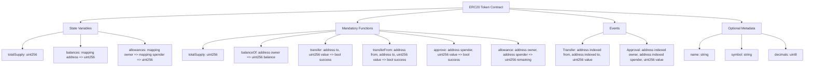

# ERC20 系列

## ERC20

ERC20是以太坊上最常用的代币标准，

## 特点

标准化，可替代性，可分割性，

ERC20 Token 的结构图 及其核心组件解析

```mermaid
graph TD
    A[ERC20 Token Contract] --> B[State Variables]
    A --> C[Mandatory Functions]
    A --> D[Events]
    A --> E[Optional Metadata]

    B --> B1[totalSupply: uint256]
    B --> B2[balances: mapping address => uint256]
    B --> B3[allowances: mapping owner => mapping spender => uint256]

    C --> C1[totalSupply: uint256]
    C --> C2[balanceOf: address owner => uint256 balance]
    C --> C3[transfer: address to, uint256 value => bool success]
    C --> C4[transferFrom: address from, address to, uint256 value => bool success]
    C --> C5[approve: address spender, uint256 value => bool success]
    C --> C6[allowance: address owner, address spender => uint256 remaining]

    D --> D1[Transfer: address indexed from, address indexed to, uint256 value]
    D --> D2[Approval: address indexed owner, address indexed spender, uint256 value]

    E --> E1[name: string]
    E --> E2[symbol: string]
    E --> E3[decimals: uint8]
```

ERC20的框架结构

ERC20Perimit
ERC20Paisable
