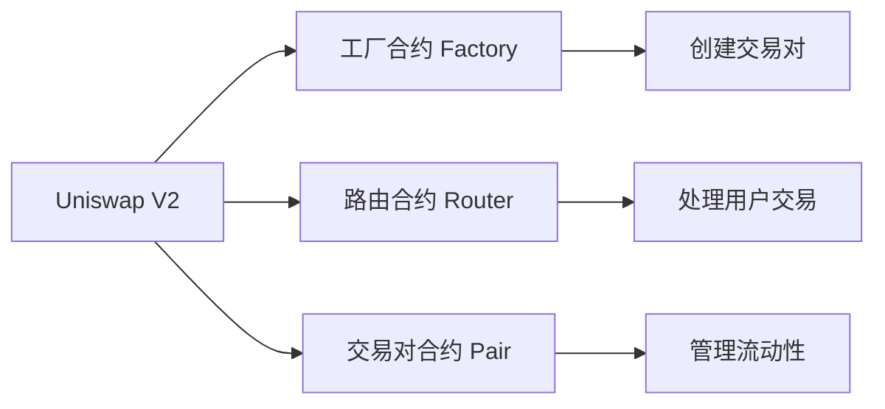
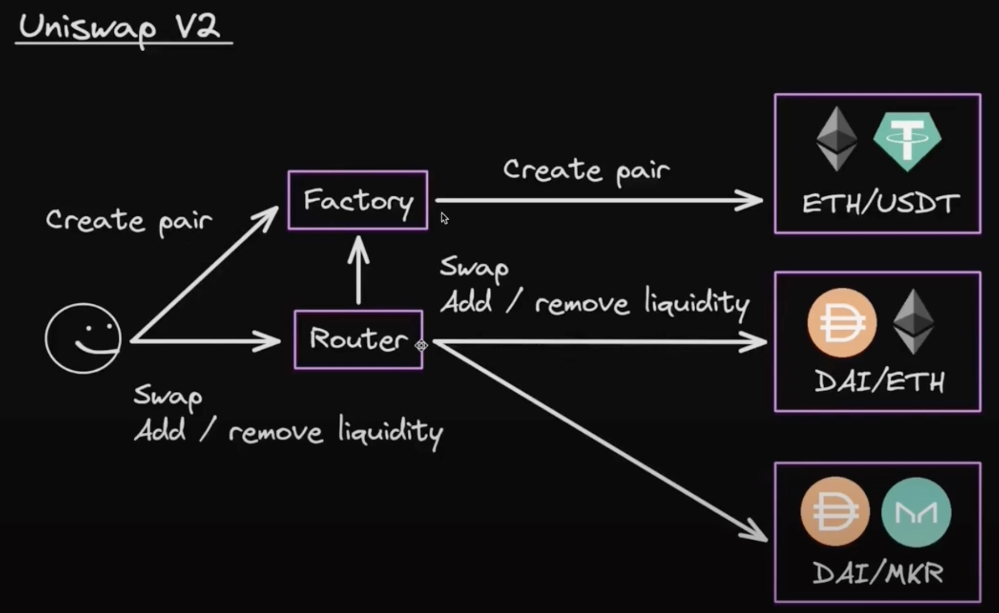

# uniswap 核心合约

## 核心概念图表



## 一、核心组件（Solidity 接口）

### 工厂合约（Factory）

创建交易对：createPair(tokenA, tokenB)
查询交易对：getPair(tokenA, tokenB) → address

### 路由合约（Router）

生成不同的pairs对
swap(address tokenA, address tokenB, uint256 amountA, uint256 amountB, address to)
核心功能：

```solidity
swapExactTokensForTokens(uint amountIn, uint amountOutMin, address[] path, address to, uint deadline)
addLiquidity(tokenA, tokenB, amountADesired, amountBDesired, amountAMin, amountBMin, to, deadline)
```

### 交易对合约（Pair）

流动性代币（LP Token）管理
储备量查询：getReserves() → (uint112 reserve0, uint112 reserve1)



## 二、代码示例

### 1. 代币兑换（ETH → DAI）

```solidity
pragma solidity ^0.8.0;
import "@uniswap/v2-periphery/contracts/interfaces/IUniswapV2Router02.sol";

contract SwapExample {
    IUniswapV2Router02 public uniswapRouter = IUniswapV2Router02(0x7a250d5630B4cF539739dF2C5dAcb4c659F2488D);

    function swapETHForDAI(uint minDAI) external payable {
        address[] memory path = new address[](2);
        path[0] = uniswapRouter.WETH(); // WETH 地址
        path[1] = 0x6B175474E89094C44Da98b954EedeAC495271d0F; // DAI 地址
        
        uniswapRouter.swapExactETHForTokens{value: msg.value}(
            minDAI,
            path,
            msg.sender,
            block.timestamp + 300
        );
    }
}
```

### 2. 添加流动性

```solidity
function addLiquidity(address tokenA, address tokenB, uint amountA, uint amountB) external {
    IERC20(tokenA).transferFrom(msg.sender, address(this), amountA);
    IERC20(tokenB).transferFrom(msg.sender, address(this), amountB);

    IERC20(tokenA).approve(address(uniswapRouter), amountA);
    IERC20(tokenB).approve(address(uniswapRouter), amountB);

    uniswapRouter.addLiquidity(
        tokenA,
        tokenB,
        amountA,
        amountB,
        1, // 最小接受量（防滑点）
        1,
        msg.sender,
        block.timestamp + 300
    );

}
```

## 三、关键机制

### 恒定乘积公式

x×y=k

- x 和 y 是池中两种代币的储备量

- 价格由储备比例决定：Price_y = x / y

### 手续费

交易费：0.3%（V2 标准）

LP 提供者按比例获得费用

## 四、安全注意事项

防滑点保护
使用 amountOutMin 参数避免价格波动损失：

```solidity
swapExactTokensForTokens(100, 95, ...); // 最少接受95个代币
```

### 重入攻击防护

Uniswap 合约使用 nonReentrant 修饰符

自定义合约应遵循 Checks-Effects-Interactions 模式

### 期限检查

```solidity
require(deadline >= block.timestamp, "EXPIRED");
```

## 五、版本对比

特性 |Uniswap V2| Uniswap V3
| --- | --- | --- |
价格机制| 全区间恒定乘积 |集中流动性
Gas 效率| 较低| 优化（约省50%）
LP 管理| 统一流动性| 多费率档位（0.01%-1%）
预言机 |时间加权平均价（TWAP）| 增强型 TWAP

## 六、学习资源

Uniswap V2 文档

GitHub 合约地址：

核心合约

周边合约

工具库：Uniswap SDK

提示：部署前务必在测试网（如 Goerli）验证逻辑，使用主网地址需参考官方地址列表。
