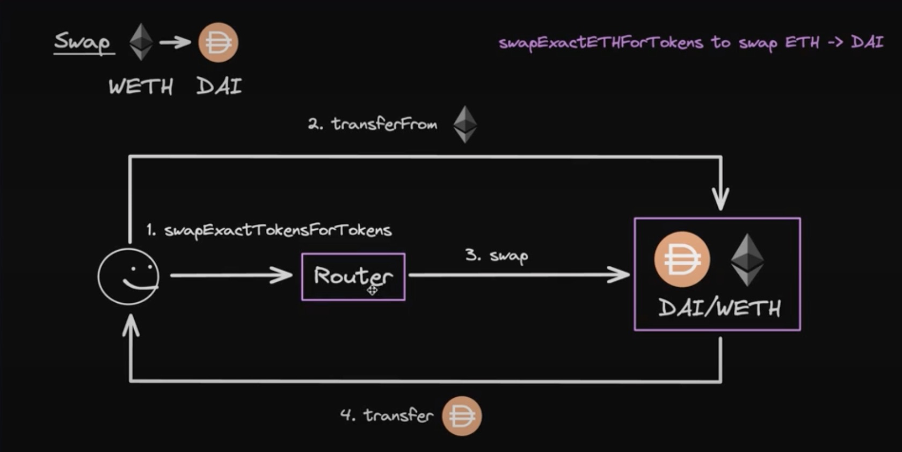
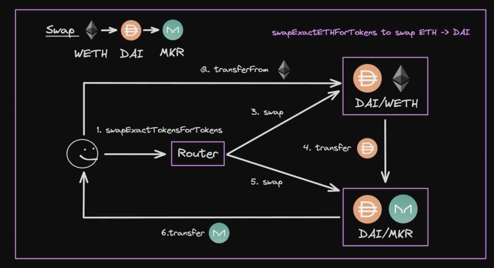

# uniswap swap合约调用

单个池子调用：

多个池子调用：

## uniswap v2协议的分层设计

uini-v2
   v2-core 核心代码
   v2-periphery 外围代码

## uniswap v2 源码分析

### swapExactTokensForTokens

这个函数在v2/v2-periphery/contreacts/UniswapV2Router02.sol中定义

getAmountsOut
swapExactTokensForTokensSupportingFeeOnTransferTokens
